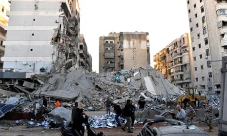

## Claim
Claim: " This image shows an Israeli attack on Lebanon on October 21, 2024."

## Actions
```
reverse_search()
geolocate()
web_search("Israeli attack Lebanon October 21 2024")
```

## Evidence
### Evidence from `reverse_search`
The image 

### Evidence from `geolocate`
The most likely countries where the image was taken are: {'Palestine': 0.66, 'Israel': 0.22, 'United Arab Emirates': 0.08, 'Jordan': 0.01, 'Albania': 0.0, 'Andorra': 0.0, 'Argentina': 0.0, 'Australia': 0.0, 'Austria': 0.0, 'Bangladesh': 0.0}

### Evidence from `web_search`
The CNN article ([https://www.cnn.com/world/live-news/israel-iran-lebanon-gaza-war-10-21-24-intl-hnk](https://www.cnn.com/world/live-news/israel-iran-lebanon-gaza-war-10-21-24-intl-hnk)) discusses the ongoing conflict between Israel and Hezbollah, including attacks and strikes in Lebanon on October 21, 2024. The article mentions an explosion in Beirut, Lebanon, on October 21, 2024, as shown in . The Wikipedia article ([https://en.wikipedia.org/wiki/2024_Israeli_invasion_of_Lebanon](https://en.wikipedia.org/wiki/2024_Israeli_invasion_of_Lebanon)) discusses the 2024 Israeli invasion of Lebanon, which began on October 1, 2024.

The Guardian article ([https://www.theguardian.com/world/2024/oct/21/israeli-airstrikes-on-lebanon-hit-branches-of-hezbollah-linked-bank-al-qard-al-hassan](https://www.theguardian.com/world/2024/oct/21/israeli-airstrikes-on-lebanon-hit-branches-of-hezbollah-linked-bank-al-qard-al-hassan)) reports on Israeli airstrikes on Lebanon that hit branches of the Hezbollah-linked bank Al-Qard Al-Hassan on October 21, 2024, and includes .


## Elaboration
The evidence confirms that the image depicts an event related to the conflict between Israel and Lebanon. The CNN article mentions an explosion in Beirut, Lebanon, on October 21, 2024, and the Guardian article reports on Israeli airstrikes on Lebanon on the same date. The geolocate search suggests the image was taken in Palestine or Israel. Therefore, the claim is likely accurate.


## Final Judgement
The image is associated with an Israeli attack on Lebanon on October 21, 2024, as confirmed by multiple news sources. The image is likely taken in Palestine or Israel.

`true`

### Verdict: TRUE

### Justification
The image depicts an event related to the conflict between Israel and Lebanon on October 21, 2024, as confirmed by a [CNN article](https://www.cnn.com/world/live-news/israel-iran-lebanon-gaza-war-10-21-24-intl-hnk) and a [Guardian article](https://www.theguardian.com/world/2024/oct/21/israeli-airstrikes-on-lebanon-hit-branches-of-hezbollah-linked-bank-al-qard-al-hassan). The geolocate search suggests the image was taken in Palestine or Israel.
