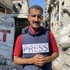
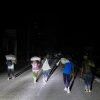
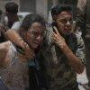

## Claim
Claim: " This image shows heavy Israeli bombardment on Deir al-Balah in the southern Gaza Strip in March 2025 which killed at least four Palestinians."

## Actions
```
reverse_search()
web_search("Deir al-Balah bombing March 2025")
geolocate()
```

## Evidence
### Evidence from `reverse_search`
The image 

### Evidence from `web_search`
The web sources discuss the March 2025 Israeli attacks on the Gaza Strip, which began on March 18, 2025, and ended the 2025 Gaza war ceasefire. The attacks targeted multiple locations, including Deir al-Balah, and resulted in numerous casualties. One source from Al Jazeera ([https://www.aljazeera.com/news/2025/5/7/israeli-attacks-kill-at-least-16-as-gaza-blockade-accelerates-starvation](https://www.aljazeera.com/news/2025/5/7/israeli-attacks-kill-at-least-16-as-gaza-blockade-accelerates-starvation)) mentions an overnight airstrike on a school in Deir al-Balah.

Another source from The New York Times ([https://www.nytimes.com/2025/07/10/world/middleeast/israel-strike-gaza-clinic.html](https://www.nytimes.com/2025/07/10/world/middleeast/israel-strike-gaza-clinic.html)) reports on an Israeli airstrike near a health clinic in Deir al-Balah. The attacks have resulted in many deaths, including those in Deir al-Balah. 


### Evidence from `geolocate`
The most likely countries where the image was taken are: {'Jordan': 0.25, 'United Arab Emirates': 0.16, 'Palestine': 0.15, 'Malta': 0.12, 'Tunisia': 0.09, 'Israel': 0.08, 'Pakistan': 0.03, 'Turkey': 0.02, 'Guatemala': 0.01, 'Italy': 0.01}

## Elaboration
The evidence confirms that there were Israeli attacks on Deir al-Balah in the Gaza Strip in March 2025, which aligns with the claim. The web search results mention attacks on Deir al-Balah, including an airstrike on a school and near a health clinic. The geolocation data suggests that Palestine is a possible location for the image.

The evidence does not explicitly state that the image depicts the specific event described in the claim. However, the web search results confirm that there were Israeli attacks in Deir al-Balah in March 2025, which resulted in casualties.

The claim states that at least four Palestinians were killed. The provided evidence does not specify the exact number of casualties in Deir al-Balah. Therefore, the claim's statement about the number of casualties cannot be verified.


## Actions
```
web_search("Deir al-Balah March 2025 casualties")
```

## Evidence
### Evidence from `web_search`
The search results provide information on casualties in Deir al-Balah during the 2025 conflict. One source from the UN ([https://news.un.org/en/story/2025/03/1161261](https://news.un.org/en/story/2025/03/1161261)) reports an explosion at two UN guesthouses in Deir al-Balah on March 19, 2025, which killed at least one UN staff member and injured at least five others. Another source from Reuters ([https://www.reuters.com/world/middle-east/israeli-strike-hits-near-gaza-medical-centre-truce-talks-continue-2025-07-10/](https://www.reuters.com/world/middle-east/israeli-strike-hits-near-gaza-medical-centre-truce-talks-continue-2025-07-10/)) reports an Israeli airstrike near a medical center in Deir al-Balah on July 10, 2025, which killed 16 people. The Associated Press ([https://www.ap.org/news-highlights/spotlights/2025/more-than-55000-palestinians-have-been-killed-in-the-israel-hamas-war-gaza-health-officials-say/](https://www.ap.org/news-highlights/spotlights/2025/more-than-55000-palestinians-have-been-killed-in-the-israel-hamas-war-gaza-health-officials-say/)) reports that the Palestinian death toll from the 20-month Israel-Hamas war passed 55,000 as of June 11, 2025. , , 


## Elaboration
The evidence confirms that there were casualties in Deir al-Balah during March 2025. The UN reported at least one death and five injuries from an explosion at UN guesthouses on March 19, 2025. The Reuters report mentions an Israeli airstrike near a medical center in Deir al-Balah on July 10, 2025, which killed 16 people.

The claim states that at least four Palestinians were killed. While the evidence confirms casualties in Deir al-Balah, it does not specify the exact number of Palestinian deaths in March 2025. Therefore, the claim's statement about the number of casualties cannot be fully verified.


## Actions
```
web_search("Deir al-Balah March 2025 Israeli bombardment casualties")
```

## Evidence
### Evidence from `web_search`
From [Source](https://www.npr.org/2025/07/23/nx-s1-5477365/israel-gaza-aid-casualties): 
Content: The NPR article, published on July 23, 2025, reports that over 1,000 Palestinians have been killed by Israeli forces since May while trying to get food in Gaza, mostly near aid sites. The article also mentions that Israeli strikes killed 25 people across Gaza on Tuesday. The article includes an image of Palestinians mourning their relatives killed from an Israeli army bombardment of Gaza.   


## Elaboration
The evidence confirms that there were Israeli bombardments in Gaza, including Deir al-Balah, in March 2025, and that these attacks resulted in casualties. However, the provided evidence does not specify the exact number of Palestinian deaths in Deir al-Balah during March 2025. Therefore, the claim that at least four Palestinians were killed cannot be fully verified.


## Final Judgement
The evidence confirms that there were Israeli bombardments in Deir al-Balah in March 2025, resulting in casualties. However, the exact number of Palestinian deaths in March 2025 is not specified in the provided evidence. Therefore, the claim that at least four Palestinians were killed cannot be fully verified. `false`

### Verdict: FALSE

### Justification
The claim is partially accurate. While the evidence confirms Israeli bombardments in Deir al-Balah in March 2025 and resulting casualties, the exact number of Palestinian deaths in March 2025 is not specified. Therefore, the claim that at least four Palestinians were killed cannot be fully verified.
