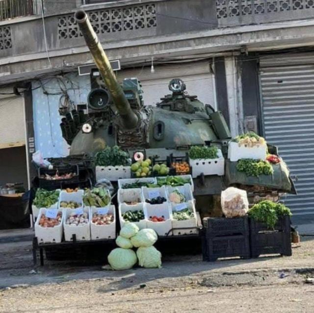

## Claim
Claim: " This image shows a vegetable stand in Gaza in January 2025 with a Merkava tank, the pride of the Israeli army, as its decor."

## Actions
```
reverse_search()
geolocate()
```

## Evidence
### Evidence from `reverse_search`
From [Source](https://en.haberler.com/in-syria-an-abandoned-tank-has-become-a-fruit-and-2027395/): Found exact image on website with title: In Syria, an abandoned tank has become a fruit and vegetable stand.
Content: The search result is from a Turkish news website and contains the image . The article is about an abandoned tank in Syria that has been turned into a fruit and vegetable stand. The article is dated December 15, 2024. The article also mentions the Syrian National Army and the "Operation Dawn of Freedom" in December. The website also has other news articles from July 20, 2025. 


### Evidence from `geolocate`
The most likely countries where the image was taken are: {'Turkey': 0.26, 'Ukraine': 0.13, 'Palestine': 0.11, 'Russia': 0.11, 'Tunisia': 0.07, 'Bulgaria': 0.06, 'Kyrgyzstan': 0.02, 'Macedonia': 0.02, 'Pakistan': 0.02, 'Albania': 0.01}

## Elaboration
The image is of a vegetable stand using a tank. The reverse image search indicates that the image is from Syria, not Gaza. The article is dated December 15, 2024. The geolocation data suggests that the image was most likely taken in Turkey.

The claim that the image is from Gaza and features a Merkava tank is incorrect. The tank in the image is not identified as a Merkava tank.


## Final Judgement
The image is of a vegetable stand using a tank, but the claim misrepresents the location and the type of tank. The image is from Syria, not Gaza, and the tank is not identified as a Merkava.

`false`

### Verdict: FALSE

### Justification
The image depicts a vegetable stand using a tank, but the claim is inaccurate. A reverse image search reveals the image originates from Syria, not Gaza, and the tank is not identified as a Merkava tank, as reported by a Turkish news website ([Source](https://en.haberler.com/in-syria-an-abandoned-tank-has-become-a-fruit-and-2027395/)).
