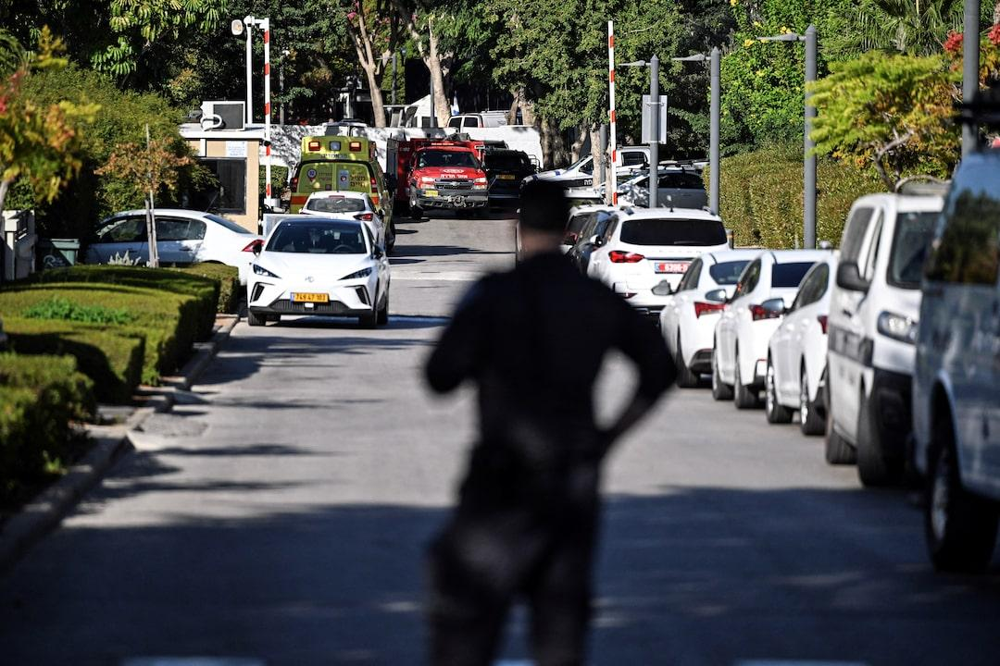

## Claim
Claim: "Netanyahu’s son Yair was killed in a drone attack on October 19, 2024 that targeted the Israeli PM’s home in Caesarea, Israel."

## Actions
```
web_search("Yair Netanyahu drone attack October 19 2024")
web_search("drone attack Caesarea Israel October 19 2024")
```

## Evidence
### Evidence from `web_search`
On October 19, 2024, a drone attack targeted Prime Minister Benjamin Netanyahu's residence in Caesarea, Israel, as reported by [Wikipedia](https://en.wikipedia.org/wiki/2024_drone_attack_on_Benjamin_Netanyahu%27s_residence), [The Times of Israel](https://www.timesofisrael.com/drones-moans-and-groans-hezbollah-attacks-pms-home-petty-politics-continue-unintercepted/), and [NBC News](https://www.nbcnews.com/news/world/live-blog/live-updates-drone-strike-lebanon-netanyahu-gaza-rcna176216). The attack was claimed by Hezbollah and was part of the ongoing Israeli–Lebanese conflict. Netanyahu and his wife were not present during the attack, and there were no injuries. <image:i>, , 

The Wikipedia article states that the drone hit a bedroom window but did not penetrate further due to reinforced glass. The Times of Israel article includes a tweet from Benjamin Netanyahu describing the attack as an assassination attempt on "me and my wife."


### Evidence from `web_search`
Reuters ([Source](https://www.reuters.com/world/middle-east/drone-launched-netanyahu-home-northern-israel-spokesman-says-2024-10-19/)) and Al Jazeera ([Source](https://www.aljazeera.com/news/2024/10/19/drone-hits-netanyahus-home-as-hezbollah-rockets-target-northern-israel)) both reported a drone attack on October 19, 2024, targeting Benjamin Netanyahu's home in Caesarea, Israel.  

Both articles mention that Netanyahu was not present during the attack and that there were no casualties. The attacks were launched from Lebanon.


## Elaboration
The evidence confirms a drone attack on October 19, 2024, that targeted Benjamin Netanyahu's residence in Caesarea, Israel. However, the evidence explicitly states that Netanyahu and his wife were not present during the attack and that there were no injuries. Therefore, the claim that Yair Netanyahu was killed in the attack is false.


## Final Judgement
The search results confirm a drone attack on October 19, 2024, on Benjamin Netanyahu's residence in Caesarea, Israel. However, the evidence indicates that Netanyahu and his wife were not present and there were no casualties. The claim that Yair Netanyahu was killed in the attack is directly contradicted by the evidence.

`false`

### Verdict: FALSE

### Justification
The claim is false. While a drone attack did target Benjamin Netanyahu's residence in Caesarea, Israel, on October 19, 2024, as reported by sources like [Wikipedia](https://en.wikipedia.org/wiki/2024_drone_attack_on_Benjamin_Netanyahu%27s_residence), [The Times of Israel](https://www.timesofisrael.com/drones-moans-and-groans-hezbollah-attacks-pms-home-petty-politics-continue-unintercepted/), and [NBC News](https://www.nbcnews.com/news/world/live-blog/live-updates-drone-strike-lebanon-netanyahu-gaza-rcna176216), Netanyahu and his wife were not present, and there were no injuries.
