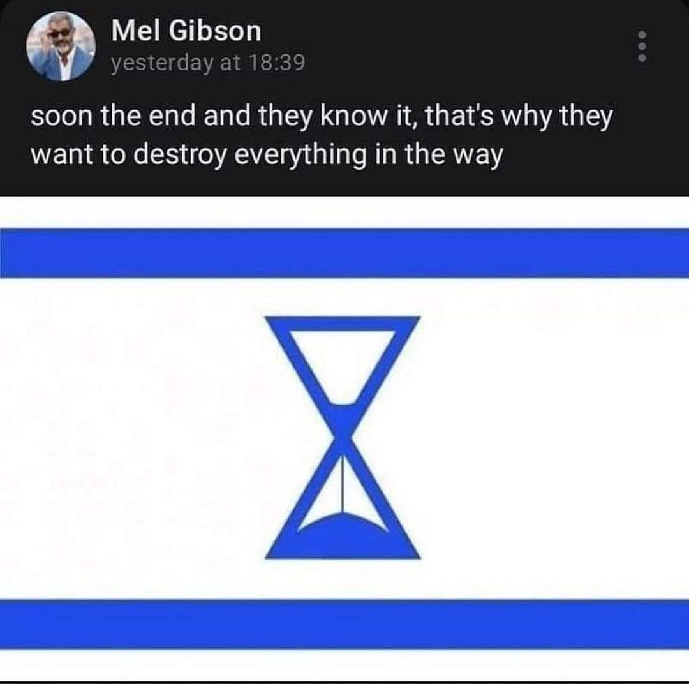

## Claim
Claim: " The image shows a screenshot of an authentic social media post from Mel Gibson saying that Israel will end soon and therefore destroy everything in its way together with a flag in the color of Israel that shows an hourglass."

## Actions
```
web_search("Mel Gibson Israel post")
reverse_search()
```

## Evidence
### Evidence from `web_search`
The Associated Press ([https://apnews.com/article/fact-check-mel-gibson-israel-post-342335121493](https://apnews.com/article/fact-check-mel-gibson-israel-post-342335121493)) and Yahoo.com ([https://www.yahoo.com/entertainment/fact-check-mel-gibson-posted-235600604.html](https://www.yahoo.com/entertainment/fact-check-mel-gibson-posted-235600604.html)) both debunked the claim that Mel Gibson posted on social media about the end of Israel. The image in the claim is fake, and Gibson does not have any public social media accounts. 

## Elaboration
The evidence indicates that the claim is false. The Associated Press ([https://apnews.com/article/fact-check-mel-gibson-israel-post-342335121493](https://apnews.com/article/fact-check-mel-gibson-israel-post-342335121493)) and Yahoo.com ([https://www.yahoo.com/entertainment/fact-check-mel-gibson-posted-235600604.html](https://www.yahoo.com/entertainment/fact-check-mel-gibson-posted-235600604.html)) both debunked the claim, stating that the image is fake and that Mel Gibson does not have any public social media accounts.


## Final Judgement
The claim is demonstrably false. Multiple reliable sources, including the Associated Press and Yahoo.com, have debunked the claim, stating that the image is fake and that Mel Gibson does not have any public social media accounts. `false`


### Verdict: FALSE

### Justification
The claim is false. Fact-checkers at the Associated Press ([https://apnews.com/article/fact-check-mel-gibson-israel-post-342335121493](https://apnews.com/article/fact-check-mel-gibson-israel-post-342335121493)) and Yahoo.com ([https://www.yahoo.com/entertainment/fact-check-mel-gibson-posted-235600604.html](https://www.yahoo.com/entertainment/fact-check-mel-gibson-posted-235600604.html)) have debunked the image, stating that it is fake and that Mel Gibson does not have any public social media accounts.
