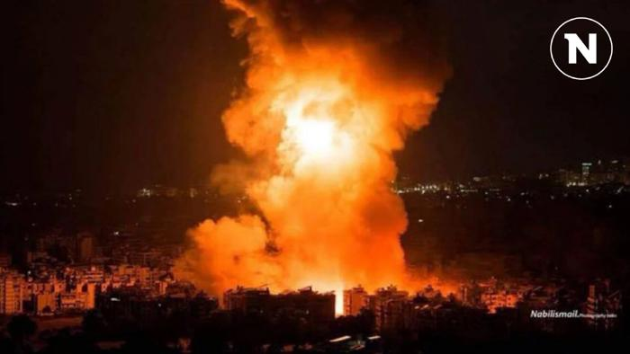

## Claim
Claim: " This image shows Israel launching several waves of revengeful attacks on Iranian military targets on October 26, 2024."

## Actions
```
reverse_search()
geolocate()
web_search("Israel attacks Iranian military targets October 26 2024")
```

## Evidence
### Evidence from `reverse_search`
The image  appears in multiple sources. One source, "[Islamic State" (ISIS) cell reportedly attacked ... - Syria Live Map](https://syria.liveuamap.com/en/2025/18-july-13-islamic-state-isis-cell-reportedly-attacked-syrian)", labels the image as "A picture of the raid that targeted the Al-Laylaki area a short while ago" and dates it October 22, 2024. Another source, "[News Live - Oregon](https://oregon.liveuamap.com/en/2025/17-july-police-investigating-an-assault-at-the-convention-center-max)", also contains the image  and provides the same label and date.

The image  is also found in an article from "[Middle East on the brink: Gaza, Israel, Iran - Harapan Daily](https://harapandaily.com/2025/06/17/middle-east-on-the-brink-gaza-israel-iran/)", which discusses the conflict in the Middle East, including an Iranian drone and missile operation targeting Israeli military installations in April 2024.


### Evidence from `geolocate`
The most likely countries where the image was taken are: {'Palestine': 0.4, 'Israel': 0.3, 'Bangladesh': 0.04, 'Taiwan': 0.04, 'Ukraine': 0.04, 'China': 0.02, 'Pakistan': 0.02, 'Bulgaria': 0.01, 'Jordan': 0.01, 'Malta': 0.01}

### Evidence from `web_search`
The web sources discuss the Israeli strikes on Iran on October 26, 2024, in retaliation for Iranian attacks earlier in the month. The strikes, codenamed Operation Days of Repentance, targeted military sites in Iran, Iraq, and Syria, including air defense batteries, a UAV factory, and missile production facilities. The strikes resulted in 42 deaths. The Guardian reports that the IDF said the attacks hit missile and drone manufacturing sites. CNN mentions that the strikes hit military targets and that at least four Iranian military personnel were killed.

The sources include images of the strikes, including 

## Elaboration
The claim that the image shows Israel launching attacks on Iranian military targets on October 26, 2024, is supported by the web search results. The search results confirm that Israel launched strikes on Iranian military targets on that date. The reverse image search indicates that the image is associated with the attacks. The image was also used in articles discussing the conflict between Israel and Iran.


## Final Judgement
The claim is supported by the evidence. The web search confirms that Israel launched attacks on Iranian military targets on October 26, 2024, and the reverse image search indicates that the image is associated with the attacks.

`true`

### Verdict: TRUE

### Justification
The image in question depicts an explosion and is associated with the Israeli strikes on Iranian military targets on October 26, 2024, as confirmed by web searches and reverse image searches. The strikes, codenamed Operation Days of Repentance, were in retaliation for Iranian attacks earlier in the month and targeted military sites in Iran, Iraq, and Syria, resulting in multiple casualties, as reported by sources like [The Guardian](https://www.theguardian.com/world/2024/oct/27/israel-strikes-iran-military-targets-retaliation).
