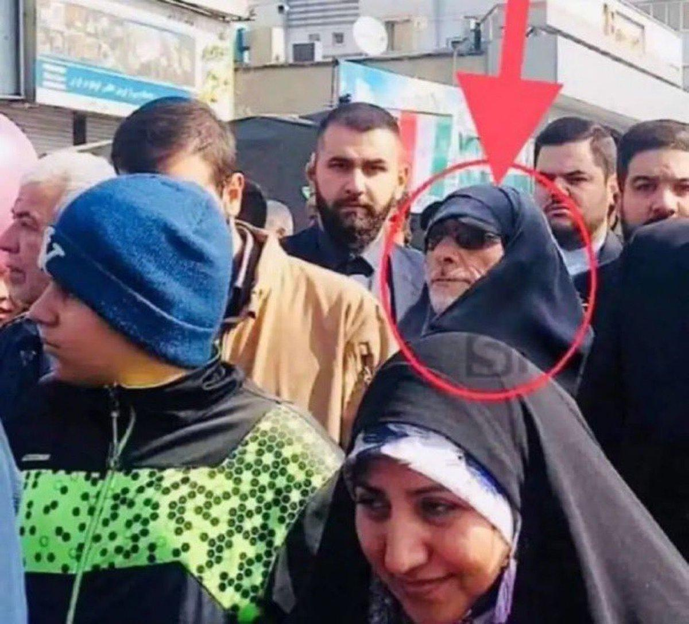
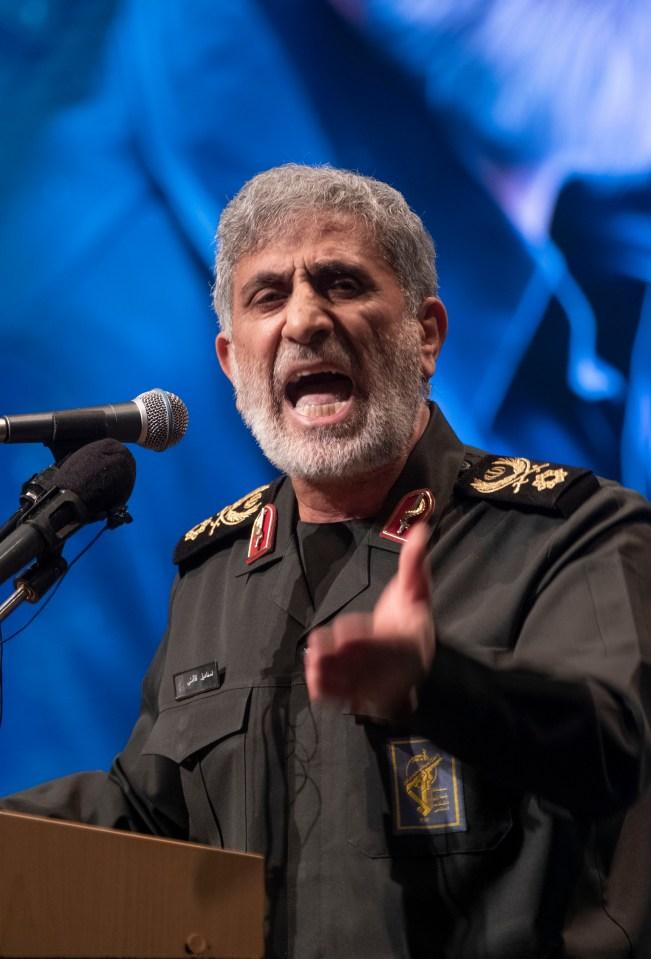
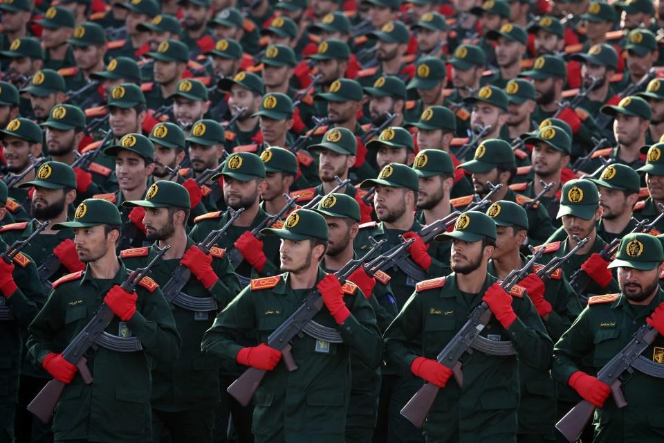
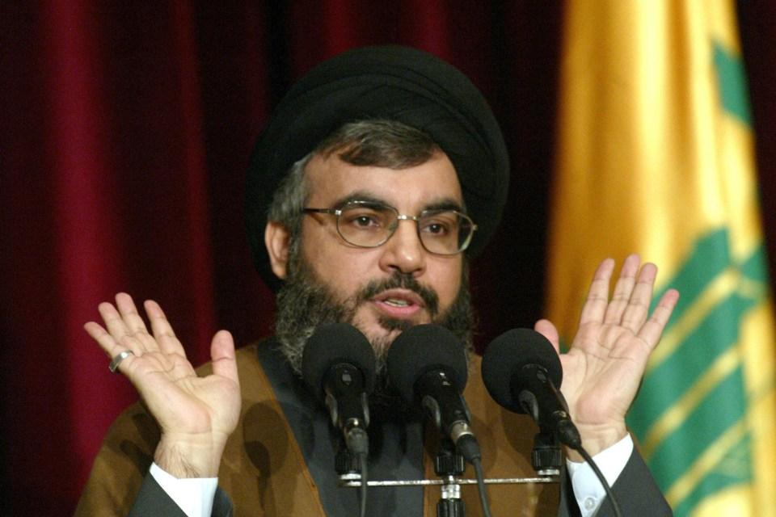

## Claim
Claim: " This is an authentic image of Esmail Qaani, the commander of the Iranian Revolutionary Guards, disguised in a hijab in fear of Israeli bombing."

## Actions
```
reverse_search()
web_search("Esmail Qaani hijab disguise")
```

## Evidence
### Evidence from `reverse_search`
From [Source](https://www.nairaland.com/8460455/commander-ghost-qaanis-great-escape): Found exact image on website with title: "From Commander To Ghost: Qaani's Great Escape?" - Foreign Affairs
Content: The search result is from Nairaland, a Nigerian forum. It discusses an image of Esmail Qaani, commander of the Iranian Revolutionary Guards, in a hijab. The post is titled "From Commander To Ghost: Qaani’s Great Escape?" and suggests that Qaani may have disguised himself to avoid Israeli airstrikes. The post includes an image of Qaani in military attire and another in civilian disguise.  The post references a tweet from @MOSSADil. The forum also contains discussions about the situation, with users sharing opinions and speculations. The date of the post is June 26, 2025.


### Evidence from `web_search`
The Nairaland Forum post discusses a photo of Esmail Qaani in a hijab, which circulated during the Israel-Hezbollah war, suggesting his escape when an attempt was made on his life while in Lebanon. The post was published on June 27. The JFeed article, published on June 25, 2025, discusses rumors that Qaani might be a spy for Israel’s Mossad.

The New Arab reports that Esmail Qaani is in good health and includes a photo of Qaani. <image:k>


## Elaboration
The evidence suggests that the image in the claim is of Esmail Qaani, the commander of the Iranian Revolutionary Guards, wearing a hijab. The image was discussed on the Nairaland forum, which speculated that Qaani was in disguise to avoid Israeli airstrikes. The forum post was published on June 26, 2025.

The web search results also mention rumors about Qaani, including the possibility of him being a spy for Israel's Mossad. However, The New Arab reports that Qaani is in good health.

The evidence does not definitively confirm the claim that the image is authentic and that Qaani was disguised in fear of Israeli bombing. More information is needed to verify the claim.


## Actions
```
web_search("Esmail Qaani disguise Israeli bombing")
```

## Evidence
### Evidence from `web_search`
The Guardian, published on October 10, 2024, discusses the whereabouts of Esmail Ghaani amid reports of Israeli strikes on Hezbollah, including conflicting reports about his health and location. The article includes a photo of Esmail Ghaani in military uniform. ([https://www.theguardian.com/world/2024/oct/10/iran-esmail-ghaani-al-quds-beirut-lebanon-israeli-strikes-hezbollah](https://www.theguardian.com/world/2024/oct/10/iran-esmail-ghaani-al-quds-beirut-lebanon-israeli-strikes-hezbollah)) The Sun, also published on October 10, 2024, discusses the disappearance of Esmail Qaani, suggesting he is suspected of being an Israeli spy and has not been seen since an October 4 strike on a bunker in Beirut. ([https://www.the-sun.com/news/12647293/irans-top-military-chief-a-traitor-esmail-qaani/](https://www.the-sun.com/news/12647293/irans-top-military-chief-a-traitor-esmail-qaani/)) This is Beirut, published on October 5, 2024, reports that Esmail Qaani may have been wounded in a Beirut bombing. ([https://thisisbeirut.com.lb/news/47665/quds-force-commander-esmail-qaani-may-have-been-wounded-in-beirut-bombing-jerusalem-post](https://thisisbeirut.com.lb/news/47665/quds-force-commander-esmail-qaani-may-have-been-wounded-in-beirut-bombing-jerusalem-post))

The Sun article includes images of Qaani in military attire and discusses his role in the Quds Force. , ,  The Guardian article also includes a photo of Qaani. 


## Elaboration
The evidence suggests that Esmail Qaani was the subject of speculation and conflicting reports regarding his whereabouts and health, particularly around October 2024, amid reports of Israeli strikes. The Sun reported his disappearance and the suspicion of him being an Israeli spy. The Guardian also discussed his whereabouts. The claim's assertion that the image is authentic and that Qaani was disguised in a hijab in fear of Israeli bombing is not directly supported by the provided evidence. The evidence does not confirm the authenticity of the image or the reason for the disguise.


## Actions
```
web_search("Esmail Qaani image hijab")
```

## Evidence
### Evidence from `web_search`
The Getty Images search result includes images of Iranian officials, including Esmail Qaani, and veiled women. The NurPhoto search result, published on August 5, 2025, shows an image of an anti-war installation in Tehran related to the Iran-Israel war and the hijab. The IranWire article, published on October 7, 2024, reports that Esmail Qaani was missing after Beirut airstrikes. The article mentions his absence from a ceremony and speculation on social media regarding his disappearance.

The Getty Images result can be found here: [https://www.gettyimages.com/photos/hijab-israel?page=4](https://www.gettyimages.com/photos/hijab-israel?page=4). The NurPhoto result can be found here: [https://www.nurphoto.com/photo/12620398](https://www.nurphoto.com/photo/12620398). The IranWire article can be found here: [https://iranwire.com/en/politics/134733-irans-quds-force-chief-esmail-qaani-missing-after-beirut-airstrikes/](https://iranwire.com/en/politics/134733-irans-quds-force-chief-esmail-qaani-missing-after-beirut-airstrikes/).


## Elaboration
The evidence indicates that Esmail Qaani was the subject of speculation regarding his whereabouts and health, particularly around October 2024, amid reports of Israeli strikes. The IranWire article reported his absence after Beirut airstrikes. The Getty Images search result includes images of Iranian officials and veiled women. The NurPhoto search result shows an image of an anti-war installation in Tehran related to the Iran-Israel war and the hijab. The claim's assertion that the image is authentic and that Qaani was disguised in a hijab in fear of Israeli bombing is not directly supported by the provided evidence.


## Final Judgement
The evidence suggests that the image in the claim is of Esmail Qaani, the commander of the Iranian Revolutionary Guards, wearing a hijab. However, the evidence does not definitively confirm the claim that the image is authentic and that Qaani was disguised in fear of Israeli bombing. The claim is based on speculation and rumors.

`false`

### Verdict: FALSE

### Justification
The claim is not supported by the evidence. While the image is of Esmail Qaani, the commander of the Iranian Revolutionary Guards, wearing a hijab, the provided sources do not confirm that the image is authentic or that he was disguised in fear of Israeli bombing. The evidence points to speculation and rumors surrounding his whereabouts and health, particularly around October 2024, amid reports of Israeli strikes, but does not validate the specific reason for the disguise.
