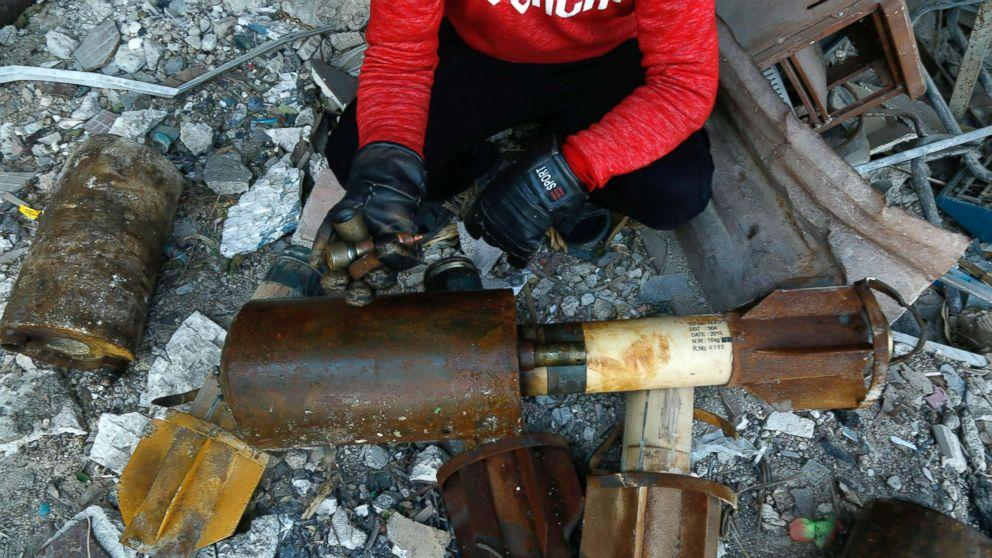
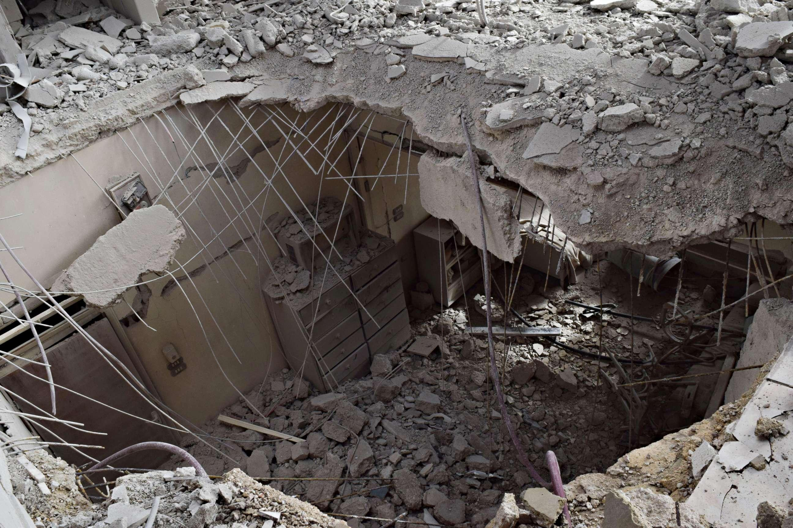

## Claim
Claim: " This image shows a Palestinian girl in the Gaza war in July 2024. She was holding her sister's oxygen mask inside the ambulance. She had already passed away, yet her hand remained on the mask firmly."

## Actions
```
reverse_search()
```

## Evidence
### Evidence from `reverse_search`
The image  appears in a VOA News article from January 24, 2018, about Syria and Russia accusing the U.S. of lying about chemical weapons attacks. The image is of a Syrian girl holding an oxygen mask over the face of an infant at a makeshift hospital following a reported gas attack on January 22, 2018. The image also appears in a report by the Center for Strategic and International Studies (CSIS) discussing emerging trends in chemical weapons usage in the Middle East. An ABC News article from January 23, 2018, also includes the image and discusses the U.S. stance on chemical attacks in Syria.

The ABC News article mentions an apparent chlorine gas attack in east Ghouta, affecting more than 20 civilians, most of them children. The article includes images of destruction in Syria ,  and of Rex Tillerson .


## Elaboration
The image is not from the Gaza war in July 2024. The evidence indicates that the image was taken in Syria in January 2018, following a reported gas attack. The image shows a Syrian girl holding an oxygen mask over an infant.


## Final Judgement
The image is from Syria in January 2018, not the Gaza war in July 2024. The claim misrepresents the origin and context of the image.

`false`

### Verdict: FALSE

### Justification
The image depicts a Syrian girl holding an oxygen mask over an infant, taken in January 2018 following a reported gas attack in Syria, as evidenced by a VOA News article and an ABC News article. The claim incorrectly attributes the image to the Gaza war in July 2024.
