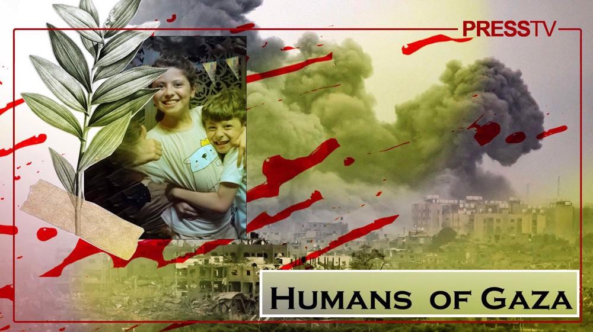
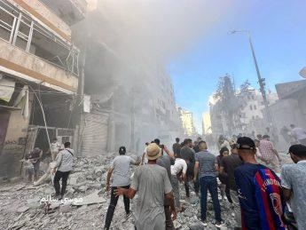
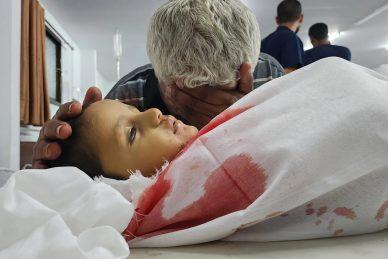

## Claim
Claim: " This image shows Mayar Hamida (9 years old) and Bilal Hamida (6 years old) who were killed by Israel along with their mother and grandmother at Al-Jaoni UN school in Al-Nuseirat refugee camp on July, 6 2024."

## Actions
```
reverse_search()
```

## Evidence
No new evidence found.

## Elaboration
There is no new evidence to verify the claim. Therefore, I cannot assess the veracity of the claim.


## Actions
```
web_search("Mayar Hamida Bilal Hamida Al-Nuseirat refugee camp")
web_search("Mayar Hamida Bilal Hamida killed Israel")
```

## Evidence
### Evidence from `web_search`
The CNN article from July 19, 2024, discusses an Israeli operation in the Nuseirat refugee camp in Gaza on June 8, 2024, where hostages were rescued. The article mentions that over 270 Palestinians were killed in Nuseirat on June 8, according to Gaza health ministry officials. ()

The Wikipedia article discusses the 2024 Nuseirat rescue operation and massacre, which took place on June 8, 2024, in the Nuseirat refugee camp in the Gaza Strip. The operation, conducted by the Israel Defense Forces (IDF), aimed to rescue Israeli hostages. According to the Gaza Health Ministry, at least 276 Palestinians were killed and over 698 injured. (<image:i>)


### Evidence from `web_search`
Al Jazeera reports that at least 16,800 children have been killed in Israeli attacks since October 7, 2023. Press TV published an article on November 25, 2023, stating that Mayar and Bilal Hamida were killed in an Israeli airstrike on October 23, 2023, along with their mother in their home in the Gaza Strip. 

Palinfo.com published an article on November 18, 2023, stating that Mayar and Bilal Hamida, children of Palestine TV correspondent Nidal Hamida, were killed in Israeli airstrikes in October 2023. , 


## Elaboration
The claim states that Mayar and Bilal Hamida were killed on July 6, 2024, at the Al-Jaoni UN school. However, the evidence indicates that Mayar and Bilal Hamida were killed in October 2023, not July 2024, in an Israeli airstrike. The evidence also mentions a separate event on June 8, 2024, in Nuseirat, where many Palestinians were killed.

Therefore, the claim is inaccurate regarding the date of the children's death and the location.


## Final Judgement
The claim is inaccurate because the provided evidence indicates that Mayar and Bilal Hamida were killed in October 2023, not July 6, 2024, as stated in the claim. The claim also incorrectly states that they were killed at the Al-Jaoni UN school.

`false`

### Verdict: FALSE

### Justification
The claim is false. Evidence from multiple sources, including [Press TV](), indicates that Mayar and Bilal Hamida were killed in October 2023, not July 6, 2024, as stated in the claim. Additionally, the claim incorrectly states the location of their death.
