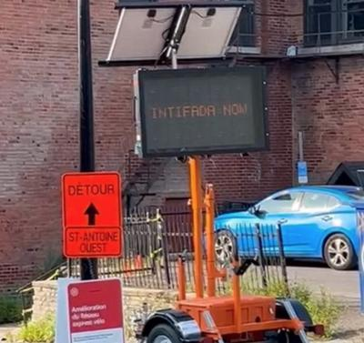

## Claim
Claim: " This image shows a traffic sign in Montreal in July 2024 which displays a 'Free Palestine. Escalate now' message and was authorized by Montreal's Mayor Valérie Plante."

## Actions
```
web_search("Montreal Mayor Valérie Plante Free Palestine sign")
reverse_search()
geolocate()
```

## Evidence
### Evidence from `web_search`
The Suburban published an article about Mayor Valérie Plante being served by bailiff regarding pro-Palestinian electronic signs, which displayed messages like "Free Palestine. Escalate now" . The signs were used in construction areas and criticized for conveying anti-Israel messages. The Maple discusses the City of Montreal's removal of pro-Palestine signs, and the city is facing legal action. The Jerusalem Post published an article about electronic street signs in Montreal displaying "Globalize the intifada". The image  is present in the articles from The Maple and The Jerusalem Post.

The articles can be found at: [https://www.thesuburban.com/news/city_news/plante-served-over-pro-palestinian-electronic-signs/article_e0143fdc-d532-5ecf-9a66-095ad0ee8ab9.html](https://www.thesuburban.com/news/city_news/plante-served-over-pro-palestinian-electronic-signs/article_e0143fdc-d532-5ecf-9a66-095ad0ee8ab9.html), [https://www.readthemaple.com/city-of-montreal-illegally-seized-pro-palestine-signs-activists-allege/](https://www.readthemaple.com/city-of-montreal-illegally-seized-pro-palestine-signs-activists-allege/) and [https://www.jpost.com/diaspora/antisemitism/article-812229](https://www.jpost.com/diaspora/antisemitism/article-812229).


### Evidence from `reverse_search`
The image () shows an electronic traffic sign in Montreal displaying the message "Free Palestine. Escalate now." According to a CBC News article published on July 25, 2024, and a Globe and Mail article published on July 24, 2024, the signs were altered to display pro-Palestinian slogans. The City of Montreal called the incident an act of vandalism, and a group called Clash Mtl claimed responsibility. The original messages were restored.

The CBC News article can be found here: [https://www.cbc.ca/news/canada/montreal/montreal-traffic-signs-pro-palestinian-slogans-1.7274809](https://www.cbc.ca/news/canada/montreal/montreal-traffic-signs-pro-palestinian-slogans-1.7274809). The Globe and Mail article can be found here: [https://www.theglobeandmail.com/canada/article-montreal-traffic-signs-apparently-hacked-to-display-pro-palestinian/](https://www.theglobeandmail.com/canada/article-montreal-traffic-signs-apparently-hacked-to-display-pro-palestinian/).


### Evidence from `geolocate`
The most likely countries where the image was taken are: {'Palestine': 0.85, 'Canada': 0.07, 'Germany': 0.02, 'Austria': 0.01, 'Israel': 0.01, 'Poland': 0.01, 'Slovenia': 0.01, 'South Korea': 0.01, 'Albania': 0.0, 'Andorra': 0.0}

## Elaboration
The evidence confirms that the image shows a traffic sign in Montreal displaying a "Free Palestine" message. The reverse image search and web search results confirm the sign's location and the message displayed. The evidence also indicates that the signs were altered to display pro-Palestinian slogans, which the City of Montreal considered vandalism. The claim that the sign was authorized by Montreal's Mayor Valérie Plante is not supported by the evidence, as the city considered the incident an act of vandalism.


## Final Judgement
The image depicts a traffic sign in Montreal displaying a "Free Palestine" message. The sign was altered to display pro-Palestinian slogans, which the city considered vandalism. The claim that the sign was authorized by Montreal's Mayor Valérie Plante is not supported by the evidence.

`false`

### Verdict: FALSE

### Justification
The image depicts a traffic sign in Montreal displaying a "Free Palestine" message, which was confirmed by reverse image search and web search results. However, the signs were altered to display pro-Palestinian slogans, which the city considered vandalism, and the claim that the sign was authorized by Montreal's Mayor Valérie Plante is not supported by the evidence, as the city considered the incident an act of vandalism.
