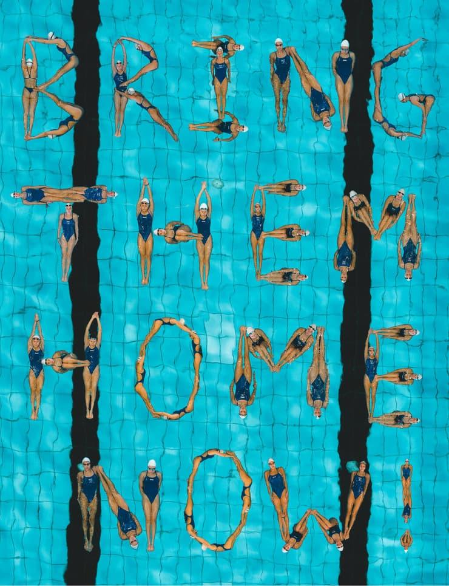

## Claim
Claim: " This image shows the Israeli Olympic team spelling out 'Bring Them Home' at the 2024 Olympic games because they were not allowed to wear their yellow 'Bring Them Home' pins."

## Actions
```
web_search("Israeli Olympic team Bring Them Home")
reverse_search()
```

## Evidence
### Evidence from `web_search`
The image of the Israeli swim team spelling out "Bring Them Home Now" is not from the Olympics, according to multiple sources. One source is a YouTube video from WKYC ([https://www.wkyc.com/video/news/verify/olympics-verify/israel-swim-team-bring-them-home-now-image-not-from-olympics-video/536-9ef735d9-23f4-4928-9611-d6607538e54f](https://www.wkyc.com/video/news/verify/olympics-verify/israel-swim-team-bring-them-home-now-image-not-from-olympics-video/536-9ef735d9-23f4-4928-9611-d6607538e54f)).

Another source, JPost.com, also confirms that the image is not from the Olympics ([https://www.jpost.com/diaspora/article-812636](https://www.jpost.com/diaspora/article-812636)). The image in question is .


## Elaboration
The evidence indicates that the image of the Israeli swim team spelling out "Bring Them Home Now" is not from the Olympics. Both WKYC ([https://www.wkyc.com/video/news/verify/olympics-verify/israel-swim-team-bring-them-home-now-image-not-from-olympics-video/536-9ef735d9-23f4-4928-9611-d6607538e54f](https://www.wkyc.com/video/news/verify/olympics-verify/israel-swim-team-bring-them-home-now-image-not-from-olympics-video/536-9ef735d9-23f4-4928-9611-d6607538e54f)) and JPost.com ([https://www.jpost.com/diaspora/article-812636](https://www.jpost.com/diaspora/article-812636)) confirm this.

The claim states that the image is from the 2024 Olympic games. Since the evidence contradicts this, the claim is false.

The evidence does not provide information about why the team performed this action, nor does it mention anything about pins.


## Final Judgement
The image is not from the Olympics, as confirmed by multiple sources. The claim that the image is from the 2024 Olympic games is demonstrably false.

`false`

### Verdict: FALSE

### Justification
The image of the Israeli swim team spelling out "Bring Them Home Now" is not from the Olympics, according to sources like WKYC ([https://www.wkyc.com/video/news/verify/olympics-verify/israel-swim-team-bring-them-home-now-image-not-from-olympics-video/536-9ef735d9-23f4-4928-9611-d6607538e54f](https://www.wkyc.com/video/news/verify/olympics-verify/israel-swim-team-bring-them-home-now-image-not-from-olympics-video/536-9ef735d9-23f4-4928-9611-d6607538e54f)) and JPost.com ([https://www.jpost.com/diaspora/article-812636](https://www.jpost.com/diaspora/article-812636)). Therefore, the claim that the image is from the 2024 Olympic games is false.
