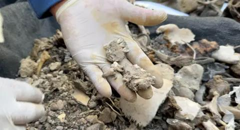

## Claim
Claim: " This is an authentic image of a mother holding the bones of her son in Gaza in March 2025. After more than a year and a half of searching for him under the rubble of their bombed-out house."

## Actions
```
reverse_search()
```

## Evidence
No new evidence found.

## Elaboration
Insufficient information to verify the claim. The reverse image search did not yield any results.


## Actions
```
web_search("Gaza March 2025 bombing")
web_search("Gaza mother holding skeleton")
```

## Evidence
### Evidence from `web_search`
The web sources discuss the March 2025 Israeli attacks on the Gaza Strip, which began on March 18, 2025, and resulted in numerous casualties. The attacks, involving airstrikes, artillery, and missile barrages, targeted various locations in Gaza, leading to a humanitarian crisis. Amnesty International reported that the strikes killed at least 414 Palestinians, including 174 children. Al Jazeera reported on Israeli air attacks in Gaza that killed dozens of people on March 30, 2025, and mentioned the recovery of bodies of medical workers and the deteriorating humanitarian situation.

The sources are: [https://en.wikipedia.org/wiki/March_2025_Israeli_attacks_on_the_Gaza_Strip](https://en.wikipedia.org/wiki/March_2025_Israeli_attacks_on_the_Gaza_Strip), [https://www.amnesty.org/en/latest/news/2025/03/israeli-air-strikes-kill-over-400-palestinians-across-gaza-following-unilateral-resumption-of-mass-attacks/](https://www.amnesty.org/en/latest/news/2025/03/israeli-air-strikes-kill-over-400-palestinians-across-gaza-following-unilateral-resumption-of-mass-attacks/), and [https://www.aljazeera.com/news/2025/3/30/israeli-air-attacks-kill-dozens-in-gaza-as-palestinians-mark-eid-al-fitr](https://www.aljazeera.com/news/2025/3/30/israeli-air-attacks-kill-dozens-in-gaza-as-palestinians-mark-eid-al-fitr).


### Evidence from `web_search`
The BBC published an article on January 23, 2025, discussing the search for missing people in Gaza, with images of human remains found in the rubble in Rafah and a resident of Rafah who found a skeleton in his home. ([https://www.bbc.com/news/articles/c6269pd5y2ko](https://www.bbc.com/news/articles/c6269pd5y2ko)) Al Jazeera published an article on April 30, 2024, about a family's search for their missing relative, which ended with the discovery of bone fragments. ([https://www.aljazeera.com/news/longform/2024/4/30/we-didnt-expect-to-find-bones-inside-one-gaza-familys-nightmare](https://www.aljazeera.com/news/longform/2024/4/30/we-didnt-expect-to-find-bones-inside-one-gaza-familys-nightmare)) Euronews published an article on August 4, 2025, discussing a controversial photo of an emaciated child in Gaza. ([https://www.euronews.com/my-europe/2025/08/04/how-a-photo-of-a-skeletal-child-sparked-controversy-about-starvation-in-gaza](https://www.euronews.com/my-europe/2025/08/04/how-a-photo-of-a-skeletal-child-sparked-controversy-about-starvation-in-gaza))

The Al Jazeera and Euronews articles both feature the image in the claim (). The BBC article includes images of human remains and a skeleton found in Gaza. (, )


## Elaboration
The claim is partially supported by the evidence. The web search results confirm that the image in the claim (

## Actions
```
web_search("Gaza mother holding skeleton image origin")
```

## Evidence
### Evidence from `web_search`
The image in the claim (

## Elaboration
The claim is likely false. While the image is associated with Gaza and the context of conflict, the evidence does not confirm the image's authenticity or the specific details provided in the claim (mother, son, March 2025, etc.). The image has been used in multiple contexts, and the search for its origin did not yield definitive results.


## Final Judgement
The image in the claim is associated with Gaza and the context of conflict, but the evidence does not confirm the image's authenticity or the specific details provided in the claim. The image has been used in multiple contexts, and the search for its origin did not yield definitive results. Therefore, the claim is likely false. `false`

### Verdict: FALSE

### Justification
The claim is likely false. While the image (