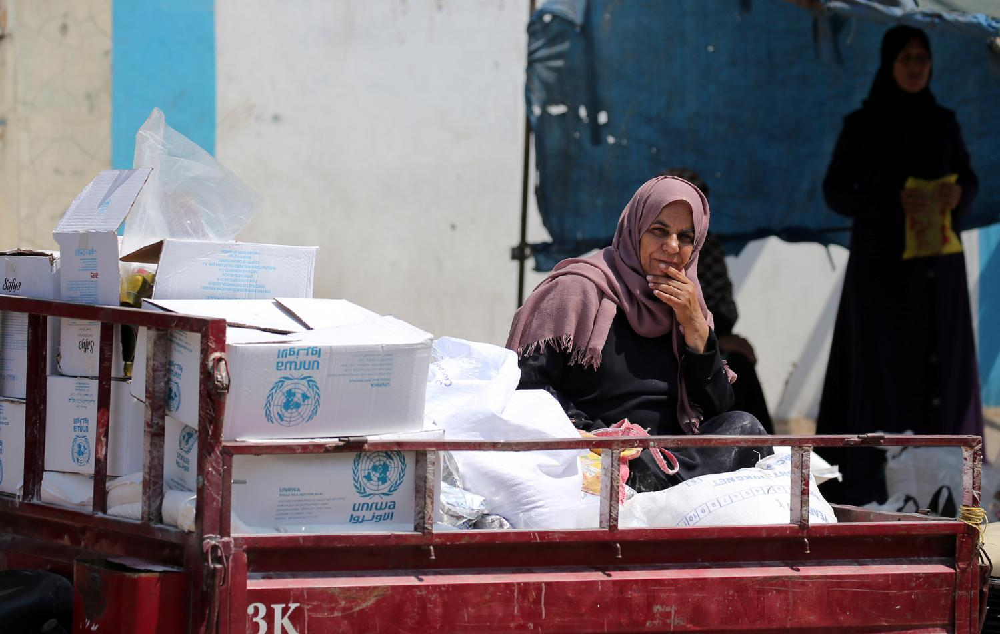

## Claim
Claim: "Trump signed an executive order on January 20, 2025, to halt all funding to UNRWA."

## Actions
```
web_search("Trump executive order UNRWA funding halt")
```

## Evidence
### Evidence from `web_search`
Politico reports that President Donald Trump is expected to issue an executive order to stop UNRWA funding, published on February 3, 2025. ([https://www.politico.com/news/2025/02/03/us-withdraw-un-human-rights-council-trump-00202100](https://www.politico.com/news/2025/02/03/us-withdraw-un-human-rights-council-trump-00202100)) The Hindu reports that on February 4, 2025, Donald Trump ordered a halt to funding for UNRWA. <image:k>

The Brookings Institution published an article on September 7, 2018, discussing Trump's decision to eliminate US funding for UNRWA. ([https://www.brookings.edu/articles/in-one-move-trump-eliminated-us-funding-for-unrwa-and-the-us-role-as-mideast-peacemaker/](https://www.brookings.edu/articles/in-one-move-trump-eliminated-us-funding-for-unrwa-and-the-us-role-as-mideast-peacemaker/)) 


## Elaboration
The evidence suggests that Donald Trump halted UNRWA funding. Politico reports that an executive order to stop UNRWA funding is expected, and The Hindu states that Trump ordered a halt to funding on February 4, 2025. However, the claim specifies the date of the executive order as January 20, 2025, which is not supported by the provided evidence.

The Brookings Institution article from 2018 discusses Trump's decision to eliminate US funding for UNRWA, indicating that this action has occurred previously.

Therefore, the claim is partially inaccurate. While Trump did halt UNRWA funding, the date of the executive order is not consistent with the evidence.


## Final Judgement
The evidence indicates that Trump halted UNRWA funding, but the date specified in the claim (January 20, 2025) is not supported by the provided sources. The evidence suggests the order was issued in February 2025.

`false`


### Verdict: FALSE

### Justification
The claim is inaccurate. While Donald Trump halted UNRWA funding, the date specified in the claim (January 20, 2025) is not supported by the evidence. According to sources like [Politico](https://www.politico.com/news/2025/02/03/us-withdraw-un-human-rights-council-trump-00202100) and The Hindu, the order was issued in February 2025.
