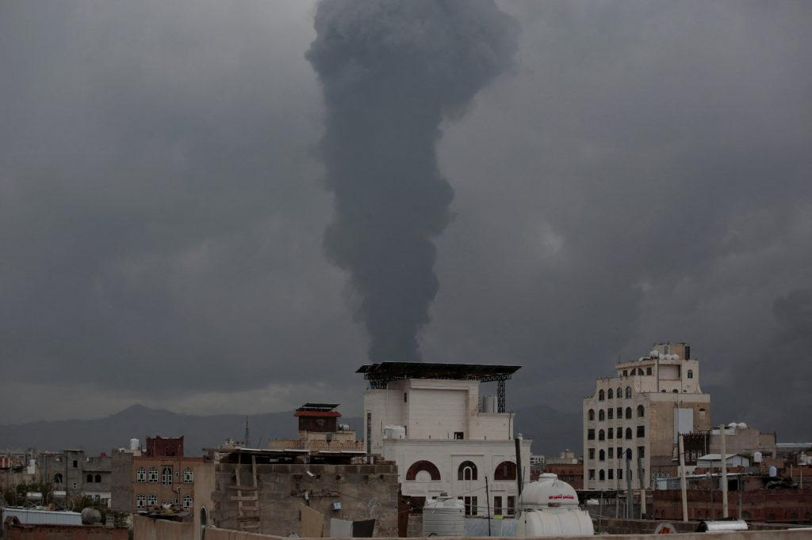

## Claim
Claim: " This image shows the U.S. bombarding Yemen on December 22, 2024 in reprisal after Yemen launched an attack on Israel's capital."

## Actions
```
reverse_search()
web_search("Anadolu images")
```

## Evidence
### Evidence from `reverse_search`
The image 

### Evidence from `web_search`
Anadolu Images ([https://www.anadoluimages.com/](https://www.anadoluimages.com/)) is a platform that hosts photographs and videos. The image in the claim has a "Credit: Anadolu" watermark. The image in the claim is not present in the search result.

Getty Images ([https://www.gettyimages.com/photos/anadolu-agency](https://www.gettyimages.com/photos/anadolu-agency)) contains images from the Anadolu Agency, including images of a burnt car  and a rocket attack , .


## Elaboration
The image in the claim has a "Credit: Anadolu" watermark, indicating that it was taken by the Anadolu Agency. The search results from Anadolu Images did not contain the image. Getty Images hosts images from the Anadolu Agency, but the search results do not include the image in the claim.

The claim states that the image shows the U.S. bombarding Yemen on December 22, 2024. The evidence does not provide any information about the location or the date of the image.

Insufficient information to verify the claim.


## Actions
```
web_search("U.S. bombing Yemen December 22, 2024")
web_search("Israel capital attack December 2024")
```

## Evidence
### Evidence from `web_search`
The Guardian ([https://www.theguardian.com/world/2024/dec/22/us-launches-airstrikes-against-houthi-targets-in-yemen](https://www.theguardian.com/world/2024/dec/22/us-launches-airstrikes-against-houthi-targets-in-yemen)) reported that the U.S. launched airstrikes against Houthi targets in Yemen on December 22, 2024, in response to Houthi attacks. Al Jazeera ([https://www.aljazeera.com/news/2024/12/22/us-army-says-two-navy-pilots-shot-down-over-red-sea-in-friendly-fire](https://www.aljazeera.com/news/2024/12/22/us-army-says-two-navy-pilots-shot-down-over-red-sea-in-friendly-fire)) also reported on December 22, 2024, that the U.S. conducted strikes against Houthi targets in Yemen's capital. Reuters ([https://www.reuters.com/world/us-airstrike-hits-houthi-command-control-facility-yemen-2024-12-16/](https://www.reuters.com/world/us-airstrike-hits-houthi-command-control-facility-yemen-2024-12-16/)) reported a U.S. airstrike on December 16, 2024, against a Houthi command and control facility in Yemen. The Guardian article includes a photograph of a sunken vessel in Hodeida, Yemen, hit by Israeli forces 

### Evidence from `web_search`
The search results indicate that there were Israeli airstrikes in Yemen in December 2024, not U.S. bombings. These strikes occurred on December 19 and 26, 2024, in response to Houthi attacks on Israel. The strikes targeted various locations, including the capital, Sanaa, and multiple ports. The PBS NewsHour reported on Israeli airstrikes hitting Yemen's capital in August 2025, days after Houthi rebels fired a missile toward Israel. The Associated Press also reported on Israeli airstrikes in Yemen on December 26, 2024. , , , , 


## Elaboration
The claim is false. The U.S. did launch airstrikes against Houthi targets in Yemen on December 22, 2024, but the claim states that the U.S. was bombarding Yemen in reprisal after Yemen launched an attack on Israel's capital. The evidence indicates that the U.S. airstrikes were in response to Houthi attacks. Furthermore, the evidence shows that Israel conducted airstrikes in Yemen in December 2024.


## Final Judgement
The claim is demonstrably false. The U.S. did launch airstrikes against Houthi targets in Yemen on December 22, 2024, but the claim misrepresents the reason for the airstrikes. The evidence indicates that the U.S. airstrikes were in response to Houthi attacks, not in reprisal for an attack on Israel's capital. Furthermore, the evidence shows that Israel conducted airstrikes in Yemen in December 2024. `false`

### Verdict: FALSE

### Justification
The claim is false. While the U.S. did conduct airstrikes in Yemen on December 22, 2024, the claim incorrectly states the reason for the strikes. The U.S. strikes were in response to Houthi attacks, not in retaliation for an attack on Israel's capital. Furthermore, Israel also conducted airstrikes in Yemen during December 2024.
