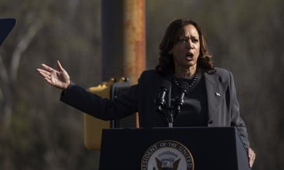

## Claim
Claim: "On July 22, 2024, Vice President Kamala Harris said, 'Our support for Israel will continue' amid Israeli Prime Minister Benjamin Netanyahu’s visit to the United States."

## Actions
```
web_search("Kamala Harris Israel July 22 2024 Netanyahu")
```

## Evidence
### Evidence from `web_search`
On July 22, 2024, CNN reported that Kamala Harris was in Maryland and was expected to underscore a commitment to Israel's defense, while also reiterating concerns about the humanitarian situation in Gaza (<image:k>). The Washington Post reported that Harris declined to preside over the Senate chamber when Benjamin Netanyahu addressed Congress on July 22, 2024. The Guardian published an article on July 23, 2024, discussing Harris's approach to Netanyahu's visit, mentioning that she is likely to engage in public criticism of Netanyahu and focus on the civilian toll in Gaza ().

The articles can be found here: [CNN](https://www.cnn.com/2024/07/22/politics/harris-declined-preside-netanyahu-address), [The Guardian](https://www.theguardian.com/us-news/article/2024/jul/23/as-netanyahu-arrives-in-washington-kamala-harris-treads-a-careful-path-on-israel-and-gaza), and [The Washington Post](https://www.washingtonpost.com/politics/2024/07/22/kamala-harris-bibi-netanyahu-speech-congress/).


## Elaboration
The CNN article states that Kamala Harris was expected to underscore a commitment to Israel's defense on July 22, 2024, which aligns with the claim. However, the evidence does not provide the exact quote.

Therefore, the claim is neither confirmed nor refuted. The exact wording of Harris's statement is missing.


## Actions
```
web_search("Kamala Harris \"Our support for Israel will continue\" July 22 2024")
```

## Evidence
### Evidence from `web_search`
From [Source](https://www.ibtimes.sg/fact-check-did-kamala-harris-say-our-support-israel-will-continue-75435): 
Content: The search result from IBTimes.sg, published on July 26, 2024, fact-checks the claim. It states that no evidence has been found of Harris using the words "Our support for Israel will continue" during Netanyahu's visit or in recent months. The article rates the claim as "False". It also mentions a post on X (Twitter) with the quote, which gained widespread attention. <image:k>, , <image:69778>, <image:59008>.


## Elaboration
The IBTimes.sg fact-check, published on July 26, 2024, states that no evidence supports the claim that Kamala Harris said, "Our support for Israel will continue" during Netanyahu's visit or in recent months. The claim is rated as "False" by the fact-checker.


## Final Judgement
The initial search indicated that Kamala Harris was expected to underscore a commitment to Israel's defense on July 22, 2024, but did not provide the exact quote. A subsequent search revealed a fact-check from IBTimes.sg, which found no evidence of Harris using the exact words "Our support for Israel will continue" during Netanyahu's visit or in recent months, and rated the claim as false.

Based on the fact-check from IBTimes.sg, the claim is demonstrably false. `false`


### Verdict: FALSE

### Justification
The claim is false. A fact-check by IBTimes.sg ([Source](https://www.ibtimes.sg/fact-check-did-kamala-harris-say-our-support-israel-will-continue-75435)) found no evidence that Kamala Harris said, "Our support for Israel will continue" on July 22, 2024, or in recent months.
