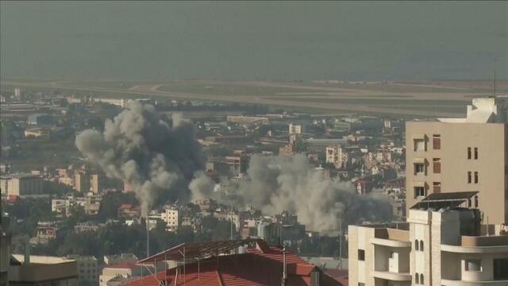
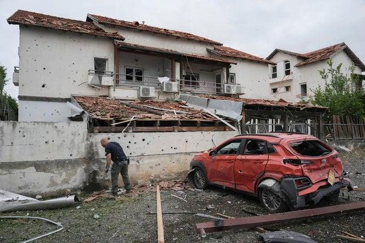
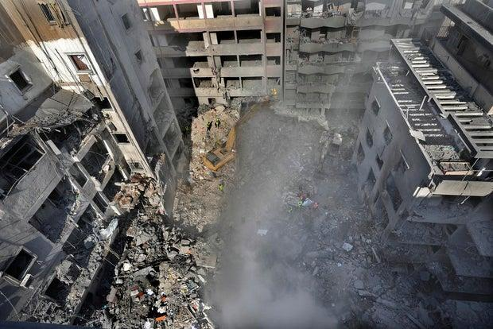

## Claim
Claim: " This image shows an Israeli helicopter shot down by Hezbollah amid clashes in Southern Lebanon on November 23, 2024."

## Actions
```
reverse_search()
web_search("Israeli helicopter Hezbollah Lebanon November 2024")
```

## Evidence
### Evidence from `reverse_search`
The image () appears in articles from The Times of Israel ([https://www.timesofisrael.com/hamas-tried-to-down-an-idf-helicopter-during-fighting-this-month-report/](https://www.timesofisrael.com/hamas-tried-to-down-an-idf-helicopter-during-fighting-this-month-report/)), PesaCheck ([https://pesacheck.org/archive/2024/12/03](https://pesacheck.org/archive/2024/12/03)), and Arab News PK ([https://www.arabnews.pk/node/1472406/middle-east](https://www.arabnews.pk/node/1472406/middle-east)). The Times of Israel article discusses an attempt to down an Israeli helicopter in 2019. PesaCheck states the image's context is missing. The Arab News PK article, updated on March 26, 2019, discusses Israeli strikes on Hamas targets in Gaza and mentions an Israeli helicopter shooting flares.


### Evidence from `web_search`
The web sources discuss the 2024 Israeli invasion of Lebanon, which began on October 1, 2024, and the ongoing conflict between Israel and Hezbollah. One source mentions a ceasefire agreement signed on November 26, 2024, and another discusses a ceasefire on November 27, 2024. The CBS News article mentions the date of November 23, 2024, and includes images of strikes and rocket attacks.

The sources are: [https://en.wikipedia.org/wiki/2024_Israeli_invasion_of_Lebanon](https://en.wikipedia.org/wiki/2024_Israeli_invasion_of_Lebanon), [https://www.cnn.com/world/live-news/israel-hezbollah-ceasefire-deal-gaza-war-11-27-24-intl-hnk](https://www.cnn.com/world/live-news/israel-hezbollah-ceasefire-deal-gaza-war-11-27-24-intl-hnk), and [https://www.cbsnews.com/news/israel-strike-lebanese-soldier-hezbollah-rockets/](https://www.cbsnews.com/news/israel-strike-lebanese-soldier-hezbollah-rockets/). The CBS News article includes images , , .


## Elaboration
The image (

## Final Judgement
The image has been used in different contexts, including a 2019 article about an attempt to down an Israeli helicopter. The web search results discuss the 2024 Israeli invasion of Lebanon and the ongoing conflict between Israel and Hezbollah, with a ceasefire agreement signed on November 26 or 27, 2024. The CBS News article mentions the date of November 23, 2024, and includes images of strikes and rocket attacks.

The claim is likely false because the image's context is misrepresented. The image is not directly related to an Israeli helicopter being shot down by Hezbollah on November 23, 2024, as the image has been used in different contexts. `false`

### Verdict: FALSE

### Justification
The claim is likely false. The image (