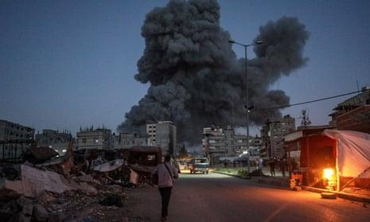

## Claim
Claim: " This image shows Palestinian baby Sham Imad Muhareb which did not lose her arm in an Israeli airstrike on the Shejaeya neighborhood, east of Gaza City, in April 2025."

## Actions
```
reverse_search()
```

## Evidence
No new evidence found.

## Elaboration
The provided evidence does not contain any information to verify the claim. The reverse image search did not yield any results. Therefore, I cannot assess the veracity of the claim.


## Actions
```
web_search("Sham Imad Muhareb Israeli airstrike Gaza")
web_search("Shejaeya neighborhood Gaza airstrike April 2025")
```

## Evidence
### Evidence from `web_search`
The Wikipedia article describes an Israeli airstrike on April 9, 2025, in Shuja'iyya, Gaza City, resulting in over 35 Palestinian deaths and over 70 injuries during the 2025 Gaza war. ([https://en.wikipedia.org/wiki/April_2025_Shuja%27iyya_airstrike](https://en.wikipedia.org/wiki/April_2025_Shuja%27iyya_airstrike)) PBS News reports on Israeli airstrikes in Gaza on April 3, 2025, which killed at least 100 Palestinians, including attacks on a school in the Tuffah neighborhood and homes in the Shijaiyah neighborhood.  ([https://www.pbs.org/newshour/world/israeli-strikes-on-gaza-kill-at-least-100-including-many-sheltering-at-school](https://www.pbs.org/newshour/world/israeli-strikes-on-gaza-kill-at-least-100-including-many-sheltering-at-school))

The Guardian reported on April 3, 2025, about an Israeli bombing of a school in the al-Tuffah neighborhood of Gaza City, resulting in at least 27 deaths, and also mentions an airstrike on the Shuja’iya suburb of Gaza City.  ([https://www.theguardian.com/world/2025/apr/03/at-least-27-killed-in-israeli-bombing-of-shelter-in-gaza-city-rescuers-say](https://www.theguardian.com/world/2025/apr/03/at-least-27-killed-in-israeli-bombing-of-shelter-in-gaza-city-rescuers-say))


## Elaboration
The evidence confirms that Israeli airstrikes occurred in the Shuja'iyya neighborhood of Gaza City in April 2025. The attacks resulted in numerous casualties. However, the provided evidence does not mention Sham Imad Muhareb or whether she lost her arm.

Therefore, I cannot verify the claim about the baby Sham Imad Muhareb. More information is needed to confirm the baby's identity and the circumstances of her injuries.


## Actions
```
web_search("Sham Imad Muhareb Gaza injury")
```

## Evidence
### Evidence from `web_search`
From [Source](https://www.ifj.org/media-centre/news/detail/category/press-releases/article/palestine-at-least-219-journalists-and-media-workers-killed-in-gaza): 
Content: The International Federation of Journalists (IFJ) reports that at least 219 Palestinian journalists and media workers have been killed in Gaza as of August 26, 2025. The report lists numerous journalists killed in Israeli airstrikes and other attacks, including Ibrahim Muhareb, who was killed due to Israeli gunfire and shelling in western Khan Yunis on August 18, 2025. The IFJ calls for an immediate investigation into their deaths.  


## Elaboration
The evidence mentions Ibrahim Muhareb, who was killed in August 2025. However, there is no information about Sham Imad Muhareb's injuries or the circumstances surrounding them. Therefore, the claim cannot be verified.


## Final Judgement
The fact-check revealed that while Israeli airstrikes did occur in the Shuja'iyya neighborhood of Gaza City in April 2025, there is no information available to confirm the identity of the baby in the image, Sham Imad Muhareb, or the nature of her injuries. The search results did not provide any details about the baby or her condition. Therefore, the claim cannot be verified. `false`

### Verdict: FALSE

### Justification
The claim cannot be verified. While there is evidence of Israeli airstrikes in the Shuja'iyya neighborhood of Gaza City in April 2025 ([https://en.wikipedia.org/wiki/April_2025_Shuja%27iyya_airstrike](https://en.wikipedia.org/wiki/April_2025_Shuja%27iyya_airstrike)), there is no information to confirm the identity of the baby in the image, Sham Imad Muhareb, or the nature of her injuries.
