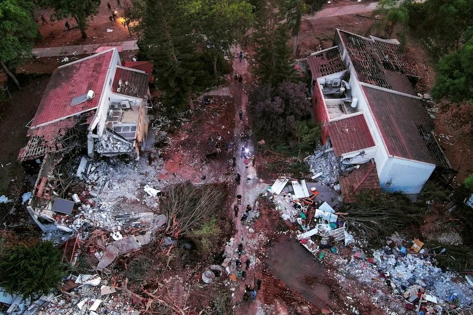
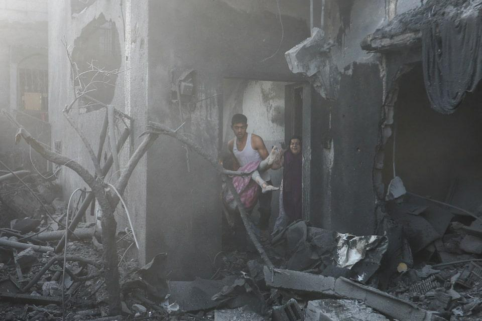
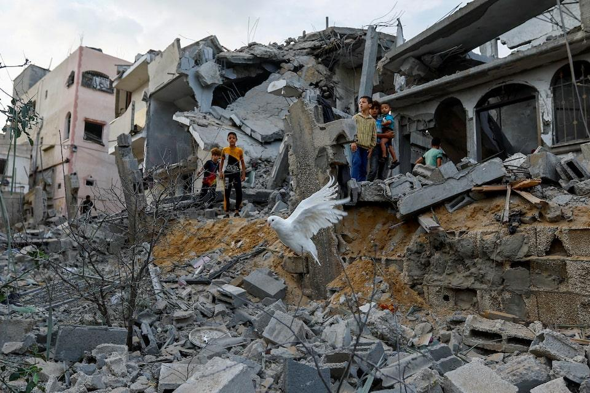
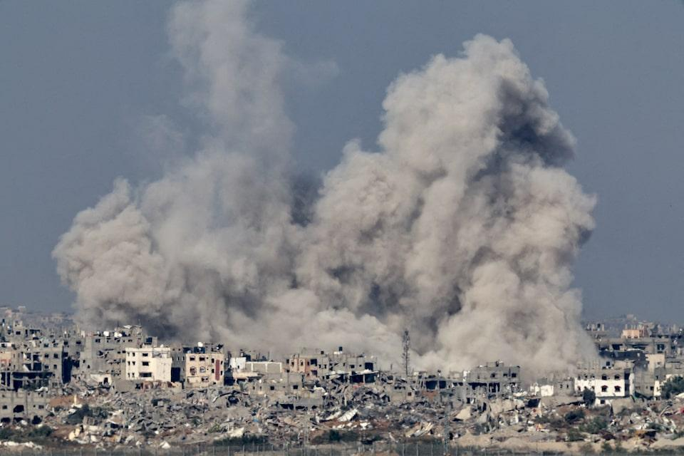
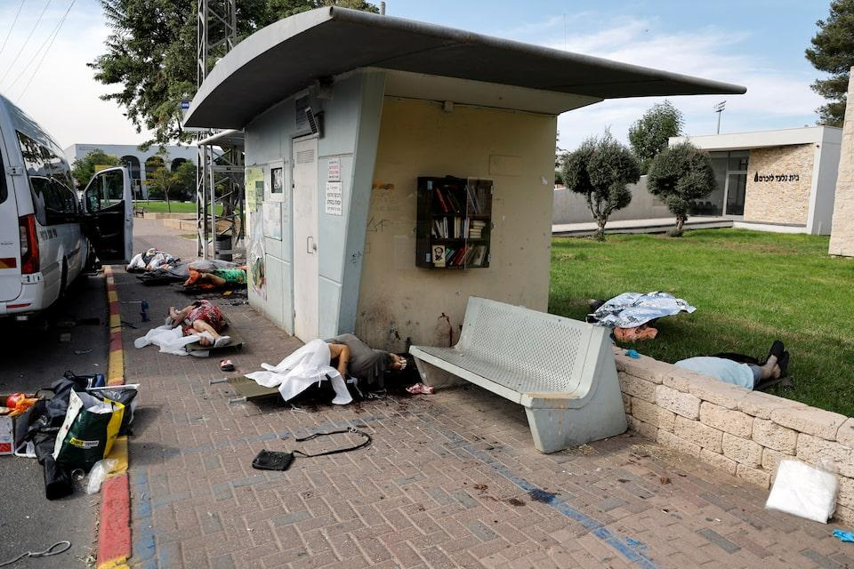
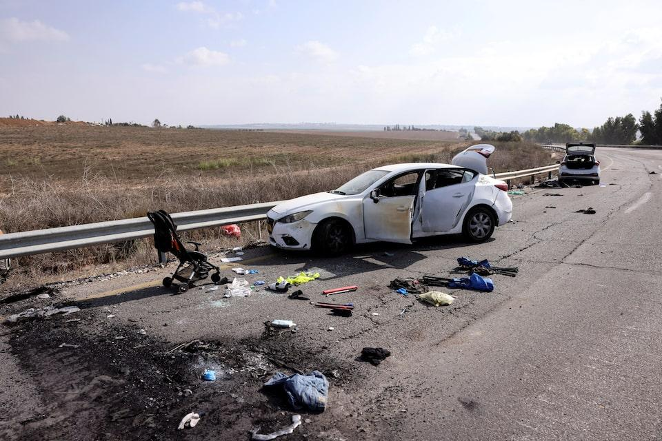
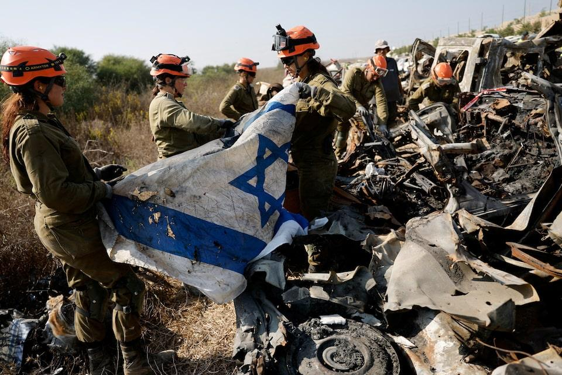
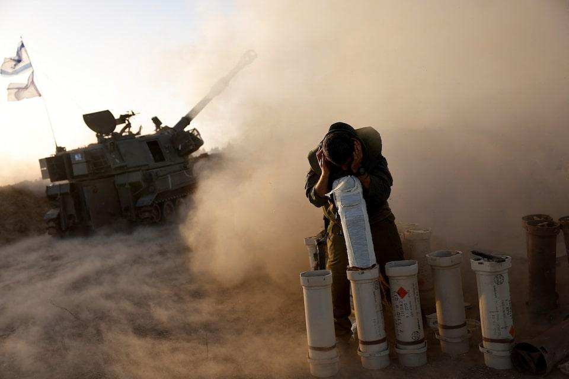

## Claim
Claim: " This image shows an Israeli tank unit near Jabalia camp in northern Gaza that was successfully ambushed by Hamas fighters, destroying multiple vehicles and injuring or killing their crews in October 2024."

## Actions
```
reverse_search()
web_search("Israeli tank Hamas ambush Jabalia October 2024")
```

## Evidence
### Evidence from `reverse_search`
The image 

### Evidence from `web_search`
The BBC reports on heavy fighting in Jabalia, Gaza, where Israeli tanks and troops are conducting a new ground operation. The Israeli military said it killed 20 "terrorists" there, while Hamas said its fighters targeted Israeli forces. The article mentions an Israeli evacuation order on October 6, 2024. ([https://www.bbc.com/news/articles/c30l9r3medzo](https://www.bbc.com/news/articles/c30l9r3medzo))

Al Jazeera reported on October 6, 2024, about an Israeli ground offensive in Jabalia, Gaza, including intense bombardment and tank deployment. ([https://www.aljazeera.com/news/2024/10/6/israel-launches-ground-offensive-on-jabalia-again-killing-17](https://www.aljazeera.com/news/2024/10/6/israel-launches-ground-offensive-on-jabalia-again-killing-17)) Reuters reported on October 8, 2024, that Israeli tanks pushed deeper into Jabalia, and Hamas and Islamic Jihad said fighters attacked Israeli forces with anti-tank rockets. ([https://www.reuters.com/world/middle-east/israeli-tanks-push-deeper-into-jabalia-northern-gaza-residents-say-2024-10-08/](https://www.reuters.com/world/middle-east/israeli-tanks-push-deeper-into-jabalia-northern-gaza-residents-say-2024-10-08/)) The image 

## Elaboration
The evidence confirms that there was heavy fighting involving Israeli tanks and Hamas fighters in Jabalia, Gaza, in October 2024. The BBC and Al Jazeera reported on ground offensives and tank deployments. Reuters reported that Hamas fighters attacked Israeli forces with anti-tank rockets. The image shows a burning tank, which aligns with the reports of fighting.

However, the evidence does not explicitly confirm that the tank in the image was destroyed by Hamas fighters. The reports describe attacks on Israeli forces, but they do not provide details about specific incidents or the destruction of vehicles.

Therefore, while the claim is plausible, it cannot be fully verified based on the available evidence. Additional information is needed to confirm the circumstances surrounding the tank's destruction.


## Actions
```
web_search("Israeli tank destroyed Gaza October 2024")
```

## Evidence
### Evidence from `web_search`
The Guardian ([https://www.theguardian.com/world/2024/oct/13/unifil-israeli-tanks-lebanon-hezbollah-gaza-iran](https://www.theguardian.com/world/2024/oct/13/unifil-israeli-tanks-lebanon-hezbollah-gaza-iran)) reports on Israeli tank movements and ground operations, including fighting in Jabalia, Gaza. The BBC ([https://www.bbc.com/news/articles/cwylekwngz8o](https://www.bbc.com/news/articles/cwylekwngz8o)) mentions Israeli tanks entering a UN base in Lebanon but does not mention any Israeli tanks being destroyed in Gaza in October 2024. CNN ([https://www.cnn.com/world/live-news/israel-war-iran-palestine-lebanon-10-13-24](https://www.cnn.com/world/live-news/israel-war-iran-palestine-lebanon-10-13-24)) reports on a drone attack on an Israeli army base and Israeli strikes in Gaza. The CNN article also includes the image 

## Elaboration
The additional search results still do not provide explicit confirmation that the tank in the image was destroyed by Hamas fighters. While the CNN article includes the image, it does not provide details about the circumstances of the tank's destruction. The Guardian and BBC articles mention fighting and tank movements, but they do not specify any destroyed tanks.

Therefore, the claim remains unverified due to a lack of specific evidence linking the image to a Hamas ambush that destroyed the tank.


## Actions
```
web_search("Hamas attacks Israeli tanks Jabalia October 2024 image")
```

## Evidence
### Evidence from `web_search`
From [Source](https://www.reuters.com/pictures/pictures-one-year-war-israel-gaza-2024-10-04/5JAOXP4LORM63GYM63E3ESAK6M/): 
Content: The Reuters article, published on October 4, 2024, contains images from the Israel-Hamas war. The article includes images of rockets being fired into Israel , damage from Israeli strikes , , , , , and the aftermath of the Hamas attack , , . The article also includes images of Palestinian militants  and Israeli soldiers . The article does not contain the image .


## Elaboration
The Reuters article from October 4, 2024, provides images related to the Israel-Hamas war, including rockets, damage from strikes, and the aftermath of attacks. However, the article does not contain the image of the burning tank (

## Final Judgement
The search results confirm that there was fighting in Jabalia, Gaza, in October 2024, involving Israeli tanks and Hamas fighters. However, the evidence does not explicitly confirm that the tank in the image was destroyed by Hamas fighters. The reports describe attacks on Israeli forces, but they do not provide details about specific incidents or the destruction of vehicles. Therefore, the claim is not fully supported by the available evidence.

`false`

### Verdict: FALSE

### Justification
Based on the evidence, the claim cannot be fully verified. While there was fighting in Jabalia, Gaza, in October 2024, involving Israeli tanks and Hamas fighters, the provided sources do not explicitly confirm that the tank in the image was destroyed by Hamas fighters. The reports describe attacks on Israeli forces, but they do not provide details about specific incidents or the destruction of vehicles.
