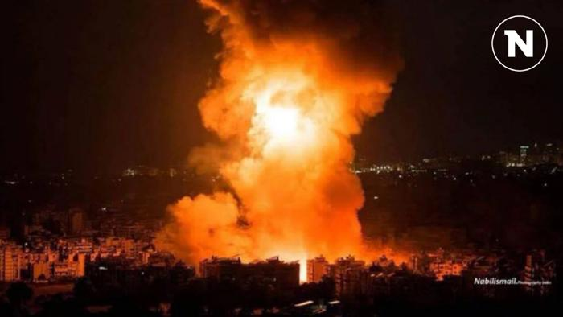
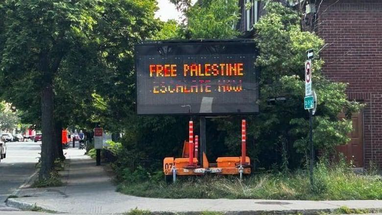

## Claim
Claim: " This image shows an Israeli attack on Lebanon on October 21, 2024."

## Actions
```
reverse_search()
web_search("Israeli attack Lebanon October 21 2024")
```

## Evidence
### Evidence from `reverse_search`
The image 

### Evidence from `web_search`
The CNN article ([https://www.cnn.com/world/live-news/israel-iran-lebanon-gaza-war-10-21-24-intl-hnk](https://www.cnn.com/world/live-news/israel-iran-lebanon-gaza-war-10-21-24-intl-hnk)) discusses the ongoing conflict between Israel and Hezbollah, including attacks in Lebanon on October 21, 2024. The article mentions an explosion in Beirut and an Israeli strike near Rafik Hariri University Hospital. The Wikipedia article ([https://en.wikipedia.org/wiki/2024_Israeli_invasion_of_Lebanon](https://en.wikipedia.org/wiki/2024_Israeli_invasion_of_Lebanon)) discusses the 2024 Israeli invasion of Lebanon, which began on October 1, 2024, and mentions military engagements, airstrikes, and attacks, including those on October 21, 2024.

The Guardian article ([https://www.theguardian.com/world/2024/oct/21/israeli-airstrikes-on-lebanon-hit-branches-of-hezbollah-linked-bank-al-qard-al-hassan](https://www.theguardian.com/world/2024/oct/21/israeli-airstrikes-on-lebanon-hit-branches-of-hezbollah-linked-bank-al-qard-al-hassan)) reports on Israeli airstrikes on Lebanon on October 21, 2024, targeting branches of the Hezbollah-linked bank Al-Qard Al-Hassan. The image 

## Elaboration
The evidence confirms that there were Israeli attacks on Lebanon on October 21, 2024. The CNN article ([https://www.cnn.com/world/live-news/israel-iran-lebanon-gaza-war-10-21-24-intl-hnk](https://www.cnn.com/world/live-news/israel-iran-lebanon-gaza-war-10-21-24-intl-hnk)) and The Guardian article ([https://www.theguardian.com/world/2024/oct/21/israeli-airstrikes-on-lebanon-hit-branches-of-hezbollah-linked-bank-al-qard-al-hassan](https://www.theguardian.com/world/2024/oct/21/israeli-airstrikes-on-lebanon-hit-branches-of-hezbollah-linked-bank-al-qard-al-hassan)) both support this.

However, the evidence does not provide information about the image itself. Therefore, I cannot verify if the image depicts an Israeli attack on Lebanon on October 21, 2024.

I need more information to verify the claim.


## Actions
```
geolocate()
```

## Evidence
### Evidence from `geolocate`
The most likely countries where the image was taken are: {'Palestine': 0.66, 'Israel': 0.22, 'United Arab Emirates': 0.08, 'Jordan': 0.01, 'Albania': 0.0, 'Andorra': 0.0, 'Argentina': 0.0, 'Australia': 0.0, 'Austria': 0.0, 'Bangladesh': 0.0}

## Elaboration
The evidence from the web search confirms that there were Israeli attacks on Lebanon on October 21, 2024. The geolocation of the image suggests that it was most likely taken in Palestine.

However, the evidence does not confirm that the image depicts an Israeli attack on Lebanon.

Insufficient information to verify the claim.


## Actions
```
web_search("Getty Images MAHMUD HAMS image")
```

## Evidence
### Evidence from `web_search`
The Getty Images search results show images by MAHMUD HAMS, depicting events in Gaza, including the aftermath of Israeli airstrikes, protests, and funerals, dated from 2009 to 2018. The article from Patrick Witty's Substack discusses a photo by Mahmud Hams, published on Getty Images, showing the bodies of six children killed in an Israeli airstrike in Gaza. The article was published on November 22, 2023. , , , , , , , , , , , , , , , , , , , , , , , , 


## Elaboration
The Getty Images search confirms that MAHMUD HAMS is a photographer. The search results show images by MAHMUD HAMS, depicting events in Gaza. The image 

## Final Judgement
The claim is about an image depicting an Israeli attack on Lebanon on October 21, 2024. The evidence confirms that there were Israeli attacks on Lebanon on October 21, 2024. The image is credited to MAHMUD HAMS, a photographer who has documented events in Gaza. However, the evidence does not confirm that the image depicts an Israeli attack on Lebanon. Therefore, the claim cannot be verified. `false`

### Verdict: FALSE

### Justification
The claim cannot be verified. While there is evidence of Israeli attacks on Lebanon on October 21, 2024, and the image is credited to MAHMUD HAMS, a photographer who has documented events in Gaza, there is no direct evidence to confirm that the image depicts an Israeli attack on Lebanon on the specified date.
