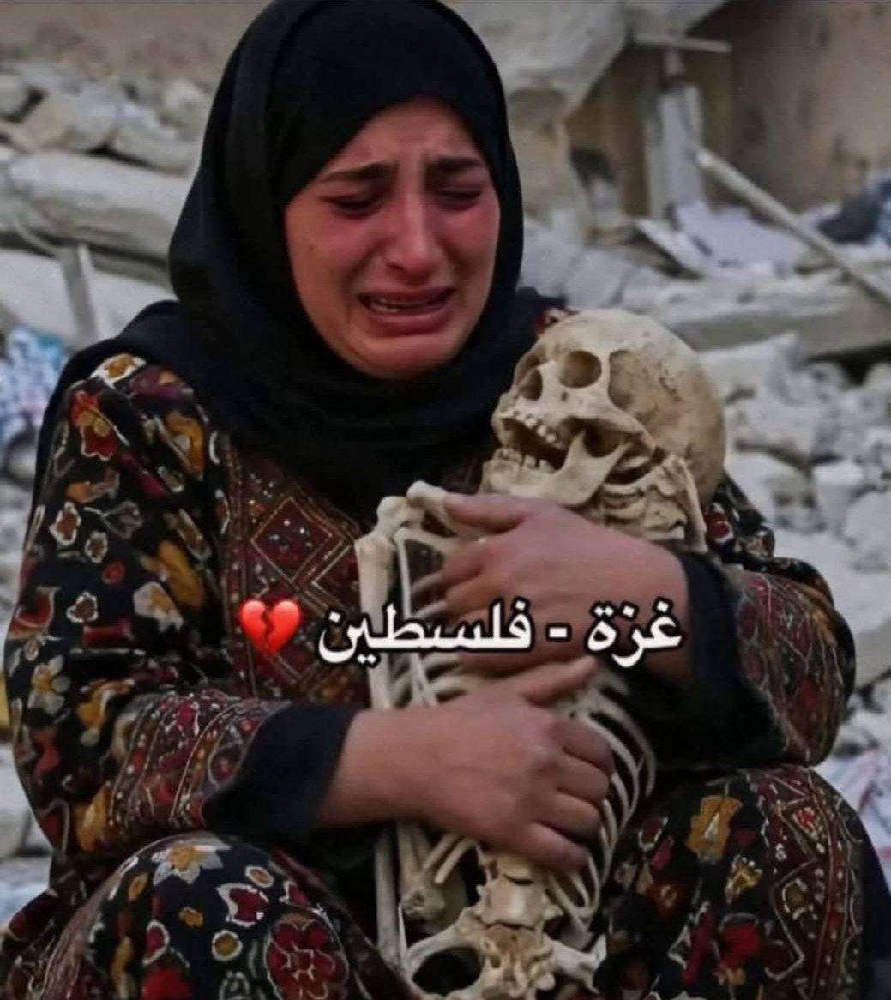

## Claim
Claim: " This image shows a Palestinian woman using an Israeli tank to dry clothes in Gaza in July 2024."

## Actions
```
reverse_search()
```

## Evidence
No new evidence found.

## Elaboration
Insufficient information to verify the claim. The reverse image search did not yield any results.


## Actions
```
web_search("Israeli tank Palestinian woman Gaza")
web_search("tank drying clothes Gaza")
```

## Evidence
### Evidence from `web_search`
The Defense for Children International - Palestine (DCIP) reported that an Israeli tank-fired shell killed a 12-year-old Palestinian girl in a hospital in the southern Gaza Strip on December 17, 2023. ([https://www.dci-palestine.org/israeli_tank_fired_shell_kills_palestinian_girl_in_gaza_hospital](https://www.dci-palestine.org/israeli_tank_fired_shell_kills_palestinian_girl_in_gaza_hospital)) 

ReliefWeb discusses military operations in the occupied Palestinian territory, including raids in Tulkarm and nearby refugee camps in January and February 2025. ([https://reliefweb.int/report/occupied-palestinian-territory/israeli-soldiers-shot-and-killed-pregnant-woman-used-her-relative-human-shield-and-killed-another-woman-when-they-blew-her-front-door](https://reliefweb.int/report/occupied-palestinian-territory/israeli-soldiers-shot-and-killed-pregnant-woman-used-her-relative-human-shield-and-killed-another-woman-when-they-blew-her-front-door)) The New Arab reported that an Israeli tank ran over a Palestinian woman in Gaza City on June 30, 2024. ([https://www.newarab.com/news/israeli-tank-runs-over-woman-gaza-citys-shejaiya-euro-med](https://www.newarab.com/news/israeli-tank-runs-over-woman-gaza-citys-shejaiya-euro-med)) <image:i>


### Evidence from `web_search`
The search results include articles discussing the situation in Gaza. Al Jazeera ([https://www.aljazeera.com/news/2024/11/25/flooding-in-gaza-compounds-hardship-of-people-displaced-by-israeli-attacks](https://www.aljazeera.com/news/2024/11/25/flooding-in-gaza-compounds-hardship-of-people-displaced-by-israeli-attacks)) reports on flooding in Gaza and the displacement of Palestinians, published on November 25, 2024, with . Asharq Al Awsat ([https://english.aawsat.com/features/5082922-desperate-cash-gazans-sell-clothes-plucked-rubble?_wrapper_format=html&page=9](https://english.aawsat.com/features/5082922-desperate-cash-gazans-sell-clothes-plucked-rubble?_wrapper_format=html&page=9)) discusses Gazans selling clothes salvaged from rubble, published on November 18, 2024, with . CNN ([https://www.cnn.com/2024/08/23/middleeast/israel-gaza-water-shortages-heatwave-crisis-intl](https://www.cnn.com/2024/08/23/middleeast/israel-gaza-water-shortages-heatwave-crisis-intl)) reports on water shortages in Gaza during a heatwave, published on August 23, 2024, with <image:0>, , , and .


## Elaboration
The evidence includes reports of Israeli tanks in Gaza and the impact of military operations on Palestinians. Specifically, there are reports of a tank-fired shell killing a child, a tank running over a woman, and general hardship due to conflict. However, there is no information about a Palestinian woman using an Israeli tank to dry clothes.

The claim's specific details, such as the woman using the tank to dry clothes, are not supported by the provided evidence. The evidence does, however, confirm the presence of Israeli tanks in Gaza and the impact of the conflict on the Palestinian population.

Therefore, the claim is not supported by the evidence.


## Actions
```
web_search("tank drying clothes Gaza image")
```

## Evidence
### Evidence from `web_search`
Getty Images has a photo from January 27, 2024, showing a girl hanging clothes to dry near her shelter in Gaza, taken by Saher Alghorra (). The Indian Express published an article on July 6, 2024, with an image of a woman drying clothes in Gaza on July 5, 2024, in a soccer stadium (). Another Getty Images photo from February 11, 2024, shows a woman walking past clothes drying on a car's roof rack in Rafah, Gaza Strip, taken by Mohammed Abed (<image:i>).


## Elaboration
The evidence provides images of people drying clothes in Gaza, but none of them show a woman using an Israeli tank to dry clothes. The search results include images of people drying clothes near shelters, in a soccer stadium, and on a car's roof rack. The claim is not supported by the evidence.


## Final Judgement
The claim is not supported by the evidence. While there are images of people drying clothes in Gaza, none of them show a woman using an Israeli tank to dry clothes. The search results did not yield any images matching the claim. `false`

### Verdict: FALSE

### Justification
The claim is not supported by the evidence. While there are reports of Israeli tanks in Gaza and images of people drying clothes in Gaza, there is no evidence to support the specific claim of a Palestinian woman using an Israeli tank to dry clothes. The reverse image search and web searches did not yield any matching images or information.
