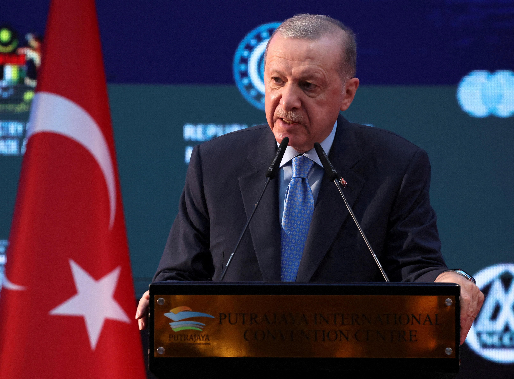

## Claim
Claim: "Turkey's President urged the U.S. in March 2025 to control its ally Israel over its intervention in southern Syria in February 2025."

## Actions
```
web_search("Turkey President US Israel Syria March 2025")
```

## Evidence
### Evidence from `web_search`
The article from Levant24.com, published on August 30, 2025, discusses Turkey's concerns regarding Syria, mentioning that Turkish Foreign Minister Hakan Fidan criticized Israel's involvement in Syria and that Turkish President Recep Erdogan made comments. The article also mentions the US Ambassador to Turkey, Tom Barrack, has adopted a softer tone. () The article from Madamasr.com, published on August 28, 2025, discusses the political situation in Syria, mentioning a meeting between Turkish President Erdogan and Syrian Interim President Sharaa in May 2025. It also mentions that Turkey and Israel held talks in April 2025. The RUSI article discusses the relationship between Turkey and Israel, mentioning that in March 2022, President Isaac Herzog visited Ankara. It also mentions that in March, Israeli airstrikes targeted Syrian air bases. The article also mentions that Turkey announced full export and import restrictions against Israel on May 2, 2024. (<image:k>)

The sources are: [Source](https://levant24.com/news/2025/08/turkey-watchful-as-sdf-delays-implementation-of-march-deal/), [Source](https://www.madamasr.com/en/2025/08/28/feature/politics/the-new-syria-under-israeli-american-construction/), and [Source](https://my.rusi.org/resource/turkey-navigates-an-escalating-israeliran-rivalry.html).


## Elaboration
The evidence indicates that Turkish President Erdogan made comments regarding Israel's involvement in Syria. However, the provided sources do not explicitly state that Erdogan urged the U.S. to control Israel in March 2025. The Levant24.com article mentions that Turkish Foreign Minister Hakan Fidan criticized Israel's involvement, and the Madamasr.com article mentions a meeting between Erdogan and the Syrian Interim President in May 2025.

The RUSI article discusses the relationship between Turkey and Israel, mentioning events in March 2022 and April 2025, but it does not provide information about Erdogan's actions in March 2025.

Therefore, the claim cannot be verified with the available evidence. More information is needed to confirm whether Erdogan urged the U.S. to control Israel in March 2025.


## Actions
```
web_search("Erdogan Israel Syria US March 2025")
```

## Evidence
### Evidence from `web_search`
The JINSA article ([Source](https://jinsa.org/wp-content/uploads/2025/04/Erdogan-Israels-Destruction-2025.pdf)) states that on March 30, 2025, Erdogan called for Israel to be "destroyed and devastated." The Guardian ([Source](https://www.theguardian.com/world/2025/apr/12/erdogan-lambasts-israel-for-undermining-stability-in-syria)) reports that Erdogan lambasted Israel for undermining stability in Syria. Reuters ([Source](https://www.reuters.com/world/erdogan-trump-discuss-ukraine-syria-defence-issues-turkey-says-2025-03-16/)) reports that Erdogan spoke with President Trump on March 16, 2025, discussing Syria, but does not mention Erdogan urging the U.S. to control Israel. , , 


## Elaboration
The evidence indicates that in March 2025, Erdogan made strong statements against Israel, including calling for its destruction. He also discussed Syria with President Trump. However, the evidence does not explicitly state that Erdogan urged the U.S. to control Israel.


## Actions
```
web_search("Erdogan Turkey US Israel Syria March 2025 control")
```

## Evidence
### Evidence from `web_search`
From [Source](https://armenianweekly.com/2025/08/05/syrias-second-civil-war-turkey-and-israels-strategic-contest-for-influence/): 
Content: The Armenian Weekly published an article on August 5, 2025, discussing the strategic contest for influence between Turkey and Israel in Syria. The article mentions that Turkey and Israel are the leading external powers influencing territorial reconfigurations and institutional developments in Syria. It also states that Turkish military forces intervened in northern Syria in March 2025. <image:k>


## Elaboration
The evidence confirms that Turkey and Israel were competing for influence in Syria in March 2025, with Turkish military forces intervening in northern Syria. However, the search results do not provide any information about Erdogan urging the U.S. to control Israel. Therefore, the claim remains unverified.


## Final Judgement
The evidence indicates that in March 2025, Erdogan made strong statements against Israel and discussed Syria with the U.S. However, the search results do not explicitly state that Erdogan urged the U.S. to control Israel. The claim cannot be verified with the available evidence.

`false`


### Verdict: FALSE

### Justification
The available evidence does not support the claim. While Turkish President Erdogan made statements against Israel and discussed Syria with the U.S. in March 2025, there is no evidence to suggest that he urged the U.S. to control Israel. The search results from [JINSA](https://jinsa.org/wp-content/uploads/2025/04/Erdogan-Israels-Destruction-2025.pdf), [The Guardian](https://www.theguardian.com/world/2025/apr/12/erdogan-lambasts-israel-for-undermining-stability-in-syria), and [Reuters](https://www.reuters.com/world/erdogan-trump-discuss-ukraine-syria-defence-issues-turkey-says-2025-03-16/) do not provide any information about Erdogan urging the U.S. to control Israel.
