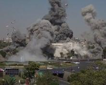
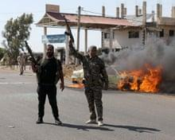

## Claim
Claim: " This image shows Israel bombing the surroundings of Southern Damascus in February 2025, destroying its last remaining army depots."

## Actions
```
reverse_search()
web_search("Israel bombing Damascus February 2025")
```

## Evidence
### Evidence from `reverse_search`
The image () appears in an interview with journalist Mohammad Al-Owaid by Daraa 24, discussing the media landscape in Syria after the fall of the regime. The article does not mention the image. The source is available at [https://daraa24.org/%D8%A7%D9%84%D8%B5%D8%AD%D9%81%D9%8A-%D9%85%D8%AD%D9%85%D8%AF-%D8%A7%D9%84%D8%B9%D9%88%D9%8A%D8%AF-%D9%81%D9%8A-%D9%85%D9%82%D8%A7%D8%A8%D9%84%D8%A9-%D9%85%D8%B9-%D8%AF%D8%B1%D8%B9%D8%A7-24/](https://daraa24.org/%D8%A7%D9%84%D8%B5%D8%AD%D9%81%D9%8A-%D9%85%D8%AD%D9%85%D8%AF-%D8%A7%D9%84%D8%B9%D9%88%D9%8A%D8%AF-%D9%81%D9%8A-%D9%85%D9%82%D8%A7%D8%A8%D9%84%D8%A9-%D9%85%D8%B9-%D8%AF%D8%B1%D8%B9%D8%A7-24/).

The image () is also present in an article from Alghad News, which reports that the Syrian Ministry of Defense revealed details of an Israeli air attack on Damascus on December 2, 2023. The source is available at [https://www.alghad.tv/%D8%A3%D8%AE%D8%A8%D8%A7%D8%B1-%D8%A7%D9%84%D8%BA%D8%AF/news/%D9%88%D8%B2%D8%A7%D8%B1%D8%A9-%D8%A7%D9%84%D8%AF%D9%81%D8%A7%D8%B9-%D8%A7%D9%84%D8%B3%D9%88%D8%B1%D9%8A%D8%A9-%D8%AA%D9%83%D8%B4%D9%81-%D8%AA%D9%81%D8%A7%D8%B5%D9%8A%D9%84-%D8%A7%D9%84%D8%B9%D8%AF%D9%88%D8%A7%D9%86-%D8%A7%D9%84%D8%AC%D9%88%D9%8A-%D8%A7%D9%84%D8%A5%D8%B3%D8%B1%D8%A7%D8%A6%D9%8A%D9%84%D9%8A-%D8%B9%D9%84%D9%89-%D8%AF%D9%85%D8%B4%D9%82](https://www.alghad.tv/%D8%A3%D8%AE%D8%A8%D8%A7%D8%B1-%D8%A7%D9%84%D8%BA%D8%AF/news/%D9%88%D8%B2%D8%A7%D8%B1%D8%A9-%D8%A7%D9%84%D8%AF%D9%81%D8%A7%D8%B9-%D8%A7%D9%84%D8%B3%D9%88%D8%B1%D9%8A%D8%A9-%D8%AA%D9%83%D8%B4%D9%81-%D8%AA%D9%81%D8%A7%D8%B5%D9%8A%D9%84-%D8%A7%D9%84%D8%B9%D8%AF%D9%88%D8%A7%D9%86-%D8%A7%D9%84%D8%AC%D9%88%D9%8A-%D8%A7%D9%84%D8%A5%D8%B3%D8%B1%D8%A7%D8%A6%D9%8A%D9%84%D9%8A-%D8%B9%D9%84%D9%89-%D8%AF%D9%85%D8%B4%D9%82).


### Evidence from `web_search`
According to Wikipedia ([https://en.wikipedia.org/wiki/Israeli_invasion_of_Syria_(2024%E2%80%93present)]), Israel deepened its invasion of southern Syria and conducted airstrikes in Damascus on February 25, 2025. Al Jazeera ([https://www.aljazeera.com/news/2025/2/26/israel-bombs-military-targets-in-southern-syria-outside-damascus]) reports that Israel conducted air raids targeting military bases and command centers in southern Syria and outside Damascus on February 26, 2025, hitting the town of Kiswa and the southern province of Deraa. The Guardian ([https://www.theguardian.com/world/2025/feb/25/israel-strikes-targets-in-southern-syria-after-demanding-demilitarisation]) also reported on Israeli airstrikes on military targets in southern Syria, including Kiswah and Deraa. The Guardian article is more than 5 months old and includes images , , , , . Al Jazeera's article includes an image .


## Elaboration
The claim is partially supported by the evidence. The web search results confirm that Israel conducted airstrikes in southern Syria and Damascus in February 2025. However, the provided image (

## Actions
```
geolocate()
```

## Evidence
### Evidence from `geolocate`
The most likely countries where the image was taken are: {'Bangladesh': 0.07, 'Pakistan': 0.07, 'Taiwan': 0.06, 'Ghana': 0.05, 'Ukraine': 0.05, 'United Arab Emirates': 0.05, 'Nigeria': 0.04, 'Sri Lanka': 0.04, 'India': 0.03, 'Israel': 0.03}

## Elaboration
The geolocation of the image does not support the claim that the image shows Israel bombing the surroundings of Southern Damascus. The most likely countries where the image was taken do not include Syria.


## Final Judgement
The claim is partially supported by the evidence. While there is evidence of Israeli airstrikes in the area and time frame mentioned, the geolocation of the image does not support the claim that the image shows Israel bombing the surroundings of Southern Damascus. Therefore, the claim is not entirely accurate.

`false`

### Verdict: FALSE

### Justification
The claim is partially supported. While there is evidence of Israeli airstrikes in the area and time frame mentioned, the geolocation of the image does not support the claim that the image shows Israel bombing the surroundings of Southern Damascus. The image was also found in an article from Alghad News ([https://www.alghad.tv/%D8%A3%D8%AE%D8%A8%D8%A7%D8%B1-%D8%A7%D9%84%D8%BA%D8%AF/news/%D9%88%D8%B2%D8%A7%D8%B1%D8%A9-%D8%A7%D9%84%D8%AF%D9%81%D8%A7%D8%B9-%D8%A7%D9%84%D8%B3%D9%88%D8%B1%D9%8A%D8%A9-%D8%AA%D9%83%D8%B4%D9%81-%D8%AA%D9%81%D8%A7%D8%B5%D9%8A%D9%84-%D8%A7%D9%84%D8%B9%D8%AF%D9%88%D8%A7%D9%86-%D8%A7%D9%84%D8%AC%D9%88%D9%8A-%D8%A7%D9%84%D8%A5%D8%B3%D8%B1%D8%A7%D8%A6%D9%8A%D9%84%D9%8A-%D8%B9%D9%84%D9%89-%D8%AF%D9%85%D8%B4%D9%82](https://www.alghad.tv/%D8%A3%D8%AE%D8%A8%D8%A7%D8%B1-%D8%A7%D9%84%D8%BA%D8%AF/news/%D9%88%D8%B2%D8%A7%D8%B1%D8%A9-%D8%A7%D9%84%D8%AF%D9%81%D8%A7%D8%B9-%D8%A7%D9%84%D8%B3%D9%88%D8%B1%D9%8A%D8%A9-%D8%AA%D9%83%D8%B4%D9%81-%D8%AA%D9%81%D8%A7%D8%B5%D9%8A%D9%84-%D8%A7%D9%84%D8%B9%D8%AF%D9%88%D8%A7%D9%86-%D8%A7%D9%84%D8%AC%D9%88%D9%8A-%D8%A7%D9%84%D8%A5%D8%B3%D8%B1%D8%A7%D8%A6%D9%8A%D9%84%D9%8A-%D8%B9%D9%84%D9%89-%D8%AF%D9%85%D8%B4%D9%82)) which reports on Israeli air attacks on Damascus.
