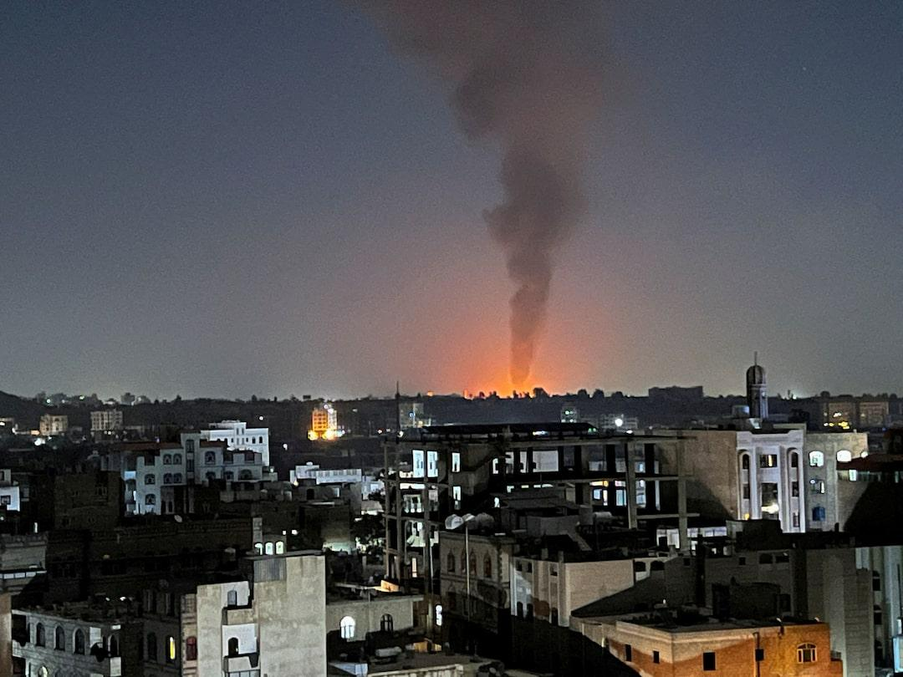

## Claim
Claim: "The Huthi rebels announced the final cessation of their military operations in international waters after Trump won the 2024 US presidential election."

## Actions
```
web_search("Huthi rebels military operations cessation Trump 2024")
```

## Evidence
### Evidence from `web_search`
A Wikipedia article discusses a U.S.-Houthi ceasefire that took effect on May 6, 2025, ending U.S. attacks in Yemen. The Houthis had previously halted attacks on vessels following a Gaza war ceasefire but resumed them after Israel ended the ceasefire in March 2025 (<image:i>). Reuters reports on a ceasefire deal between Yemen's Houthis and the U.S., announced by Trump, which does not include Israel. The Houthis agreed to stop attacks on U.S. vessels ().

The Arab Center for DC published an article on May 21, 2025, discussing the ceasefire deal between the US and the Houthis. The deal, announced by Trump on May 6, 2025, involved the Houthis agreeing not to target American ships in the Red Sea in exchange for the US ceasing attacks. The US military campaign against the Houthis was intensified after the collapse of the Israel-Hamas ceasefire in March 2025 (<image:k>).


## Elaboration
The evidence indicates that a ceasefire agreement between the U.S. and the Houthis was announced by Trump on May 6, 2025. This agreement involved the Houthis ceasing attacks on U.S. vessels in exchange for the U.S. halting attacks. The evidence does not explicitly state that this was the final cessation of all military operations in international waters.

The evidence suggests that the ceasefire was related to attacks on U.S. vessels, not necessarily all military operations. The claim is partially supported, but it lacks the information to confirm the "final cessation" of all military operations.


## Actions
```
reverse_search()
```

## Evidence
### Evidence from `reverse_search`
From [Source](https://www.aljazeera.com/news/2025/5/16/israel-vows-to-kill-houthi-leader-after-striking-yemeni-ports): Found exact image on website with title: Israel launches strikes on two Yemen ports | Houthis News
Content: Al Jazeera published an article on May 16, 2025, reporting on Israeli strikes on Yemeni ports. <image:i>. The strikes were in response to Houthi missile attacks towards Israel, which occurred after a U.S.-Houthi ceasefire deal. The article mentions a ceasefire deal between the U.S. and the Houthis, where the Houthis agreed to end attacks on shipping lanes in the Red Sea. Israel was not included in this agreement.


## Elaboration
The evidence confirms a U.S.-Houthi ceasefire deal announced by Trump, where the Houthis agreed to stop attacking U.S. vessels in the Red Sea. However, the evidence also shows that the Houthis continued military actions, such as missile attacks towards Israel, after the ceasefire. The image search reveals that Israel launched strikes on Yemeni ports in response to these attacks.

The claim is therefore **partially false**. While a ceasefire regarding attacks on U.S. vessels was agreed upon, it did not represent a complete cessation of military operations in international waters, as the Houthis continued other military actions.


## Final Judgement
The fact-check reveals a U.S.-Houthi ceasefire deal announced by Trump in May 2025, where the Houthis agreed to stop attacking U.S. vessels. However, the Houthis continued military actions, such as missile attacks towards Israel, after the ceasefire. The image search confirms that Israel launched strikes on Yemeni ports in response to these attacks.

The claim is partially false because while a ceasefire regarding attacks on U.S. vessels was agreed upon, it did not represent a complete cessation of military operations in international waters, as the Houthis continued other military actions. `false`


### Verdict: FALSE

### Justification
The claim is partially false. While a U.S.-Houthi ceasefire was announced by Trump in May 2025, where the Houthis agreed to stop attacking U.S. vessels, it did not represent a complete cessation of military operations. The Houthis continued other military actions, such as missile attacks towards Israel, after the ceasefire, as reported by [Al Jazeera](https://www.aljazeera.com/news/2025/5/16/israel-vows-to-kill-houthi-leader-after-striking-yemeni-ports).
