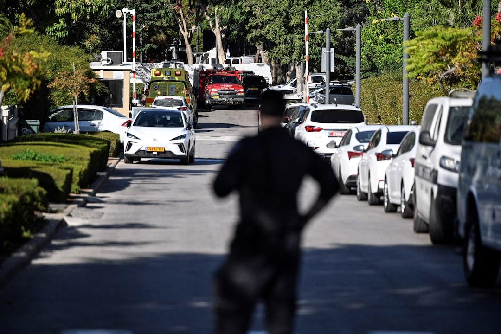

## Claim
Claim: "Netanyahu’s son Yair was killed in a drone attack on October 19, 2024 that targeted the Israeli PM’s home in Caesarea, Israel."

## Actions
```
web_search("Yair Netanyahu drone attack October 19 2024")
web_search("drone attack Caesarea Israel October 19 2024")
```

## Evidence
### Evidence from `web_search`
On October 19, 2024, a drone attack targeted the private residence of Benjamin Netanyahu in Caesarea, Israel, as reported by [Wikipedia](https://en.wikipedia.org/wiki/2024_drone_attack_on_Benjamin_Netanyahu%27s_residence) and [The Times of Israel](https://www.timesofisrael.com/drones-moans-and-groans-hezbollah-attacks-pms-home-petty-politics-continue-unintercepted/). The attack was part of the Israeli–Lebanese conflict and was attributed to Hezbollah. Netanyahu and his wife were not present, and there were no injuries.

[NBC News](https://www.nbcnews.com/news/world/live-blog/live-updates-drone-strike-lebanon-netanyahu-gaza-rcna176216) also reported on the drone strike on October 19, 2024, targeting Netanyahu's house in Caesarea. The Times of Israel article includes a tweet from Benjamin Netanyahu on October 19, 2024, describing the attack as an assassination attempt on "me and my wife." , 


### Evidence from `web_search`
Reuters ([https://www.reuters.com/world/middle-east/drone-launched-netanyahu-home-northern-israel-spokesman-says-2024-10-19/](https://www.reuters.com/world/middle-east/drone-launched-netanyahu-home-northern-israel-spokesman-says-2024-10-19/)) and Al Jazeera ([https://www.aljazeera.com/news/2024/10/19/drone-hits-netanyahus-home-as-hezbollah-rockets-target-northern-israel](https://www.aljazeera.com/news/2024/10/19/drone-hits-netanyahus-home-as-hezbollah-rockets-target-northern-israel)) both reported a drone attack on October 19, 2024, on Benjamin Netanyahu's home in Caesarea, Israel.  

Both articles state that Netanyahu was not present and there were no casualties. The Reuters article mentions the attack was launched from Lebanon, while the Al Jazeera article mentions Hezbollah fired rockets at northern Israel.


## Elaboration
The evidence confirms a drone attack on October 19, 2024, that targeted Benjamin Netanyahu's home in Caesarea, Israel. However, the evidence explicitly states that Netanyahu and his wife were not present during the attack and that there were no injuries.

The evidence does not mention anything about Netanyahu's son, Yair, being killed in the attack.

Therefore, the claim that Yair Netanyahu was killed in the drone attack is not supported by the provided evidence.


## Final Judgement
The fact-check confirms a drone attack on October 19, 2024, on Benjamin Netanyahu's home in Caesarea, Israel. However, the evidence indicates that Netanyahu and his wife were not present and there were no injuries. The evidence does not mention Yair Netanyahu being killed in the attack.

The claim is demonstrably false because the evidence contradicts the assertion that Yair Netanyahu was killed in the drone attack. `false`


### Verdict: FALSE

### Justification
The claim is false. While a drone attack did target Benjamin Netanyahu's home in Caesarea, Israel, on October 19, 2024, as reported by sources like [Wikipedia](https://en.wikipedia.org/wiki/2024_drone_attack_on_Benjamin_Netanyahu%27s_residence) and [The Times of Israel](https://www.timesofisrael.com/drones-moans-and-groans-hezbollah-attacks-pms-home-petty-politics-continue-unintercepted/), the evidence indicates that Netanyahu and his wife were not present and there were no injuries. There is no mention of Yair Netanyahu being killed in the attack.
