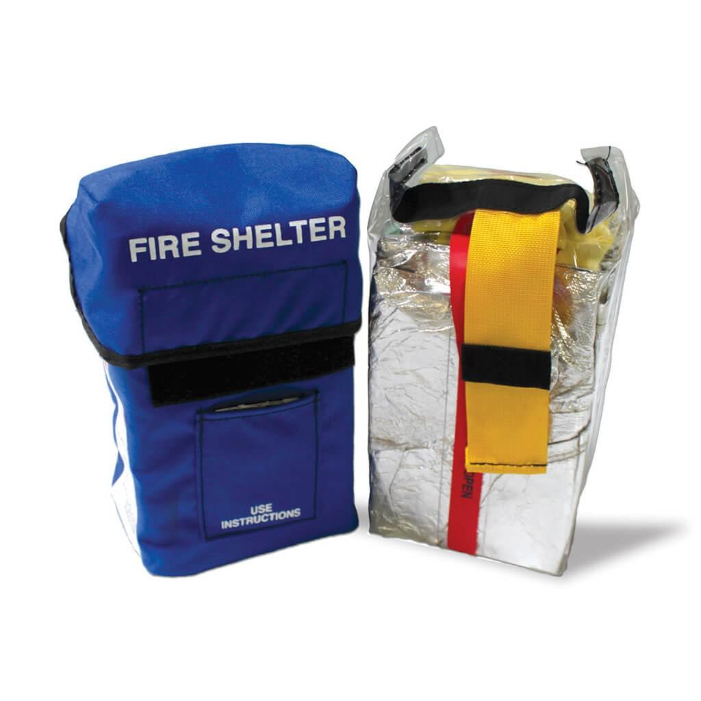
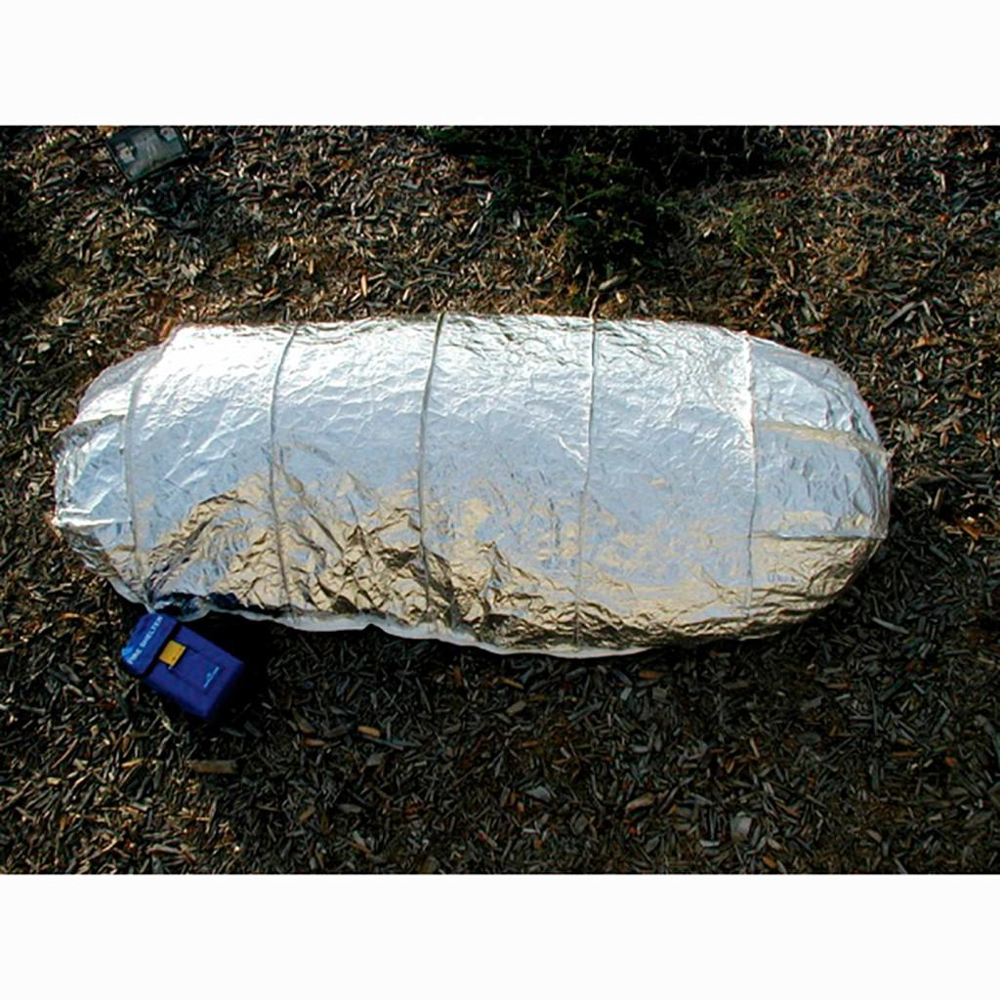
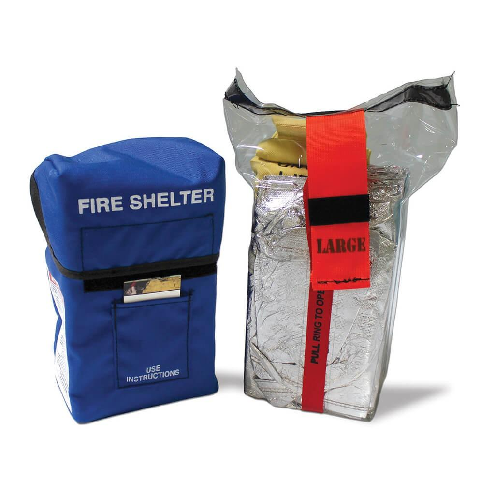
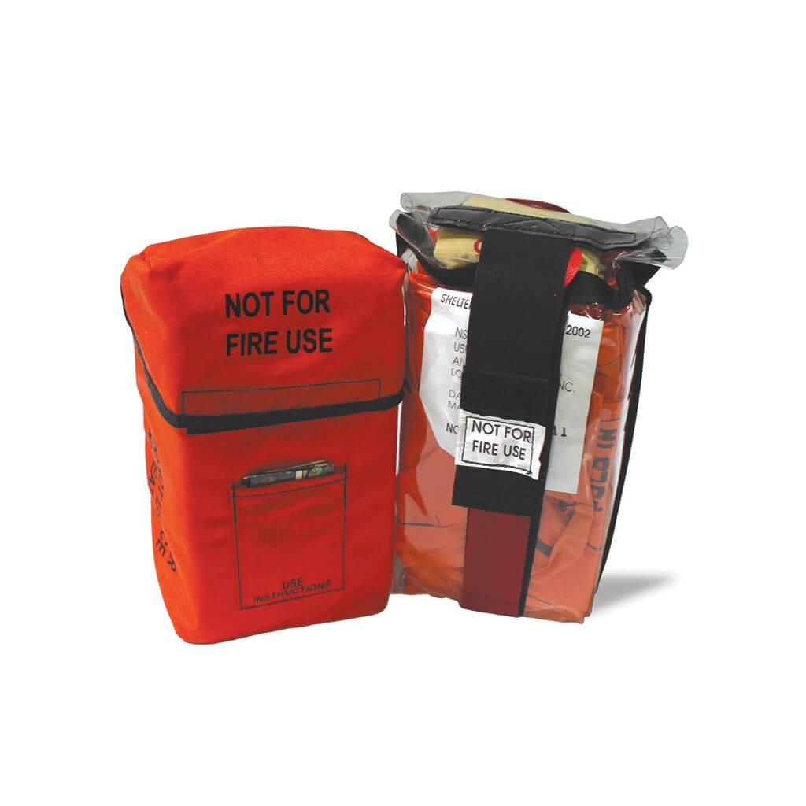

## Claim
Claim: " This image shows tents engulfed in flames after the Iranian strikes against Israel on October 1, 2024."

## Actions
```
reverse_search()
```

## Evidence
### Evidence from `reverse_search`
The image 

## Elaboration
The reverse image search did not yield any results. Therefore, I cannot verify the claim. I need more information to determine the image's origin and context.


## Actions
```
web_search("Iranian strikes against Israel October 1 2024")
```

## Evidence
### Evidence from `web_search`
NPR published an article on October 1, 2024, discussing Iranian strikes against Israel, including images of Israelis taking shelter during a missile barrage 

## Elaboration
The provided evidence includes an article from NPR discussing Iranian strikes against Israel on October 1, 2024. However, the article does not contain the image in the claim. The image search did not yield any results. Therefore, I cannot verify the claim.


## Actions
```
web_search("fire tents")
```

## Evidence
### Evidence from `web_search`
The search results discuss different types of tents and fire shelters. Supply Cache ([https://www.supplycache.com/collections/tents?srsltid=AfmBOorh69B4v-XazNDjIO3zKTna_iqj2otS4pRihT55p9l0xgneZQvM](https://www.supplycache.com/collections/tents?srsltid=AfmBOorh69B4v-XazNDjIO3zKTna_iqj2otS4pRihT55p9l0xgneZQvM)) lists various tents, including fire camp tents. LineGear.com ([https://www.linegear.com/product-category/fire-shelters/?srsltid=AfmBOoqd2HFVsmG5wtsP7feHOu6JkDjwx5G8GPTalNrPHXtnY3Q1Ekwd](https://www.linegear.com/product-category/fire-shelters/?srsltid=AfmBOoqd2HFVsmG5wtsP7feHOu6JkDjwx5G8GPTalNrPHXtnY3Q1Ekwd)) discusses fire shelters, which are portable tent-like coverings for firefighters , , , .

The Wikipedia article ([https://en.wikipedia.org/wiki/Fire_shelter](https://en.wikipedia.org/wiki/Fire_shelter)) discusses fire shelters used by wildland firefighters <image:0>.


## Elaboration
The search results provide information about different types of tents, including fire shelters. However, the evidence does not contain the image in the claim. Therefore, I cannot verify the claim.


## Final Judgement
The image search and web searches did not yield any results to verify the claim. The evidence includes an article from NPR discussing Iranian strikes against Israel on October 1, 2024, but it does not contain the image in the claim. Therefore, I cannot verify the claim.

`false`

### Verdict: FALSE

### Justification
The claim cannot be verified. Reverse image search and web searches did not yield any results to confirm the image's origin or context. While there is evidence of Iranian strikes against Israel on October 1, 2024, as reported by NPR ([https://www.npr.org/](https://www.npr.org/)), the provided image is not present in the available sources.
