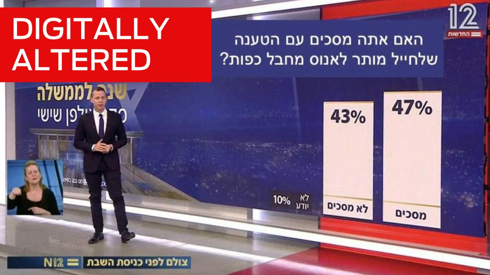
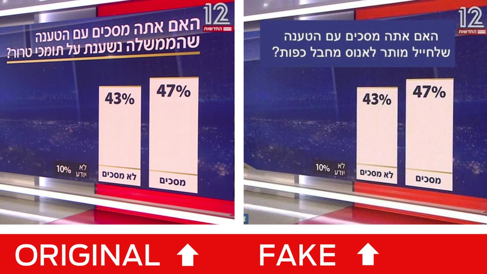

## Claim
Claim: " The image shows a screenshot of an authentic question from Israel's Channel 12 public opinion poll: 'Do you agree with the claim that a solder is allowed to rape a prisoner with his hands tied?'"

## Actions
```
web_search("Channel 12 Israel public opinion poll rape prisoner")
reverse_search()
```

## Evidence
### Evidence from `web_search`
The image in the claim is a doctored version of a poll from Israel's Channel 12 (). The original poll, which aired on May 27, 2022, asked about the government's reliance on supporters of terrorism. The altered image replaced the original question with "Do you agree that a soldier is allowed to rape a prisoner with his hands tied?". Channel 12 stated that they did not broadcast the poll.

The National Desk (TND) also reports that the image is a doctored version of a 2022 Channel 12 poll. Mondoweiss.net discusses a poll showing that 65% of Israeli Jews oppose criminal prosecution for soldiers suspected of raping Palestinian detainees. The article references a Channel 12 report.


### Evidence from `reverse_search`
The image in the claim appears on the Times of Israel website, which discusses a Channel 12 election poll ([https://www.timesofisrael.com/liveblog_entry/channel-12-poll-shows-liberman-still-holds-the-key-to-netanyahus-next-coalition/](https://www.timesofisrael.com/liveblog_entry/channel-12-poll-shows-liberman-still-holds-the-key-to-netanyahus-next-coalition/)). AAP FactCheck states that the image has been digitally manipulated ([https://www.aap.com.au/factcheck/digital-manipulation-distorts-israeli-tv-poll/](https://www.aap.com.au/factcheck/digital-manipulation-distorts-israeli-tv-poll/)). The original image is from a News 12 broadcast in May 2022. The original question was: "Do you agree with the claim that the government relies on terrorist supporters?". The manipulated image includes the question: "Do you agree with the claim that a soldier is allowed to rape a prisoner with his hands tied?". The image also appears on Haaretz ([https://www.haaretz.com/ty-tag/yigal-amir-0000017f-da25-d718-a5ff-faa5f9030000](https://www.haaretz.com/ty-tag/yigal-amir-0000017f-da25-d718-a5ff-faa5f9030000)).    


## Elaboration
The claim is false. The image is a doctored version of a poll from Israel's Channel 12. The original poll, which aired on May 27, 2022, asked about the government's reliance on supporters of terrorism. The altered image replaced the original question with "Do you agree that a soldier is allowed to rape a prisoner with his hands tied?". Channel 12 did not broadcast the poll.


## Final Judgement
The claim is demonstrably false. The image is a manipulated version of a poll from Channel 12. The original poll's question was replaced with a fabricated one. `false`

### Verdict: FALSE

### Justification
The image presented in the claim is a digitally altered version of a poll from Israel's Channel 12. The original poll, which aired on May 27, 2022, addressed the government's reliance on supporters of terrorism, but the image was manipulated to include a fabricated question about soldiers and rape, as confirmed by multiple sources, including the [AAP FactCheck](https://www.aap.com.au/factcheck/digital-manipulation-distorts-israeli-tv-poll/).
