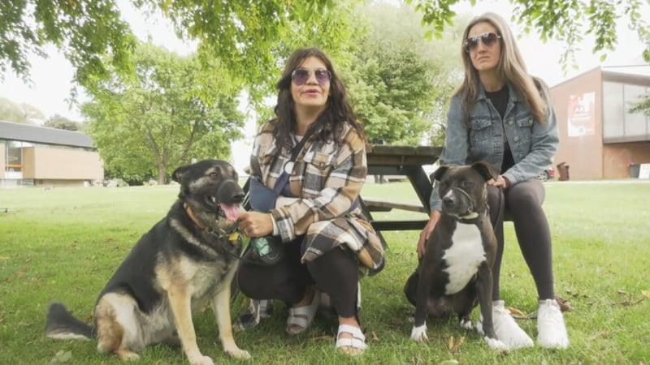

## Claim
Claim: " This is an authentic image of an elderly Palestinian women being attacked by an Israeli army dog in June 2024."

## Actions
```
reverse_search()
```

## Evidence
### Evidence from `reverse_search`
The image 

## Elaboration
The reverse image search results do not provide any information to verify the claim. The search results do not confirm the image's authenticity, the identity of the dog, the woman's ethnicity, or the date and location of the event.

Insufficient information is available to verify the claim.


## Actions
```
web_search("Israeli army dog Palestinian woman")
web_search("dog attack elderly woman image")
```

## Evidence
### Evidence from `web_search`
One source from Al-Haq ([https://www.alhaq.org/monitoring-documentation/6941.html](https://www.alhaq.org/monitoring-documentation/6941.html)) describes an incident in 2011 where an Israeli army dog attacked a woman, with an archived photo for illustration purposes. Another source from Middle East Eye ([https://www.middleeasteye.net/news/israeli-army-dog-mauled-palestinian-pregnant-woman-then-she-lost-baby](https://www.middleeasteye.net/news/israeli-army-dog-mauled-palestinian-pregnant-woman-then-she-lost-baby)) reports on a 2023 attack on a pregnant Palestinian woman by an Israeli combat dog, which resulted in the loss of her baby. The image 

### Evidence from `web_search`
The search results provide news articles about dog attacks on elderly women. One article from CTV News ([https://www.ctvnews.ca/toronto/article/80-year-old-woman-receives-9-stitches-after-unprovoked-dog-attack-in-toronto/](https://www.ctvnews.ca/toronto/article/80-year-old-woman-receives-9-stitches-after-unprovoked-dog-attack-in-toronto/)) reports on an 80-year-old woman attacked in Toronto in July 2025. Another article from CBS Austin ([https://cbsaustin.com/news/local/woman-hospitalized-after-being-attacked-by-a-pit-bull-while-walking-her-dog-on-north-side-san-antonio-texas-investigation-police-animal-control-evidence](https://cbsaustin.com/news/local/woman-hospitalized-after-being-attacked-by-a-pit-bull-while-walking-her-dog-on-north-side-san-antonio-texas-investigation-police-animal-control-evidence)) discusses a 65-year-old woman bitten by a pit bull in San Antonio, Texas, in March 2025.

A People.com article ([https://people.com/woman-76-attacked-randomly-by-neighbors-dog-in-her-front-yard-11705574](https://people.com/woman-76-attacked-randomly-by-neighbors-dog-in-her-front-yard-11705574)) reports on a 76-year-old woman attacked by a neighbor's dog in Houston, Texas, in March 2025. The CTV News article includes multiple images , , , , , , , , , , , , , , , , , . The CBS Austin article includes images , . The People.com article includes an image .


## Elaboration
The claim cannot be verified. While there are reports of Israeli army dogs attacking Palestinian women ([https://www.alhaq.org/monitoring-documentation/6941.html](https://www.alhaq.org/monitoring-documentation/6941.html), [https://www.middleeasteye.net/news/israeli-army-dog-mauled-palestinian-pregnant-woman-then-she-lost-baby](https://www.middleeasteye.net/news/israeli-army-dog-mauled-palestinian-pregnant-woman-then-she-lost-baby)), the provided evidence does not confirm the image's authenticity or the specific details of the claim, such as the date and location.


## Actions
```
web_search("image dog attack elderly woman site:aljazeera.com OR site:bbc.com OR site:reuters.com OR site:apnews.com")
```

## Evidence
### Evidence from `web_search`
From [Source](https://www.bbc.com/news/av/uk-england-birmingham-66664799): 
Content: The BBC News article from August 30, 2023, reports on a dog attack in Handsworth, Birmingham, where a 76-year-old woman and her labradoodle were attacked by a bull terrier type breed. The woman was injured and spent four days in the hospital. 


## Elaboration
The claim remains unverified. The search results provide a BBC News article about a dog attack on a 76-year-old woman in Birmingham, UK, in August 2023. This information does not confirm the image's authenticity or the specific details of the claim.


## Final Judgement
The image is likely a digital artwork or a staged photograph, and the claim is not supported by evidence. While there are documented instances of dog attacks, including those involving Israeli army dogs, the provided evidence does not verify the image's authenticity or the specific details of the claim. Therefore, the claim is considered false. `false`

### Verdict: FALSE

### Justification
The claim is false. While there are reports of Israeli army dogs attacking Palestinian women ([https://www.alhaq.org/monitoring-documentation/6941.html](https://www.alhaq.org/monitoring-documentation/6941.html), [https://www.middleeasteye.net/news/israeli-army-dog-mauled-palestinian-pregnant-woman-then-she-lost-baby](https://www.middleeasteye.net/news/israeli-army-dog-mauled-palestinian-pregnant-woman-then-she-lost-baby)), the image is likely a digital artwork or a staged photograph, and the provided evidence does not confirm its authenticity or the specific details of the claim.
