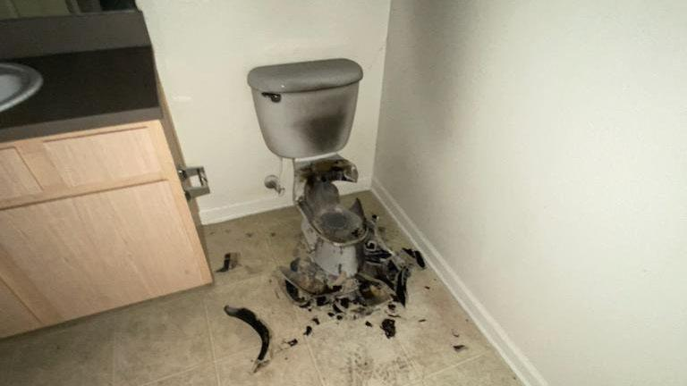
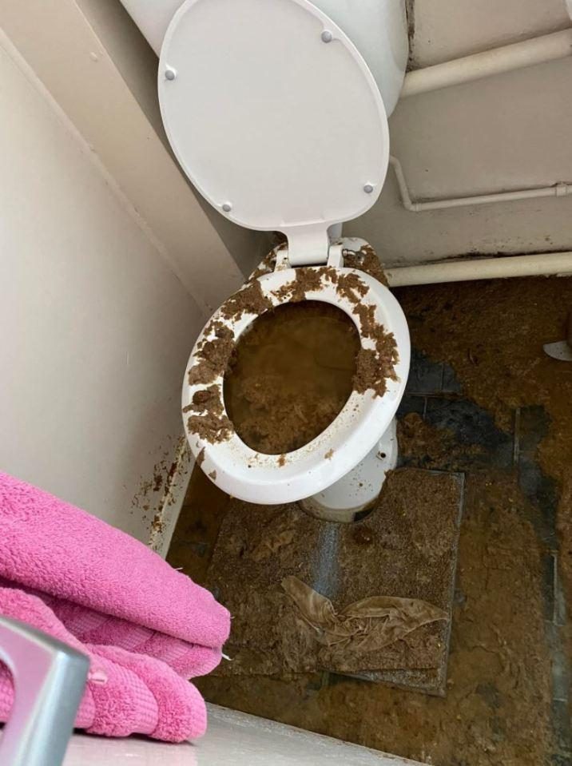

## Claim
Claim: " This image shows the aftermath of an explosion of a Hezbollah pager in Lebanon in September 2024."

## Actions
```
image_search("exploded toilet")
image_search("toilet explosion damage")
```

## Evidence
### Evidence from `image_search`
The search results include images of exploded toilets. One image is from [localsyr.com](https://www.localsyr.com/news/national/mystery-of-exploding-toilet-at-texas-dental-office/) . Another image is from [Fox 5 San Diego](https://fox5sandiego.com/news/trending/lightning-blows-up-toilet-after-traveling-through-apartment-buildings-exhaust-vent/) . The Sun also published an article about a toilet explosion .


### Evidence from `image_search`
From [Source](https://factly.in/an-old-image-from-2020-of-a-damaged-toilet-in-hong-kong-is-falsely-shared-as-a-recent-hezbollah-incident-in-lebanon/): 
Content: The image  shows a damaged toilet. The source claims the image is old and from 2020.


## Elaboration
The image in the claim shows a damaged toilet. The evidence from the image search reveals that the image is old and from 2020. The source states that the image is falsely shared as a recent Hezbollah incident in Lebanon.

Therefore, the claim is false.


## Final Judgement
The image shows a damaged toilet, but the evidence indicates that the image is old and not related to a recent Hezbollah incident in Lebanon. The image was taken out of context and misrepresented. `false`

### Verdict: FALSE

### Justification
The image in the claim depicts a damaged toilet, but the evidence from a fact-checking source ([Source](https://factly.in/an-old-image-from-2020-of-a-damaged-toilet-in-hong-kong-is-falsely-shared-as-a-recent-hezbollah-incident-in-lebanon/)) indicates that the image is old and unrelated to the alleged event.
