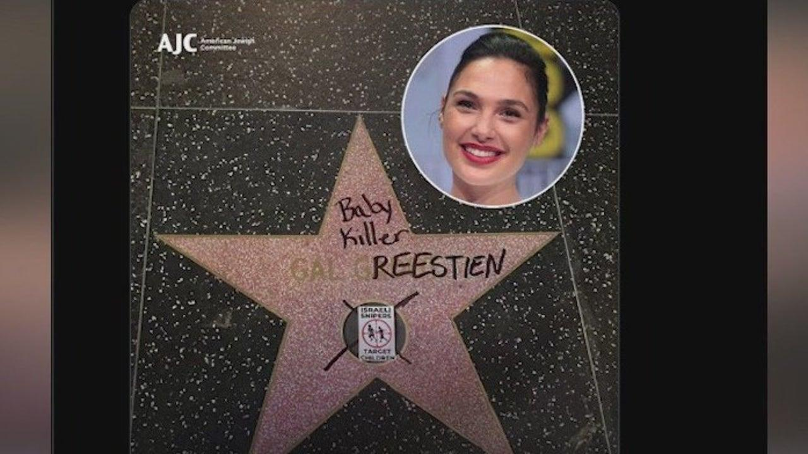

## Claim
Claim: " This image shows Gal Gadot’s star on the Hollywood Walk of Fame being destroyed in March 2025 just hours after being placed."

## Actions
```
image_search("Gal Gadot star Hollywood Walk of Fame vandalism")
web_search("Gal Gadot Hollywood Walk of Fame star")
```

## Evidence
### Evidence from `image_search`
The NDTV source contains an image of a vandalized star on the Hollywood Walk of Fame.  The Fox 11 Los Angeles source shows an image of Gal Gadot's star on the Hollywood Walk of Fame with the words "Baby Killer" written on it. 

The Telegraph source contains no content.


### Evidence from `web_search`
The Los Angeles Times ([https://www.latimes.com/entertainment-arts/story/2025-03-18/gal-gadot-walk-of-fame-pro-palestine-pro-israel-protesters-snow-white](https://www.latimes.com/entertainment-arts/story/2025-03-18/gal-gadot-walk-of-fame-pro-palestine-pro-israel-protesters-snow-white)) and Entertainment Weekly ([https://ew.com/fact-check-was-gal-gadot-s-hollywood-star-destroyed-11700747?srsltid=AfmBOop90p4riItENYAoYHyIWv-yrIB5GIgeKGqAsLTSAZq-VEQRVwTS](https://ew.com/fact-check-was-gal-gadot-s-hollywood-star-destroyed-11700747?srsltid=AfmBOop90p4riItENYAoYHyIWv-yrIB5GIgeKGqAsLTSAZq-VEQRVwTS)) reported on Gal Gadot's Hollywood Walk of Fame ceremony on March 18, 2025, which was disrupted by protesters. The Los Angeles Times article includes a photo of the aftermath of vandalism, and Entertainment Weekly mentions a viral post depicting a vandalized star, but it is unclear if the images are original or manipulated.

Fox LA ([https://www.foxla.com/news/gal-gadot-star-walk-of-fame-vandalized](https://www.foxla.com/news/gal-gadot-star-walk-of-fame-vandalized)) reported that Gadot's star was vandalized with the words "baby killer" and a sticker. 

## Elaboration
The evidence confirms that Gal Gadot's star on the Hollywood Walk of Fame was vandalized. The Los Angeles Times and Entertainment Weekly reported on the ceremony and the subsequent vandalism. Fox LA reported that the star was vandalized with the words "baby killer" and a sticker. The image search also provided images of the vandalized star. The claim is partially supported by the evidence. However, the claim states that the vandalism occurred hours after the star was placed, which is not explicitly stated in the evidence.


## Final Judgement
The evidence confirms that Gal Gadot's star on the Hollywood Walk of Fame was vandalized. However, the claim states that the vandalism occurred hours after the star was placed, which is not explicitly stated in the evidence. Therefore, the claim is not entirely accurate.

`false`

### Verdict: FALSE

### Justification
The claim is partially supported. Multiple sources, including the Los Angeles Times and Fox LA, confirm that Gal Gadot's star on the Hollywood Walk of Fame was vandalized ([https://www.foxla.com/news/gal-gadot-star-walk-of-fame-vandalized](https://www.foxla.com/news/gal-gadot-star-walk-of-fame-vandalized)). However, the claim's assertion that the vandalism occurred hours after the star was placed is not explicitly stated in the provided evidence.
