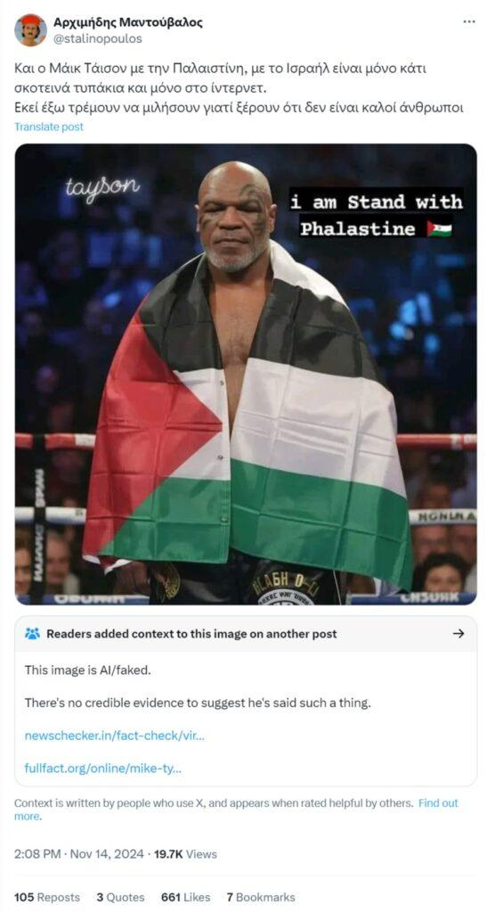
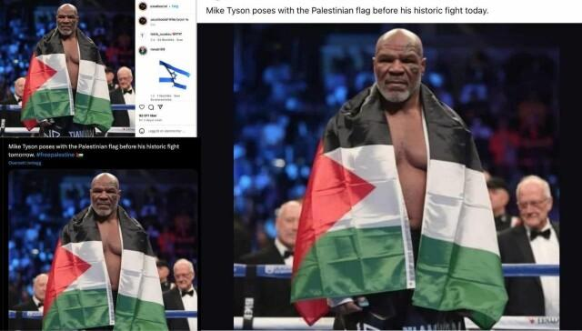

## Claim
Claim: " This is an authentic image of Mike Tyson posing with the Palestinian flag in the ring before his fight against Jake Paul on November, 15, 2024."

## Actions
```
web_search("Mike Tyson Jake Paul fight date")
web_search("Mike Tyson Palestinian flag")
image_search("Mike Tyson Palestinian flag fight")
```

## Evidence
### Evidence from `web_search`
The Jake Paul vs. Mike Tyson fight took place on November 15, 2024, at the AT&T Stadium in Arlington, Texas, according to [Wikipedia](https://en.wikipedia.org/wiki/Jake_Paul_vs._Mike_Tyson) and [ESPN](https://www.espn.com/boxing/story/_/id/40244442/mike-tyson-vs-jake-paul-watch-rules-date-location-more). The fight was streamed on Netflix.

However, according to [Netflix Tudum](https://www.netflix.com/tudum/articles/jake-paul-vs-mike-tyson-live-release-date-news), the fight took place on May 2, 2024. , , , , 


### Evidence from `web_search`
The image of Mike Tyson with the Palestinian flag is not authentic and was created using artificial intelligence tools, according to factchecker.gr ([https://www.factchecker.gr/2024/11/16/ai-generated-image-of-mike-tyson-with-palestinian-flag/](https://www.factchecker.gr/2024/11/16/ai-generated-image-of-mike-tyson-with-palestinian-flag/)). The University at Buffalo also published an article about a Reuters fact-check article addressing the fake photo ([https://engineering.buffalo.edu/computer-science-engineering/news-and-events/news.host.html/content/shared/engineering/home/articles/media-mentions/2024-media-coverage/fact-check--mike-tyson-did-not-pose-with-palestinian-flag-ahead-.detail.html](https://engineering.buffalo.edu/computer-science-engineering/news-and-events/news.host.html/content/shared/engineering/home/articles/media-mentions/2024-media-coverage/fact-check--mike-tyson-did-not-pose-with-palestinian-flag-ahead-.detail.html)). The image displays characteristics indicative of AI software manipulation. , 


### Evidence from `image_search`
The image shows Mike Tyson posing with the Palestinian flag. , , 


## Elaboration
The claim is not accurate. The image of Mike Tyson with the Palestinian flag is AI-generated, according to factchecker.gr ([https://www.factchecker.gr/2024/11/16/ai-generated-image-of-mike-tyson-with-palestinian-flag/](https://www.factchecker.gr/2024/11/16/ai-generated-image-of-mike-tyson-with-palestinian-flag/)). The fight date is also inconsistent, with some sources stating November 15, 2024, and others May 2, 2024.


## Final Judgement
The image of Mike Tyson with the Palestinian flag is AI-generated, and therefore not authentic. The fight date is also inconsistent.

`false`

### Verdict: FALSE

### Justification
The image of Mike Tyson with the Palestinian flag is AI-generated and not authentic, as reported by factchecker.gr ([https://www.factchecker.gr/2024/11/16/ai-generated-image-of-mike-tyson-with-palestinian-flag/](https://www.factchecker.gr/2024/11/16/ai-generated-image-of-mike-tyson-with-palestinian-flag/)).
