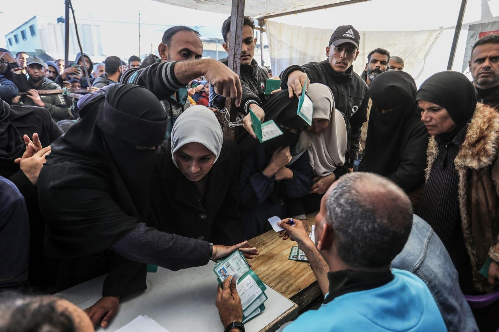

## Claim
Claim: " This image shows a screenshot of the X profile of UNRWA which has placed a black band over its profile photo in mourning for the death of Yahya Sinwar, Hamas leader in the Gaza Strip, in October 2024."

## Actions
```
web_search("UNRWA Yahya Sinwar death")
image_search("UNRWA profile picture mourning")
```

## Evidence
### Evidence from `web_search`
The Wikipedia article discusses the killing of Yahya Sinwar, the Hamas leader, on October 16, 2024, during the Gaza war, and includes an image of Sinwar and mentions that a UNRWA teacher's passport was found on his person ([https://en.wikipedia.org/wiki/Killing_of_Yahya_Sinwar](https://en.wikipedia.org/wiki/Killing_of_Yahya_Sinwar)). The New York Post reports that Israeli soldiers killed Yahya Sinwar, and an apparent passport belonging to an UNRWA teacher was found on Sinwar's body ([https://nypost.com/2024/10/17/us-news/unrwa-teachers-passport-found-on-hamas-leader-sinwars-slain-body-after-israeli-forces-killed-him-photos-show/](https://nypost.com/2024/10/17/us-news/unrwa-teachers-passport-found-on-hamas-leader-sinwars-slain-body-after-israeli-forces-killed-him-photos-show/)).

The DW article fact-checks the claim that UNRWA is mourning the death of Yahya Sinwar by adding a black ribbon to its logo, stating that the black ribbon was added to the profile picture on X before Sinwar's death, specifically since at least October 22, 2023, to show solidarity with the victims of war ([https://www.dw.com/en/fact-check-black-ribbon-on-unrwa-logo-does-not-show-mourning-for-sinwar/a-70532996](https://www.dw.com/en/fact-check-black-ribbon-on-unrwa-logo-does-not-show-mourning-for-sinwar/a-70532996)). The image  is present in all sources.


### Evidence from `image_search`
From [Source](https://www.nbcnews.com/news/world/israel-banning-unrwa-palestinian-territories-gaza-hamas-west-bank-rcna189554): 
Content: The NBC News article discusses Israel's ban on UNRWA in Palestinian territories. 


## Elaboration
The claim is not accurate. The evidence indicates that the black ribbon on UNRWA's profile picture on X was added before Yahya Sinwar's death, specifically since at least October 22, 2023, to show solidarity with the victims of war ([https://www.dw.com/en/fact-check-black-ribbon-on-unrwa-logo-does-not-show-mourning-for-sinwar/a-70532996](https://www.dw.com/en/fact-check-black-ribbon-on-unrwa-logo-does-not-show-mourning-for-sinwar/a-70532996)).


## Final Judgement
The claim is demonstrably false. The black ribbon on UNRWA's profile picture predates the death of Yahya Sinwar and was not added in mourning for him.

`false`

### Verdict: FALSE

### Justification
The claim is false. The black ribbon on UNRWA's X profile picture was added before the death of Yahya Sinwar, as reported by DW ([https://www.dw.com/en/fact-check-black-ribbon-on-unrwa-logo-does-not-show-mourning-for-sinwar/a-70532996](https://www.dw.com/en/fact-check-black-ribbon-on-unrwa-logo-does-not-show-mourning-for-sinwar/a-70532996)).
