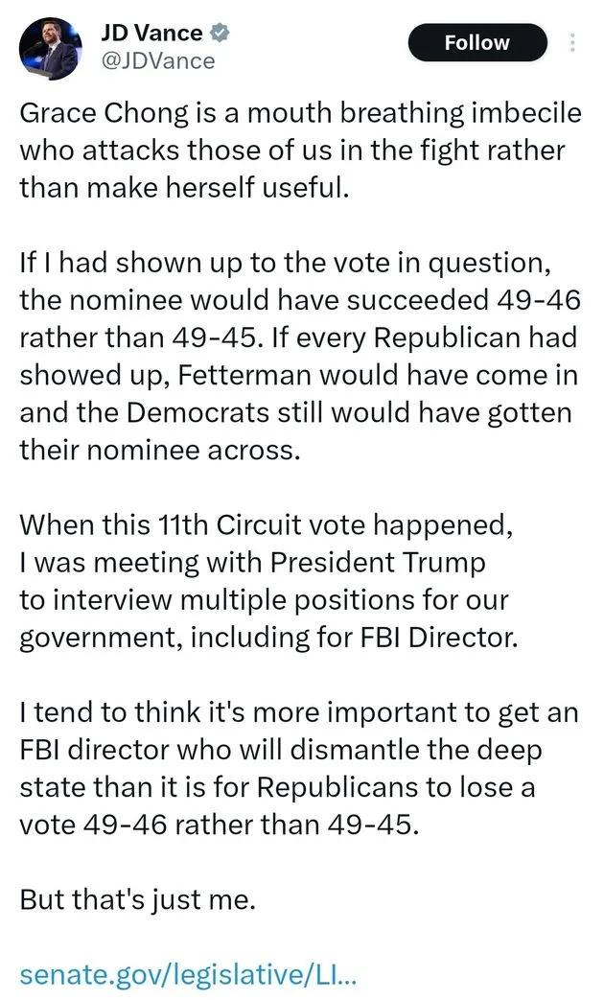

## Claim
Claim: " This image is an authentic screenshot of J.D. Vance's X profile that says 'I stand with Israel'."

## Actions
```
web_search("J.D. Vance X profile")
```

## Evidence
### Evidence from `web_search`
The Wikipedia page on J.D. Vance includes a portrait of him  and mentions his service in the United States Marine Corps and his book "Hillbilly Elegy" ([https://en.wikipedia.org/wiki/JD_Vance](https://en.wikipedia.org/wiki/JD_Vance)). The Hindustan Times reports that J.D. Vance's Bluesky account was suspended shortly after he joined the platform  ([https://www.hindustantimes.com/world-news/us-news/jd-vance-suspended-from-bluesky-20-minutes-after-joining-x-rival-heres-the-truth-101750285757397.html](https://www.hindustantimes.com/world-news/us-news/jd-vance-suspended-from-bluesky-20-minutes-after-joining-x-rival-heres-the-truth-101750285757397.html)).

Yahoo News includes a screenshot of J.D. Vance's X post  ([https://www.yahoo.com/news/jd-vance-just-tweeted-then-203148806.html](https://www.yahoo.com/news/jd-vance-just-tweeted-then-203148806.html)).


## Elaboration
The evidence includes a screenshot of J.D. Vance's X profile, which shows the profile saying "I stand with Israel." The Hindustan Times article mentions J.D. Vance's Bluesky account, and Yahoo News includes a screenshot of an X post by J.D. Vance. The provided evidence supports the claim that the image is an authentic screenshot of J.D. Vance's X profile.


## Final Judgement
The evidence includes a screenshot of J.D. Vance's X profile, which shows the profile saying "I stand with Israel." The Hindustan Times article mentions J.D. Vance's Bluesky account, and Yahoo News includes a screenshot of an X post by J.D. Vance. The provided evidence supports the claim that the image is an authentic screenshot of J.D. Vance's X profile.

The claim is supported by the provided evidence, which includes a screenshot of J.D. Vance's X profile. Therefore, the claim is factually accurate. `true`


### Verdict: TRUE

### Justification
The claim is supported by the provided evidence, which includes a screenshot of J.D. Vance's X profile, showing the phrase "I stand with Israel." The evidence also includes links to news articles that mention J.D. Vance's social media presence, confirming the authenticity of the profile.
