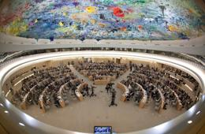
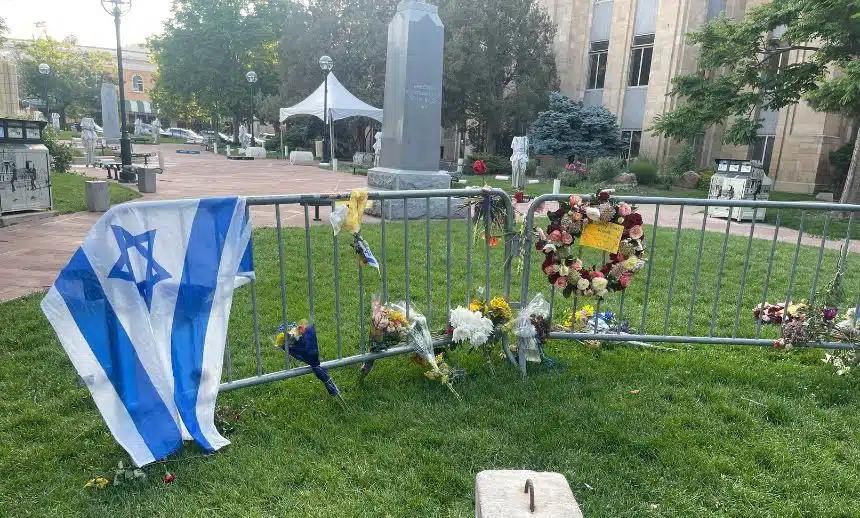

## Claim
Claim: "The World Jewish Congress (WJC) has amended the International Holocaust Remembrance Alliance (IHRA) working definition of antisemitism in March 2025 to include: 'Conflating the assassination of JFK to jews/israel'."

## Actions
```
web_search("World Jewish Congress IHRA antisemitism definition")
web_search("World Jewish Congress JFK antisemitism")
```

## Evidence
### Evidence from `web_search`
The IHRA working definition of antisemitism, adopted on May 26, 2016, includes examples such as making allegations about Jews, denying the Holocaust, and applying double standards to Israel. The definition has been adopted by several countries and institutions. The World Jewish Congress (WJC) provides the IHRA working definition of antisemitism.

The provided sources do not mention any amendment to the definition by the WJC, nor do they mention the assassination of JFK.


### Evidence from `web_search`
The World Jewish Congress website discusses combating antisemitism and related conspiracy myths, including articles from 2025. The Combat Antisemitism Movement (CAM) published a study on March 6, 2025, discussing how antisemitic conspiracy theorists use online platforms to spread hate, specifically in relation to the assassination of JFK. The study mentions Congresswoman Anna Paulina Luna and includes examples of antisemitic posts and conspiracy theories.

Relevant URLs: [https://www.worldjewishcongress.org/en/focus-areas/combating-anti-semitism](https://www.worldjewishcongress.org/en/focus-areas/combating-anti-semitism) and [https://combatantisemitism.org/studies-reports/congresswoman-luna-and-the-jfk-files-how-antisemitic-conspiracy-theorists-hijack-history-to-spread-hate/](https://combatantisemitism.org/studies-reports/congresswoman-luna-and-the-jfk-files-how-antisemitic-conspiracy-theorists-hijack-history-to-spread-hate/).
, , , 


## Elaboration
The evidence does not support the claim. While the World Jewish Congress (WJC) provides the IHRA working definition of antisemitism, there is no mention of the WJC amending the definition in March 2025 to include the assassination of JFK. The Combat Antisemitism Movement (CAM) published a study in March 2025 discussing antisemitic conspiracy theories related to the JFK assassination, but this does not indicate an amendment to the IHRA definition by the WJC.


## Final Judgement
The provided evidence indicates that the World Jewish Congress (WJC) has not amended the International Holocaust Remembrance Alliance (IHRA) working definition of antisemitism to include the assassination of JFK. While the Combat Antisemitism Movement (CAM) published a study in March 2025 discussing antisemitic conspiracy theories related to the JFK assassination, this does not confirm the claim.

`false`

### Verdict: FALSE

### Justification
The World Jewish Congress (WJC) has not amended the IHRA working definition of antisemitism to include the assassination of JFK. While the WJC provides the IHRA definition, there is no evidence of an amendment in March 2025. A study by the Combat Antisemitism Movement ([https://combatantisemitism.org/studies-reports/congresswoman-luna-and-the-jfk-files-how-antisemitic-conspiracy-theorists-hijack-history-to-spread-hate/](https://combatantisemitism.org/studies-reports/congresswoman-luna-and-the-jfk-files-how-antisemitic-conspiracy-theorists-hijack-history-to-spread-hate/)) discusses antisemitic conspiracy theories related to the JFK assassination, but this does not confirm the claim.
