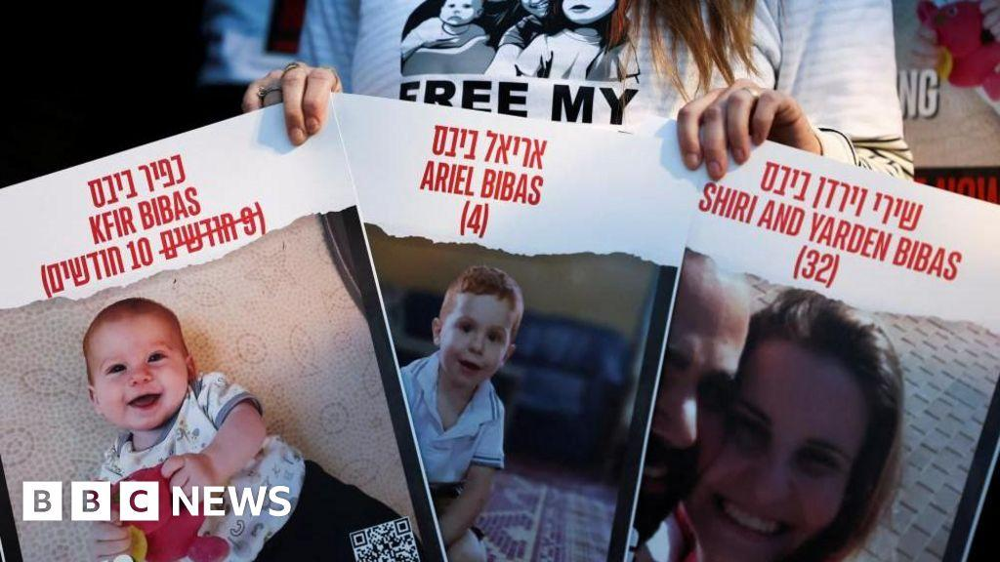
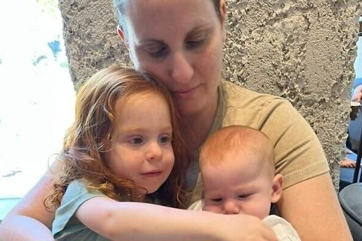
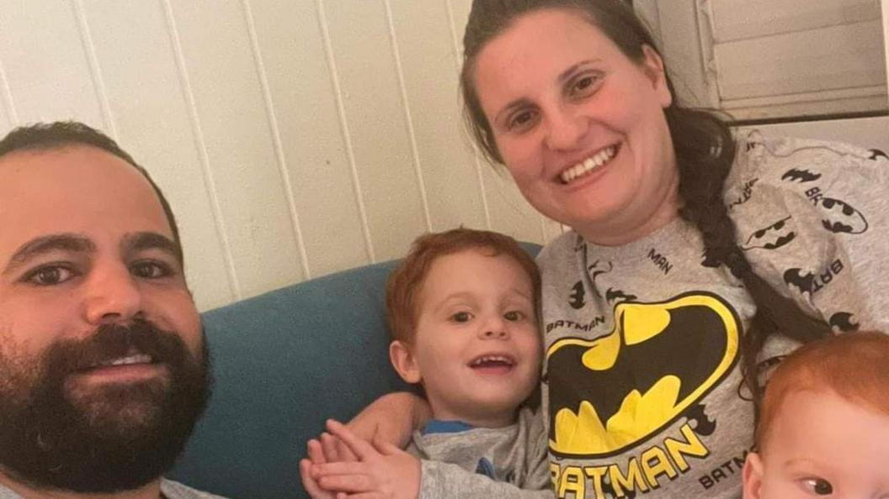
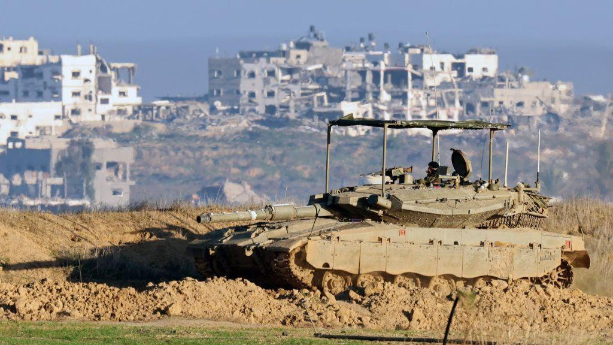

## Claim
Claim: " This image shows a screenshot of an authentic BBC article from February 2025 with the title 'Hamas just wanted to protect the Bibas family but Israel killed them - Hamas said.'"

## Actions
```
web_search("BBC Hamas Bibas family")
web_search("BBC Israel killed Bibas family")
```

## Evidence
### Evidence from `web_search`
From [Source](https://www.bbc.com/news/articles/cjry3jzedl1o): 
Content: The BBC published an article on February 21, 2025, discussing the Bibas family. , . The article states that Israel said forensic evidence suggested that the children, Ariel and Kfir Bibas, were killed by their captors in Gaza. Hamas said the children and their mother were killed by Israeli bombing. The article also mentions that the bodies of the two boys were returned to Israel. The article is authored by George Wright & Mallory Moench.


### Evidence from `web_search`
From [Source](https://en.wikipedia.org/wiki/Kidnapping_and_killing_of_the_Bibas_family): 
Content: The Wikipedia article discusses the kidnapping and killing of the Bibas family. It mentions that Hamas claimed the family was killed by an Israeli airstrike, while Israel stated they were killed by their captors. The article also mentions that the bodies of Shiri, Ariel, and Kfir Bibas were returned on February 20, and that a forensic analysis showed they were killed with "bare hands".  The article also references a BBC article.


## Elaboration
The BBC did publish an article about the Bibas family on February 21, 2025. The article discussed the conflicting claims regarding the family's death, with Hamas stating they were killed by an Israeli airstrike and Israel claiming they were killed by their captors. The evidence confirms the existence of a BBC article on the Bibas family, but it does not confirm the exact wording of the headline in the image.

The evidence does not confirm the exact wording of the headline in the image. Therefore, the claim cannot be fully verified.


## Actions
```
image_search("BBC Bibas family article screenshot")
```

## Evidence
### Evidence from `image_search`
The BBC published an article about the Bibas family (). ABC News also published an article discussing the return of Shiri Bibas's body ().


## Elaboration
The image search results show that the BBC did publish an article about the Bibas family. However, the evidence does not confirm the exact headline presented in the image. Therefore, the claim is not fully verifiable.


## Actions
```
web_search("BBC article Bibas family Hamas Israel")
```

## Evidence
### Evidence from `web_search`
From [Source](https://www.bbc.co.uk/news/articles/c78xeg7xn55o): 
Content: The BBC published an article on February 2, 2025, discussing the Bibas family. The article mentions that Hamas had previously said the family was killed in an Israeli air strike. The article is authored by Mallory Moench and Alice Cuddy. , .


## Elaboration
The BBC did publish an article about the Bibas family. The article mentions that Hamas claimed the family was killed in an Israeli airstrike. However, the evidence does not confirm the exact headline presented in the image. Therefore, the claim is not fully verifiable.


## Final Judgement
The BBC did publish articles discussing the Bibas family and the conflicting claims surrounding their deaths. However, the exact headline presented in the image cannot be verified.

`false`

### Verdict: FALSE

### Justification
The BBC did publish articles about the Bibas family, including discussions of conflicting claims regarding their deaths, as evidenced by multiple sources ([BBC article](https://www.bbc.co.uk/news/articles/c78xeg7xn55o)). However, the exact headline presented in the image cannot be verified, leading to a "false" verdict.
