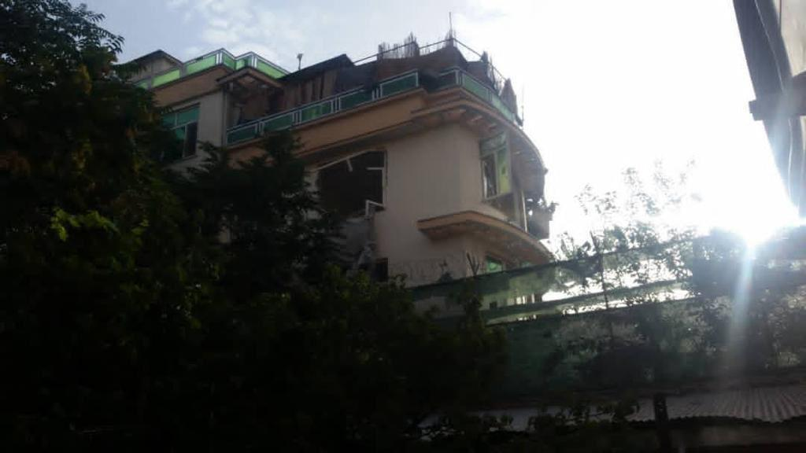
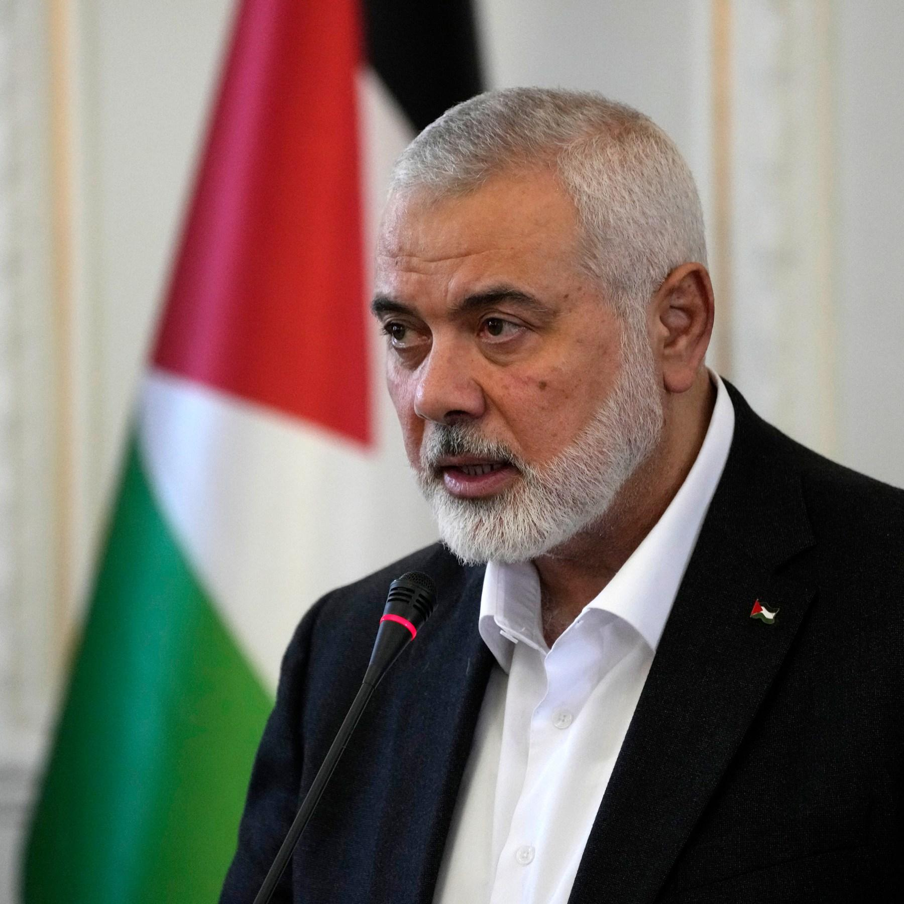

## Claim
Claim: " This image shows the assassination of Hamas leader Ismail Haniyeh on July 31st, 2024. This is how a precision strike looks like: a single missile through the window, and only Haniyeh and his bodyguard are dead. Nobody else in the building is even injured."

## Actions
```
geolocate()
web_search("Ismail Haniyeh assassination July 31 2024")
image_search("Ismail Haniyeh assassination")
```

## Evidence
### Evidence from `geolocate`
The most likely countries where the image was taken are: {'Cambodia': 0.35, 'Pakistan': 0.1, 'Bangladesh': 0.07, 'Ghana': 0.07, 'Bhutan': 0.06, 'China': 0.05, 'Sri Lanka': 0.04, 'Albania': 0.03, 'Kyrgyzstan': 0.02, 'Laos': 0.02}

### Evidence from `web_search`
The web sources discuss the assassination of Hamas leader Ismail Haniyeh in Tehran, Iran, on July 31, 2024. The attack was carried out by Israel, according to a Wikipedia article ([https://en.wikipedia.org/wiki/Assassination_of_Ismail_Haniyeh](https://en.wikipedia.org/wiki/Assassination_of_Ismail_Haniyeh)). The CSIS article ([https://www.csis.org/analysis/ismail-haniyehs-assassination-escalation-or-ramp](https://www.csis.org/analysis/ismail-haniyehs-assassination-escalation-or-ramp)) mentions that Haniyeh was killed by an explosion in his guesthouse.

CNN ([https://www.cnn.com/world/live-news/hamas-political-leader-haniyeh-killed-iran-07-31-24](https://www.cnn.com/world/live-news/hamas-political-leader-haniyeh-killed-iran-07-31-24)) reports on the assassination, stating that Israel has neither confirmed nor denied being behind the assassination. The image 

### Evidence from `image_search`
Al Jazeera ([https://www.aljazeera.com/news/2024/7/31/hamass-political-chief-ismail-haniyeh-assassinated-in-iran-state-media](https://www.aljazeera.com/news/2024/7/31/hamass-political-chief-ismail-haniyeh-assassinated-in-iran-state-media)) reports that Hamas leader Ismail Haniyeh was assassinated. ABC News ([https://abcnews.go.com/International/ismail-haniyeh-assassinated-hamas-political-bureau-history/story?id=112430229](https://abcnews.go.com/International/ismail-haniyeh-assassinated-hamas-political-bureau-history/story?id=112430229)) published an article about Ismail Haniyeh. CNN ([https://www.cnn.com/2024/07/30/middleeast/hamas-political-leader-ismail-haniyeh-killed-intl-hnk](https://www.cnn.com/2024/07/30/middleeast/hamas-political-leader-ismail-haniyeh-killed-intl-hnk)) reports that Ismail Haniyeh was killed.

The sources include images of Ismail Haniyeh (, , ).


## Elaboration
The evidence indicates that Ismail Haniyeh was assassinated on July 31, 2024, in Tehran, Iran. The image provided in the claim is not directly linked to the assassination. The evidence does not provide details about the nature of the attack, such as whether it involved a single missile or the extent of the damage.

The claim that the image shows the assassination and describes a "precision strike" is not supported by the evidence. The evidence does not confirm the image's location or the method of attack.

Therefore, the claim is unsubstantiated due to the lack of evidence linking the image to the assassination and the absence of details about the attack's specifics.


## Final Judgement
The evidence confirms that Ismail Haniyeh was assassinated on July 31, 2024, but the provided image is not directly linked to the event. The evidence does not provide details about the nature of the attack.

The claim is not supported by the evidence because the image is not confirmed to be related to the assassination. The claim also describes the attack in detail, which is not supported by the evidence. `false`

### Verdict: FALSE

### Justification
The claim that the image depicts the assassination of Ismail Haniyeh on July 31, 2024, is not supported by the evidence. While multiple sources confirm Haniyeh's assassination on that date ([https://en.wikipedia.org/wiki/Assassination_of_Ismail_Haniyeh](https://en.wikipedia.org/wiki/Assassination_of_Ismail_Haniyeh)), the provided image's location and relation to the event are not confirmed. The evidence does not provide details about the nature of the attack.
