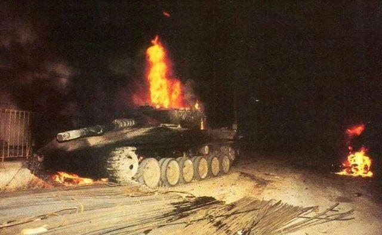

## Claim
Claim: " This image shows an Israeli tank unit near Jabalia camp in northern Gaza that was successfully ambushed by Hamas fighters, destroying multiple vehicles and injuring or killing their crews in October 2024."

## Actions
```
image_search("burning tank Israeli army")
geolocate()
```

## Evidence
### Evidence from `image_search`
Sky News shows an image of a burning tank (). The search result from vpk.name shows a burning tank (). The source discusses an old photo that is being circulated as showing the destruction of an Israeli military tank in Shamaa, south of Lebanon ().

The sources are:
*   [https://news.sky.com/video/israel-gunfire-heard-as-tank-burns-after-hamas-attack-12978835](https://news.sky.com/video/israel-gunfire-heard-as-tank-burns-after-hamas-attack-12978835)
*   [https://vpk.name/en/783167_atgm-kornet-burned-israeli-tanks-merkava-mk4-back-in-2006.html](https://vpk.name/en/783167_atgm-kornet-burned-israeli-tanks-merkava-mk4-back-in-2006.html)
*   [https://kashif.ps/en/index.php/2024/11/25/old-photo-circulated-as-showing-destruction-of-israeli-military-tank-in-shamaa-south-of-lebanon/](https://kashif.ps/en/index.php/2024/11/25/old-photo-circulated-as-showing-destruction-of-israeli-military-tank-in-shamaa-south-of-lebanon/)


### Evidence from `geolocate`
The most likely countries where the image was taken are: {'Pakistan': 0.11, 'Palestine': 0.11, 'Israel': 0.1, 'Tunisia': 0.09, 'Mexico': 0.06, 'Colombia': 0.05, 'Chile': 0.04, 'Sweden': 0.03, 'Argentina': 0.02, 'Denmark': 0.02}

## Elaboration
The image search results show other images of burning tanks, including one from Sky News. One source discusses an old photo being circulated as showing the destruction of an Israeli military tank in Shamaa, south of Lebanon. The geolocation data suggests the image could have been taken in Palestine or Israel.

The evidence does not confirm the claim that the image shows an Israeli tank unit near Jabalia camp in northern Gaza that was successfully ambushed by Hamas fighters in October 2024. The evidence does not provide the date or location of the image.


## Actions
```
web_search("Hamas ambush Israeli tank Jabalia October 2024")
```

## Evidence
### Evidence from `web_search`
The Wikipedia article on the "Siege of North Gaza" mentions fighting in Jabalia, including an ambush on October 10, 2024, where Hamas destroyed an IDF mechanized infantry company. The Reuters article from October 8, 2024, reports that Israeli tanks pushed into Jabalia. Al Jazeera reports on an Israeli ground offensive on Jabalia on October 6, 2024, including intense bombardment and tank deployment ().


## Elaboration
The web search results provide additional information about the events in Jabalia in October 2024. The Wikipedia article mentions an ambush on October 10, 2024, where Hamas destroyed an IDF mechanized infantry company. Reuters and Al Jazeera also report on the fighting in Jabalia, including tank deployments.

While the evidence confirms that there was fighting in Jabalia in October 2024, including tank deployments and an ambush, it does not confirm that the image depicts the specific event described in the claim. The evidence does not provide any information about the image.

Therefore, the claim cannot be verified.


## Actions
```
web_search("Israeli tank destroyed Jabalia October 2024")
```

## Evidence
### Evidence from `web_search`
The Guardian published an article on December 18, 2024, detailing the destruction of the Jabaliya refugee camp, including bulldozed lanes for Israeli armour and tank berms. The article mentions three offensives by Israeli forces, with the third offensive beginning on October 5, 2024. Reuters reported on October 15, 2024, that Israeli forces tightened their squeeze around Jabalia amid fierce battles with Hamas-led fighters, mentioning that the Israeli military has encircled the Jabalia camp and sent tanks into nearby towns ().


## Elaboration
The web search results confirm that there was fighting in Jabalia in October 2024, including the deployment of tanks. However, the evidence does not provide any information about the image. Therefore, the claim cannot be verified.


## Final Judgement
The claim cannot be verified because the evidence does not confirm that the image depicts the specific event described in the claim. While the search results confirm that there was fighting in Jabalia in October 2024, including tank deployments and an ambush, it does not provide any information about the image. `false`

### Verdict: FALSE

### Justification
The claim cannot be verified. While web searches confirm fighting in Jabalia in October 2024, including tank deployments and an ambush, the evidence does not link the provided image to these events. The image search results show other images of burning tanks, but do not confirm the context of the claim.
