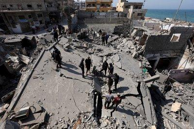
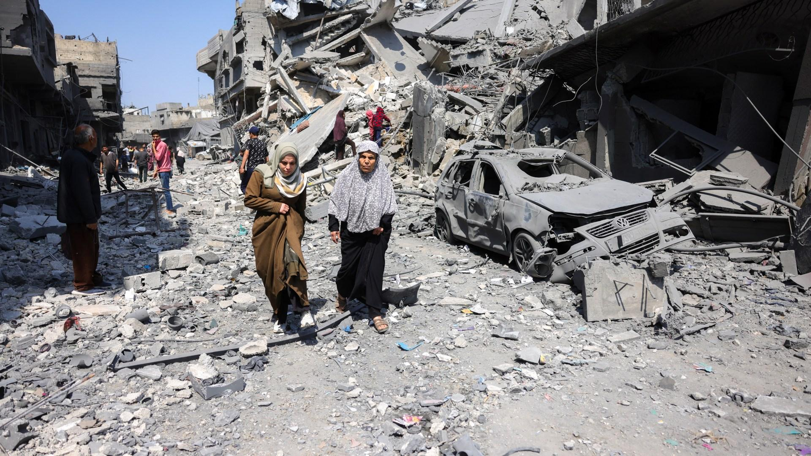

## Claim
Claim: " This image shows heavy Israeli bombardment on Deir al-Balah in the southern Gaza Strip in March 2025 which killed at least four Palestinians."

## Actions
```
geolocate()
web_search("Israeli bombardment Deir al-Balah March 2025")
image_search("Deir al-Balah bombing March 2025")
```

## Evidence
### Evidence from `geolocate`
The most likely countries where the image was taken are: {'Jordan': 0.25, 'United Arab Emirates': 0.16, 'Palestine': 0.15, 'Malta': 0.12, 'Tunisia': 0.09, 'Israel': 0.08, 'Pakistan': 0.03, 'Turkey': 0.02, 'Guatemala': 0.01, 'Italy': 0.01}

### Evidence from `web_search`
The provided sources discuss Israeli attacks on the Gaza Strip, including Deir al-Balah, in March and July 2025. According to a Wikipedia article, the March attacks, which began on March 18, 2025, resulted in over 591 deaths and 1,042 injuries, with Deir al-Balah being one of the targeted locations. The UN News reported on March 24, 2025, that strikes on a UN compound in Deir Al Balah on March 19, 2025, caused casualties.

The Guardian reported on July 21, 2025, about an Israeli air and ground offensive on Deir al-Balah, which included tank shelling, resulting in casualties. The article includes an image of smoke rising over western Deir al-Balah . The Wikipedia article can be found here: [https://en.wikipedia.org/wiki/March_2025_Israeli_attacks_on_the_Gaza_Strip](https://en.wikipedia.org/wiki/March_2025_Israeli_attacks_on_the_Gaza_Strip). The UN News article can be found here: [https://news.un.org/en/story/2025/03/1161461](https://news.un.org/en/story/2025/03/1161461). The Guardian article can be found here: [https://www.theguardian.com/world/2025/jul/21/israel-launches-air-ground-offensive-deir-al-balah-central-gaza](https://www.theguardian.com/world/2025/jul/21/israel-launches-air-ground-offensive-deir-al-balah-central-gaza).


### Evidence from `image_search`
PBS NewsHour published an article about Israel resuming bombing in Gaza after failed negotiations. ([https://www.pbs.org/newshour/classroom/daily-news-lessons/2025/03/israel-resumes-bombing-in-gaza-after-failed-negotiations](https://www.pbs.org/newshour/classroom/daily-news-lessons/2025/03/israel-resumes-bombing-in-gaza-after-failed-negotiations)) 

Al Jazeera published an image of destruction in Deir al-Balah. ([https://www.aljazeera.com/news/liveblog/2025/3/18/live-trump-threatens-iran-as-deadly-us-attacks-on-yemens-houthis-continue](https://www.aljazeera.com/news/liveblog/2025/3/18/live-trump-threatens-iran-as-deadly-us-attacks-on-yemens-houthis-continue))  The BBC News website contains an image of a destroyed building in Deir al-Balah. ([https://www.bbc.com/news/articles/c4gmyrezyvyo](https://www.bbc.com/news/articles/c4gmyrezyvyo)) 


## Elaboration
The evidence confirms that Deir al-Balah was targeted by Israeli attacks in March 2025. The web search results mention attacks in March and July 2025, with the March attacks resulting in numerous casualties. The image search results also show destruction in Deir al-Balah. However, the evidence does not explicitly state that the image in the claim depicts the March 2025 attacks or the number of casualties.

The geolocation data suggests that the image was most likely taken in Jordan, the United Arab Emirates, or Palestine.

Therefore, while the claim is partially supported by the evidence, it lacks specific information to confirm the exact date and the number of casualties depicted in the image. More information is needed to verify the claim fully.


## Actions
```
image_search("Deir al-Balah bombing March 2025 image")
```

## Evidence
### Evidence from `image_search`
The Guardian published an image of an explosion in Deir al-Balah (). CNN published an article on July 21, 2025, about Israeli military activity in Deir al-Balah, Gaza, including an image of smoke rising over the city (). PBS NewsHour published an article about Israel resuming strikes in Gaza, including an image of destruction ().


## Elaboration
The new evidence provides additional images related to the bombing in Deir al-Balah. However, none of the images match the one in the claim. The evidence confirms that there were Israeli attacks in Deir al-Balah in March 2025, but it does not provide any information about the specific image in the claim.

Therefore, the claim remains unverified due to the lack of evidence directly linking the image to the March 2025 attacks and the number of casualties.


## Actions
```
web_search("Deir al-Balah March 2025 casualties image")
```

## Evidence
### Evidence from `web_search`
The UN News article ([https://news.un.org/en/story/2025/03/1161261](https://news.un.org/en/story/2025/03/1161261)) reports on an explosion at a UN guesthouse in Deir al-Balah, Gaza, which killed at least one UN staff member and injured five others . Getty Images ([https://www.gettyimages.com/photos/deir-el-balah-gaza-strip](https://www.gettyimages.com/photos/deir-el-balah-gaza-strip)) contains images from Deir al-Balah, including images of destruction and the aftermath of strikes , , , , , . Al Jazeera ([https://www.aljazeera.com/gallery/2025/1/15/israels-war-on-gaza-15-months-15-pictures](https://www.aljazeera.com/gallery/2025/1/15/israels-war-on-gaza-15-months-15-pictures)) published an article on January 15, 2025, featuring images from the 15-month war in Gaza, including images from Deir al-Balah , , , , , , .

The evidence provides additional images and information about the attacks in Deir al-Balah, but none of the images match the one in the claim. The UN article mentions casualties, and the Getty Images and Al Jazeera articles show the destruction and aftermath of the attacks.


## Elaboration
The claim remains unverified. While the evidence confirms Israeli attacks in Deir al-Balah in March 2025 and mentions casualties, it does not provide any information about the specific image in the claim. Therefore, the claim cannot be fully verified.


## Final Judgement
The evidence confirms that Deir al-Balah was targeted by Israeli attacks in March 2025, resulting in casualties. However, the provided evidence does not include the image in the claim or confirm the exact date and number of casualties depicted in the image. Therefore, the claim is not fully supported by the evidence.

`false`


### Verdict: FALSE

### Justification
The claim is not supported by the evidence. While there is evidence of Israeli attacks on Deir al-Balah in March 2025, resulting in casualties, the provided sources do not include the image in the claim or confirm the exact date and number of casualties depicted in the image.
