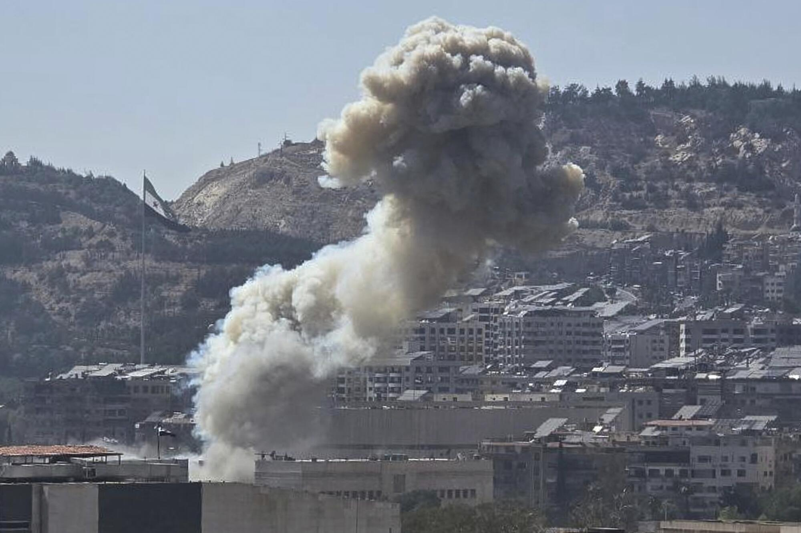
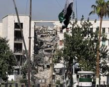

## Claim
Claim: " This image shows Israel bombing the surroundings of Southern Damascus in February 2025, destroying its last remaining army depots."

## Actions
```
image_search("Israel bombing Damascus February 2025")
geolocate()
```

## Evidence
### Evidence from `image_search`
Al Jazeera reported that Israel bombed military targets in southern Syria outside Damascus in February 2025 (). The Los Angeles Times published an article on July 16, 2025, about unrest in Sweida, Syria, which includes an image of an explosion ().

The search result from twz.com contains an image of an explosion ().


### Evidence from `geolocate`
The most likely countries where the image was taken are: {'Bangladesh': 0.07, 'Pakistan': 0.07, 'Taiwan': 0.06, 'Ghana': 0.05, 'Ukraine': 0.05, 'United Arab Emirates': 0.05, 'Nigeria': 0.04, 'Sri Lanka': 0.04, 'India': 0.03, 'Israel': 0.03}

## Elaboration
The evidence confirms that Israel bombed military targets in southern Syria outside Damascus in February 2025. However, the image search did not return the same image as the claim. The geolocation data does not provide enough information to verify the claim that the image shows the surroundings of Southern Damascus.

The claim's veracity cannot be fully verified due to the lack of evidence directly linking the provided image to the bombing of Damascus in February 2025.


## Actions
```
web_search("Israel bombing Syria February 2025 army depots")
```

## Evidence
### Evidence from `web_search`
The Guardian reported on February 25, 2025, that Israel struck military targets outside Damascus and in southern Syria, including images of explosions and Israeli forces. ([https://www.theguardian.com/world/2025/feb/25/israel-strikes-targets-in-southern-syria-after-demanding-demilitarisation](https://www.theguardian.com/world/2025/feb/25/israel-strikes-targets-in-southern-syria-after-demanding-demilitarisation)) The Wikipedia article on the Israeli invasion of Syria, which began in December 2024 and continued into 2025, mentions extensive aerial and naval strikes by Israel and the July 16, 2025, bombing of the Syrian military headquarters in Damascus.

The Guardian article includes images of Israeli forces and explosions in Syria (, , , , ).


## Elaboration
The evidence confirms that Israel struck military targets outside Damascus and in southern Syria in February 2025. However, the provided images do not match the image in the claim. The claim also states that the bombing destroyed the last remaining army depots, which is not explicitly stated in the evidence.

The claim is partially supported by the evidence, but the specific details about the image and the destruction of the last remaining army depots cannot be verified.


## Actions
```
image_search("explosion near Damascus February 2025")
```

## Evidence
### Evidence from `image_search`
The search results include images of explosions in Syria in February 2025 (

## Elaboration
The evidence confirms that there were explosions in Syria in February 2025. However, none of the images from the search results match the image in the claim. The claim's assertion about the destruction of the last remaining army depots remains unverified.

Insufficient information is available to verify the claim.


## Final Judgement
The evidence confirms that Israel bombed military targets in Syria in February 2025, but the specific image in the claim could not be verified. The claim also mentions the destruction of the last remaining army depots, which is not explicitly supported by the evidence.

The claim is not fully supported by the evidence because the image cannot be verified, and the claim's assertion about the destruction of the last remaining army depots is not confirmed. `false`

### Verdict: FALSE

### Justification
The claim that the image shows Israel bombing the surroundings of Southern Damascus in February 2025 is not fully supported. While evidence confirms that Israel struck military targets in Syria in February 2025, the specific image in the claim could not be verified, and the claim's assertion about the destruction of the last remaining army depots is not confirmed by the provided sources, including a report from The Guardian ([https://www.theguardian.com/world/2025/feb/25/israel-strikes-targets-in-southern-syria-after-demanding-demilitarisation](https://www.theguardian.com/world/2025/feb/25/israel-strikes-targets-in-southern-syria-after-demanding-demilitarisation)).
