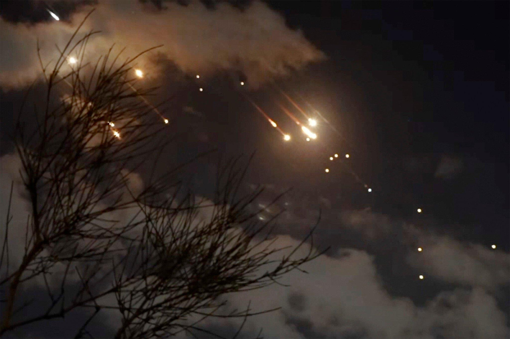

## Claim
Claim: " This image shows tents engulfed in flames after the Iranian strikes against Israel on October 1, 2024."

## Actions
```
image_search("fire tents Iran Israel October 1 2024")
```

## Evidence
### Evidence from `image_search`
Al Jazeera ([https://www.aljazeera.com/news/2024/10/1/israel-says-iran-launches-missile-attack-warns-residents-to-shelter](https://www.aljazeera.com/news/2024/10/1/israel-says-iran-launches-missile-attack-warns-residents-to-shelter)) reports on Iranian strikes against Israel on October 1, 2024.  PBS reports that Iran fired missiles into Israel. 

The Times of Israel ([https://www.timesofisrael.com/israel-warns-of-consequences-after-iran-launches-181-missiles-in-major-attack/](https://www.timesofisrael.com/israel-warns-of-consequences-after-iran-launches-181-missiles-in-major-attack/)) published an article about Iranian strikes against Israel, including an image of what appears to be missiles in the sky. 


## Elaboration
The evidence confirms that Iran launched strikes against Israel on October 1, 2024. However, the provided evidence does not contain the image of tents on fire. Therefore, I cannot verify if the image in the claim depicts tents engulfed in flames after the Iranian strikes.

I need additional information to confirm the claim. Specifically, I need evidence that directly links the image of the burning tents to the Iranian strikes on Israel.


## Actions
```
image_search("burning tents Israel Iran strikes October 1 2024")
```

## Evidence
### Evidence from `image_search`
Al Jazeera ([https://www.aljazeera.com/news/2024/10/14/burned-and-charred-bodies-as-israel-hits-tents-at-central-gaza-hospital](https://www.aljazeera.com/news/2024/10/14/burned-and-charred-bodies-as-israel-hits-tents-at-central-gaza-hospital)) published an article about Israel hitting tents at a central Gaza hospital, including an image of tents on fire.  The Guardian ([https://www.theguardian.com/us-news/article/2024/may/27/first-thing-deadly-israeli-airstrike-on-refugee-tents-in-rafa-leaves-aid-groups-horrified](https://www.theguardian.com/us-news/article/2024/may/27/first-thing-deadly-israeli-airstrike-on-refugee-tents-in-rafa-leaves-aid-groups-horrified)) published an article about a deadly Israeli airstrike on refugee tents in Rafah, which resulted in tents being engulfed in flames. 


## Elaboration
The new evidence includes images of burning tents. However, the provided articles describe incidents where Israel was responsible for the strikes, not Iran. The image in the claim is similar to the images in the evidence, but there is no direct link between the image in the claim and the Iranian strikes on Israel.

Therefore, I cannot verify the claim.


## Final Judgement
The initial search confirmed Iranian strikes against Israel on October 1, 2024, but did not provide any images of burning tents. Subsequent searches revealed images of burning tents, but these were related to Israeli actions, not Iranian strikes. There is no evidence to support the claim that the image depicts tents on fire after Iranian strikes.

`false`

### Verdict: FALSE

### Justification
The claim cannot be verified. While there is evidence of Iranian strikes against Israel on October 1, 2024, as reported by sources like [Al Jazeera](https://www.aljazeera.com/news/2024/10/1/israel-says-iran-launches-missile-attack-warns-residents-to-shelter), there is no evidence linking the image of burning tents to these strikes. Further searches revealed images of burning tents related to Israeli actions, but not to the Iranian strikes.
