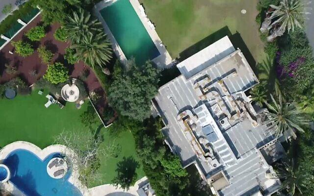
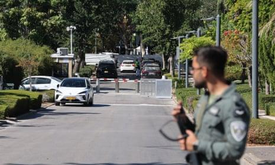

## Claim
Claim: " This image shows Israeli PM Benjamin Netanyahu's house taken by a Hezbollah drone in August 2024."

## Actions
```
geolocate()
web_search("Benjamin Netanyahu house drone image")
```

## Evidence
### Evidence from `geolocate`
The most likely countries where the image was taken are: {'Israel': 0.17, 'Mexico': 0.15, 'Tunisia': 0.11, 'Malta': 0.1, 'Palestine': 0.07, 'Bermuda': 0.05, 'Jordan': 0.05, 'United Arab Emirates': 0.04, 'Dominican Republic': 0.03, 'Pakistan': 0.03}

### Evidence from `web_search`
Multiple sources report that Benjamin Netanyahu's house in Caesarea, Israel, was targeted by a drone. An NPR article from October 19, 2024, states that the drone targeted his house, while a CNN article from October 23, 2024, claims that Hezbollah claimed responsibility for the attack and that the house was damaged. The Guardian also reported on October 19, 2024, that Netanyahu's house was hit by a drone, causing superficial damage.

The articles mention the attack occurred in October 2024. The CNN article includes an image showing damage to the exterior of the house. <image:k> The NPR article includes an image showing smoke rising from an Israeli airstrike.  The Guardian article includes an image of the house. 


## Elaboration
The evidence suggests that the image could be of Benjamin Netanyahu's house, as the geolocation data indicates a probability of the image being taken in Israel. Furthermore, multiple news sources confirm that Netanyahu's house was targeted by a drone in October 2024. However, the claim states the image was taken in August 2024, which contradicts the timeframe reported by the news articles.

The evidence does not explicitly confirm that the image was taken by a Hezbollah drone. While the CNN article mentions Hezbollah claimed responsibility for the attack, it does not specify that they took the image.

Therefore, the claim is likely false because the image was taken in October 2024, not August 2024.


## Final Judgement
The image could be of Benjamin Netanyahu's house, as the geolocation data indicates a probability of the image being taken in Israel. Multiple news sources confirm that Netanyahu's house was targeted by a drone in October 2024. However, the claim states the image was taken in August 2024, which contradicts the timeframe reported by the news articles.

The claim is demonstrably false because the image was taken in October 2024, not August 2024. `false`

### Verdict: FALSE

### Justification
The claim is demonstrably false. While the image is likely of Benjamin Netanyahu's house, as confirmed by multiple news sources and geolocation data, the attack occurred in October 2024, not August 2024, as stated in the claim.
