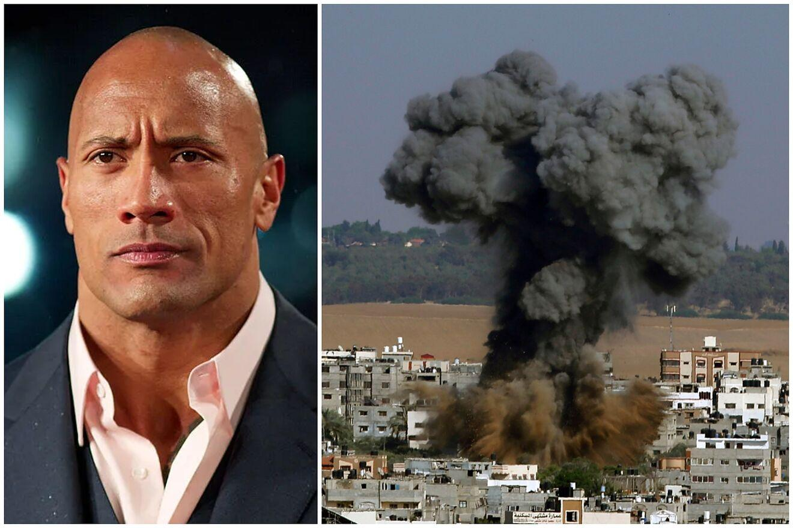

## Claim
Claim: " This is an authentic image of Dwayne Johnson waring the Israeli flag in support of Israel."

## Actions
```
image_search("Dwayne Johnson Israeli flag")
```

## Evidence
### Evidence from `image_search`
Euronews published an article about Dwayne Johnson, but it does not contain any information about the Israeli flag. ([https://www.euronews.com/culture/2023/11/14/dwayne-the-rock-johnson-says-political-parties-asked-him-to-run-for-president](https://www.euronews.com/culture/2023/11/14/dwayne-the-rock-johnson-says-political-parties-asked-him-to-run-for-president))

WIONews published an image of Dwayne Johnson.  Variety published an article about Hollywood stars supporting Israel, which includes a picture of Dwayne Johnson. 


## Elaboration
The evidence includes an image of Dwayne Johnson expressing his feelings about the conflict in the Middle East, but it does not show him wearing the Israeli flag. Another image shows Dwayne Johnson, but it does not include the Israeli flag. The Euronews article does not mention the Israeli flag.

The claim cannot be verified with the provided evidence. More information is needed to confirm if the image is authentic.


## Actions
```
web_search("Dwayne Johnson Israel support")
image_search("Dwayne Johnson Israeli flag holding sign")
```

## Evidence
### Evidence from `web_search`
Marca published an article on October 11, 2023, discussing Dwayne "The Rock" Johnson's views on the Israel-Palestine conflict, where he expressed his heartbreak and outrage over the conflict on his Instagram account. The article does not show Johnson wearing the Israeli flag. ([https://www.marca.com/en/lifestyle/world-news/2023/10/11/6526c4cc22601d2d748b45da.html](https://www.marca.com/en/lifestyle/world-news/2023/10/11/6526c4cc22601d2d748b45da.html)) 

Shop Israel states that Dwayne Johnson has not been noted for direct engagements with Israel, but has expressed his views on the Israel-Palestine conflict, condemning terrorism and expressing sympathy for innocent lives lost in the conflict. ([https://shopisrael.com/blogs/support/does-dwayne-johnson-support-israel?srsltid=AfmBOopy4n2f7lxTWWqdiE6_xSd1XeW0AbQOVlP76nNPJQ6KrktIHL3X](https://shopisrael.com/blogs/support/does-dwayne-johnson-support-israel?srsltid=AfmBOopy4n2f7lxTWWqdiE6_xSd1XeW0AbQOVlP76nNPJQ6KrktIHL3X)) 


### Evidence from `image_search`
Gulf News published an image of people holding Israeli flags (). Yahoo News published a fact-check article about Dwayne Johnson (). Telegrafi.com includes an image of Dwayne Johnson ().


## Elaboration
The evidence does not support the claim. The search results show Dwayne Johnson expressing his views on the Israel-Palestine conflict, but they do not include any images of him wearing the Israeli flag. The image search results also do not show the image in the claim.


## Final Judgement
The fact-check reveals that while Dwayne Johnson has expressed his views on the Israel-Palestine conflict, there is no evidence to support the claim that he was photographed wearing the Israeli flag. The search results do not include the image in the claim.

`false`

### Verdict: FALSE

### Justification
The claim is false. While Dwayne Johnson has commented on the Israel-Palestine conflict, there is no evidence from the provided sources, including articles from Marca ([https://www.marca.com/en/lifestyle/world-news/2023/10/11/6526c4cc22601d2d748b45da.html](https://www.marca.com/en/lifestyle/world-news/2023/10/11/6526c4cc22601d2d748b45da.html)) and Shop Israel ([https://shopisrael.com/blogs/support/does-dwayne-johnson-support-israel?srsltid=AfmBOopy4n2f7lxTWWqdiE6_xSd1XeW0AbQOVlP76nNPJQ6KrktIHL3X](https://shopisrael.com/blogs/support/does-dwayne-johnson-support-israel?srsltid=AfmBOopy4n2f7lxTWWqdiE6_xSd1XeW0AbQOVlP76nNPJQ6KrktIHL3X)), to support the image's authenticity.
