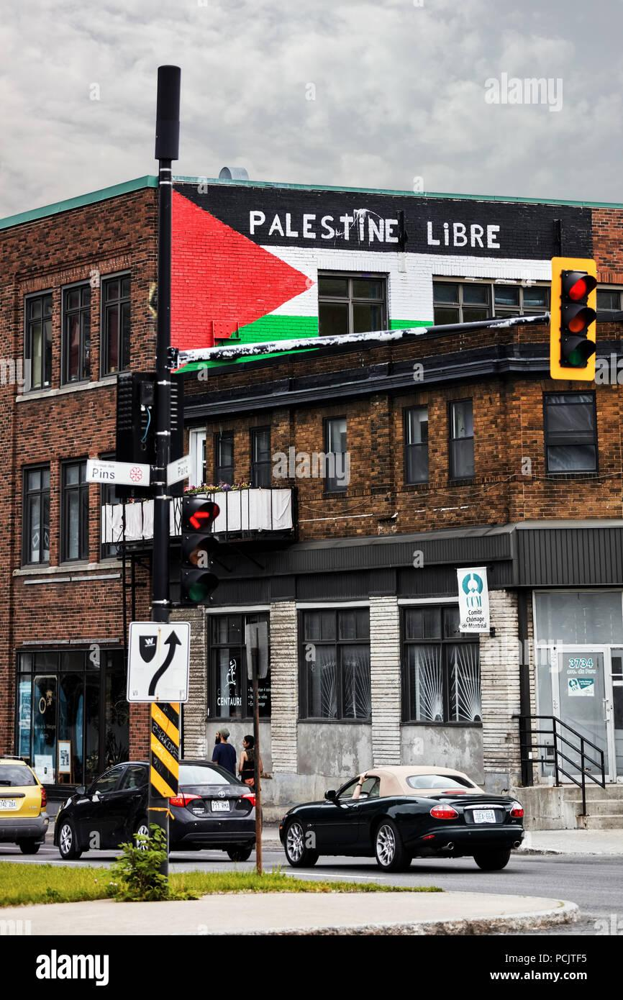

## Claim
Claim: " This image shows a traffic sign in Montreal in July 2024 which displays a 'Free Palestine. Escalate now' message and was authorized by Montreal's Mayor Valérie Plante."

## Actions
```
geolocate()
web_search("Free Palestine Montreal sign")
image_search("Free Palestine sign Montreal")
```

## Evidence
### Evidence from `geolocate`
The most likely countries where the image was taken are: {'Palestine': 0.85, 'Canada': 0.07, 'Germany': 0.02, 'Austria': 0.01, 'Israel': 0.01, 'Poland': 0.01, 'Slovenia': 0.01, 'South Korea': 0.01, 'Albania': 0.0, 'Andorra': 0.0}

### Evidence from `web_search`
Electronic traffic signs in Montreal displayed pro-Palestinian slogans, including "free Palestine" and "escalate now" (). The signs were altered at two construction sites and the original messages were restored. The City of Montreal called the incident an act of vandalism. A group called Clash Mtl claimed responsibility.

The City of Montreal has a history of removing pro-Palestine signs. The article from The Maple mentions that Jeremy Levi, the mayor of Hampstead, called on Montreal Mayor Valérie Plante to take a stand against the signs.

Sources:
*   [https://www.cbc.ca/news/canada/montreal/montreal-traffic-signs-pro-palestinian-slogans-1.7274809](https://www.cbc.ca/news/canada/montreal/montreal-traffic-signs-pro-palestinian-slogans-1.7274809)
*   [https://montrealgazette.com/news/local-news/montreal-traffic-signs-apparently-hacked-to-display-pro-palestinian-political-slogans](https://montrealgazette.com/news/local-news/montreal-traffic-signs-apparently-hacked-to-display-pro-palestinian-political-slogans)
*   [https://www.readthemaple.com/city-of-montreal-illegally-seized-pro-palestine-signs-activists-allege/](https://www.readthemaple.com/city-of-montreal-illegally-seized-pro-palestine-signs-activists-allege/)

### Evidence from `image_search`
The Globe and Mail reported on a traffic sign in Montreal displaying a "Free Palestine. Escalate now" message (). Alamy shows a building in Montreal with a Palestine flag and the words "Palestine Libre" painted on it ().

*   [https://www.theglobeandmail.com/canada/article-montreal-traffic-signs-apparently-hacked-to-display-pro-palestinian/](https://www.theglobeandmail.com/canada/article-montreal-traffic-signs-apparently-hacked-to-display-pro-palestinian/)
*   [https://www.alamy.com/palestine-flag-and-free-palestine-palestine-libre-slogan-in-french-painted-on-the-brick-walls-of-a-building-in-montreal-quebec-canada-image214314665.html](https://www.alamy.com/palestine-flag-and-free-palestine-palestine-libre-slogan-in-french-painted-on-the-brick-walls-of-a-building-in-montreal-quebec-canada-image214314665.html)


## Elaboration
The evidence confirms that traffic signs in Montreal displayed the "Free Palestine" message, matching the image. However, the signs were altered at construction sites, and the City of Montreal called the incident an act of vandalism. The evidence does not support the claim that the message was authorized by Montreal's Mayor Valérie Plante.


## Final Judgement
The image is of a traffic sign in Montreal displaying a "Free Palestine" message. The signs were altered at construction sites, and the City of Montreal called the incident an act of vandalism. The claim that the message was authorized by Montreal's Mayor Valérie Plante is not supported by the evidence.

`false`

### Verdict: FALSE

### Justification
The image depicts a traffic sign in Montreal displaying a "Free Palestine" message, which was confirmed by multiple sources, including the CBC and the Montreal Gazette ([https://www.cbc.ca/news/canada/montreal/montreal-traffic-signs-pro-palestinian-slogans-1.7274809](https://www.cbc.ca/news/canada/montreal/montreal-traffic-signs-pro-palestinian-slogans-1.7274809), [https://montrealgazette.com/news/local-news/montreal-traffic-signs-apparently-hacked-to-display-pro-palestinian-political-slogans](https://montrealgazette.com/news/local-news/montreal-traffic-signs-apparently-hacked-to-display-pro-palestinian-political-slogans)). However, the signs were altered at construction sites, and the City of Montreal considered it an act of vandalism, with no evidence suggesting the message was authorized by Mayor Valérie Plante.
