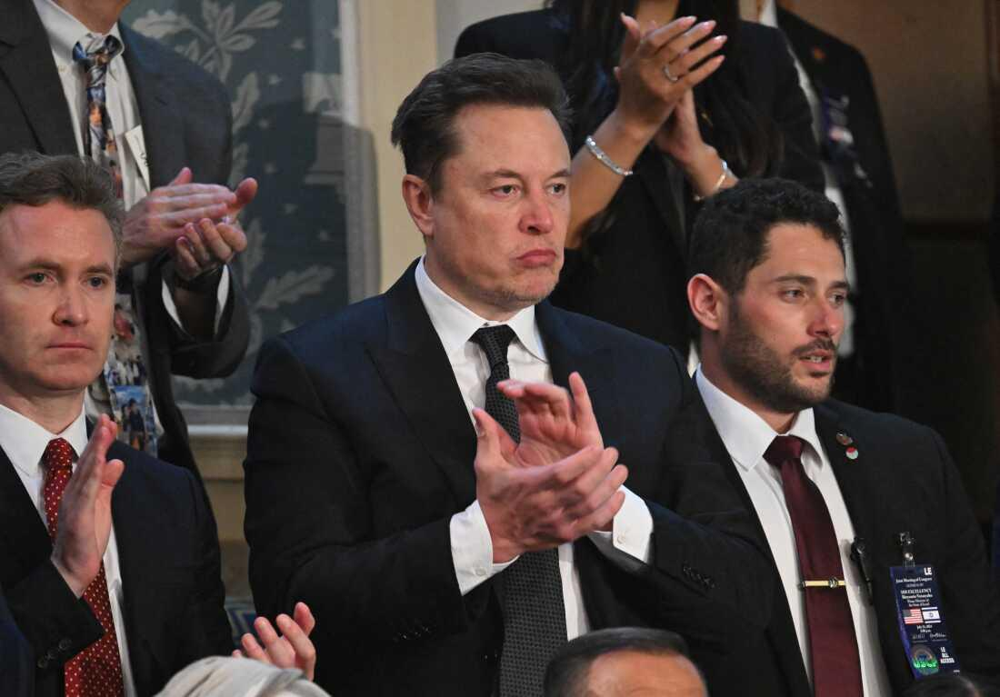

## Claim
Claim: " This is an authentic image of Donald Trump, Benjamin Netanyahu and Elon Musk during Netanyahu's official visit to the U.S. in February 2025."

## Actions
```
web_search("Donald Trump Benjamin Netanyahu Elon Musk meeting")
web_search("Benjamin Netanyahu US visit February 2025")
image_search("Donald Trump Benjamin Netanyahu Elon Musk")
```

## Evidence
### Evidence from `web_search`
The Guardian ([https://www.theguardian.com/us-news/live/2025/jul/07/donald-trump-elon-musk-new-party-us-politics-live-latest-news](https://www.theguardian.com/us-news/live/2025/jul/07/donald-trump-elon-musk-new-party-us-politics-live-latest-news)) reported on a meeting between Donald Trump and Benjamin Netanyahu at the White House in July 2025, and mentioned Trump's comments on Elon Musk's new political party. FRANCE 24 ([https://www.france24.com/en/tv-shows/truth-or-fake/20250205-photo-of-elon-musk-donald-trump-and-benjamin-netanyahu-is-ai-generated](https://www.france24.com/en/tv-shows/truth-or-fake/20250205-photo-of-elon-musk-donald-trump-and-benjamin-netanyahu-is-ai-generated)) published an article on February 5, 2025, stating that a photo of Elon Musk, Donald Trump, and Benjamin Netanyahu () is AI-generated.

NDTV ([https://www.ndtv.com/world-news/elon-musk-vs-donald-trump-musks-praise-for-trump-amid-latest-feud-credit-where-its-due-8811697](https://www.ndtv.com/world-news/elon-musk-vs-donald-trump-musks-praise-for-trump-amid-latest-feud-credit-where-its-due-8811697)) reported on July 2, 2025, about Elon Musk's praise for Donald Trump's negotiation skills regarding the Israel-Hamas conflict, also mentioning Trump's claim to resolve the conflict. The image of Trump, Netanyahu, and Musk () was included in the article.


### Evidence from `web_search`
NPR published an article on February 3, 2025, about Israeli Prime Minister Benjamin Netanyahu's visit to the U.S., where he met with U.S. President Donald Trump (). The Soufan Center published an article on April 9, 2025, discussing Benjamin Netanyahu's visit to the White House ().

The Guardian published an article on April 7, 2025, discussing a meeting between Benjamin Netanyahu and Donald Trump, mentioning Netanyahu's visit to the US in February ().


### Evidence from `image_search`
NPR published an article about Elon Musk. () Al Jazeera published an image of Donald Trump and Benjamin Netanyahu. ()

The provided sources are: [https://www.npr.org/2024/07/24/nx-s1-5049715/elon-musk-donald-trump-tesla](https://www.npr.org/2024/07/24/nx-s1-5049715/elon-musk-donald-trump-tesla) and [https://www.aljazeera.com/news/liveblog/2025/7/7/donald-trump-live-us-president-to-host-israeli-pm-benjamin-netanyahu](https://www.aljazeera.com/news/liveblog/2025/7/7/donald-trump-live-us-president-to-host-israeli-pm-benjamin-netanyahu).


## Elaboration
The claim is not entirely accurate. While there were meetings between Trump and Netanyahu in February 2025, and the image in question does depict Trump, Netanyahu, and Musk, the evidence indicates that the photo is AI-generated, as reported by FRANCE 24 ([https://www.france24.com/en/tv-shows/truth-or-fake/20250205-photo-of-elon-musk-donald-trump-and-benjamin-netanyahu-is-ai-generated](https://www.france24.com/en/tv-shows/truth-or-fake/20250205-photo-of-elon-musk-donald-trump-and-benjamin-netanyahu-is-ai-generated)).


## Final Judgement
The claim is demonstrably false. While the individuals in the image are real and there were meetings between Trump and Netanyahu, the image itself is AI-generated, as confirmed by a reliable source. `false`

### Verdict: FALSE

### Justification
The claim is false. While Donald Trump and Benjamin Netanyahu did meet in February 2025, and Elon Musk was involved in discussions with Trump, the image presented is AI-generated, according to a report by FRANCE 24 ([https://www.france24.com/en/tv-shows/truth-or-fake/20250205-photo-of-elon-musk-donald-trump-and-benjamin-netanyahu-is-ai-generated](https://www.france24.com/en/tv-shows/truth-or-fake/20250205-photo-of-elon-musk-donald-trump-and-benjamin-netanyahu-is-ai-generated)).
