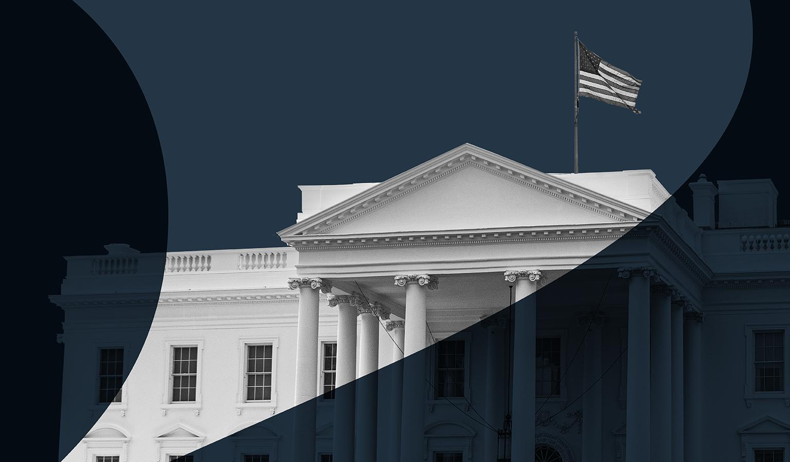

## Claim
Claim: "Trump signed an executive order on January 20, 2025, to halt all funding to UNRWA."

## Actions
```
web_search("Trump executive order UNRWA funding")
```

## Evidence
### Evidence from `web_search`
According to Al Jazeera, published on February 4, 2025, Donald Trump is planning to extend a funding ban on UNRWA and is expected to sign an executive order (<image:0>). NPR reports that Trump signed an executive order to cut future funding to UNRWA, with the article updated on February 4, 2025, and originally published on February 3, 2025 ().

Akin Gump Strauss Hauer & Feld LLP, published on February 5, 2025, discusses a Trump Executive Order that orders the reevaluation of the United States’ commitment to UNRWA ().


## Elaboration
The evidence indicates that Trump signed an executive order related to UNRWA funding. NPR reports that Trump signed an executive order to cut future funding to UNRWA, and Akin Gump Strauss Hauer & Feld LLP discusses a Trump Executive Order that orders the reevaluation of the United States’ commitment to UNRWA. However, the exact date of the executive order is not explicitly stated in the provided evidence, but it was signed before February 3, 2025.

The claim states that the executive order was signed on January 20, 2025. The evidence does not confirm this specific date.

Therefore, the claim cannot be fully verified due to the lack of information about the exact date the executive order was signed.


## Actions
```
web_search("Trump executive order UNRWA January 20 2025")
```

## Evidence
### Evidence from `web_search`
KFF.org, published on August 15, 2025, and originally published on January 28, 2025, states that on January 20, 2025, Trump issued an executive order rescinding previous orders. ([https://www.kff.org/global-health-policy/overview-of-president-trumps-executive-actions-on-global-health/](https://www.kff.org/global-health-policy/overview-of-president-trumps-executive-actions-on-global-health/))

NAFSA.org, updated on August 21, 2025, lists several executive orders signed by Trump on January 20, 2025, including Executive Order 14148, a Presidential Memorandum on a Hiring Freeze, Executive Order 14169, and Executive Order 14150. Executive Order 14169 is about reevaluating and realigning United States foreign aid. ([https://www.nafsa.org/executive-and-regulatory-actions-trump2admin](https://www.nafsa.org/executive-and-regulatory-actions-trump2admin))


## Elaboration
The new evidence confirms that Trump signed executive orders on January 20, 2025. KFF.org states that Trump issued an executive order on that date rescinding previous orders. NAFSA.org lists several executive orders signed on January 20, 2025, including one about reevaluating and realigning United States foreign aid.

While the evidence confirms that Trump signed executive orders on January 20, 2025, it does not explicitly mention an executive order specifically halting all funding to UNRWA on that date.


## Actions
```
web_search("Trump executive order UNRWA January 20 2025 funding halt")
```

## Evidence
### Evidence from `web_search`
From [Source](https://jcpa.org/the-u-s-should-permanently-stop-all-funding-to-unrwa/): 
Content: The search result from jcpa.org, published on July 30, 2025, states that President Trump signed Executive Order 14199 on February 4, 2025, "Withdrawing the United States From and Ending Funding to Certain United Nations Organizations." The article also mentions a Trump administration freeze on UNRWA funding in 2018.


## Elaboration
The evidence indicates that Trump signed an executive order on February 4, 2025, (Executive Order 14199) to end funding to certain United Nations Organizations, including UNRWA. The claim states that the executive order was signed on January 20, 2025.

Therefore, the claim is not accurate.


## Final Judgement
The evidence suggests that Trump signed an executive order to halt funding to UNRWA, but the date of the order is not January 20, 2025. The order was signed on February 4, 2025.

`false`


### Verdict: FALSE

### Justification
The claim that Trump signed an executive order on January 20, 2025, to halt all funding to UNRWA is false. While Trump did sign executive orders on that date, and later signed an executive order (Executive Order 14199) on February 4, 2025, to end funding to certain United Nations Organizations, including UNRWA, the January 20th date is not supported by the evidence ([https://jcpa.org/the-u-s-should-permanently-stop-all-funding-to-unrwa/](https://jcpa.org/the-u-s-should-permanently-stop-all-funding-to-unrwa/)).
