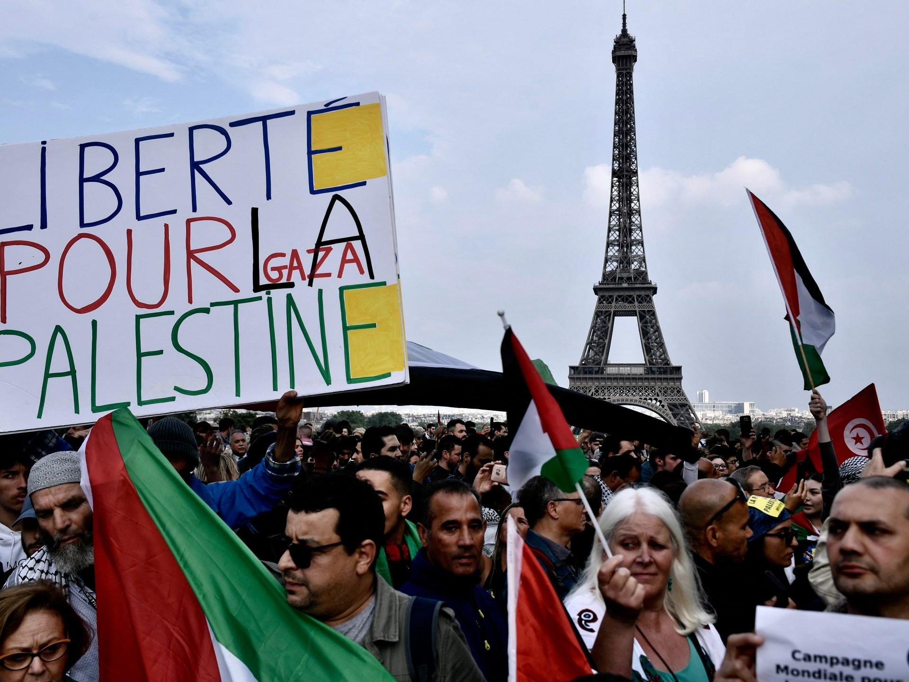

## Claim
Claim: " This image shows the 'French' Left who is rioting against Le Pen's victory in the first round of the French parliamentary elections in 2024."

## Actions
```
geolocate()
web_search("French parliamentary elections 2024 Le Pen")
image_search("protest Palestine France")
```

## Evidence
### Evidence from `geolocate`
The most likely countries where the image was taken are: {'Palestine': 0.38, 'France': 0.31, 'Germany': 0.1, 'Tunisia': 0.05, 'Belgium': 0.03, 'Sweden': 0.03, 'Israel': 0.02, 'Jordan': 0.02, 'Hungary': 0.01, 'Italy': 0.01}

### Evidence from `web_search`
The NPR article ([https://www.npr.org/2024/07/01/nx-s1-5025215/france-elections-2024-analysis](https://www.npr.org/2024/07/01/nx-s1-5025215/france-elections-2024-analysis)) discusses the first round of the French legislative elections on July 1, 2024, where Marine Le Pen's far-right National Rally party gained a strong lead. The New Popular Front, an alliance of center-left and far-left parties, placed second.

The Politico.eu article ([https://www.politico.eu/article/france-legislative-election-2024-second-round-front-populaire-jean-luc-melenchon-raphael-glucksmann-shock-victory/](https://www.politico.eu/article/france-legislative-election-2024-second-round-front-populaire-jean-luc-melenchon-raphael-glucksmann-shock-victory/)) discusses the 2024 French parliamentary elections, where the left-wing alliance won the most seats, dealing a blow to Marine Le Pen's far-right party. The Economist ([https://www.economist.com/interactive/france-elections-2024-polls-macron-le-pen](https://www.economist.com/interactive/france-elections-2024-polls-macron-le-pen)) discusses the 2024 French legislative elections, mentioning the National Rally (RN) led by Marine Le Pen, the New Popular Front (NFP), and Ensemble. The RN did not secure a majority.  and 


### Evidence from `image_search`
Al Jazeera published an article about a pro-Palestinian protest in Paris, with an image showing the Eiffel Tower in the background (). Reuters reported on a French court upholding a government ban on pro-Palestine protests, including an image of a pro-Palestine protest in France ().


## Elaboration
The evidence suggests the image was likely taken in France, and the image search results confirm pro-Palestine protests in France. The web search indicates that the 2024 French parliamentary elections took place, with Marine Le Pen's party gaining a strong lead in the first round, but the left-wing alliance won the most seats overall.

The claim states that the image shows the "French" Left rioting against Le Pen's victory. However, the image search results show pro-Palestine protests in France. The image itself contains Palestinian flags and signs. Therefore, the claim is not supported by the evidence. It is more likely that the image depicts a pro-Palestine protest in France, not necessarily a riot against Le Pen's victory.

The evidence does not provide enough information to determine the exact nature of the protest in the image, such as the specific reasons for the protest or the political affiliations of the participants.


## Final Judgement
The image was likely taken in France, and the web search confirms the 2024 French parliamentary elections. However, the image search results show pro-Palestine protests in France, not necessarily a riot against Le Pen's victory.

`false`

### Verdict: FALSE

### Justification
The image likely depicts a pro-Palestine protest in France, as indicated by the presence of Palestinian flags and the geolocation results. While the 2024 French parliamentary elections did take place, with Marine Le Pen's party gaining a lead, the evidence does not support the claim that the image shows a riot against her victory. The image search results show pro-Palestine protests in France, not necessarily a riot against Le Pen's victory. Therefore, the claim is false.
