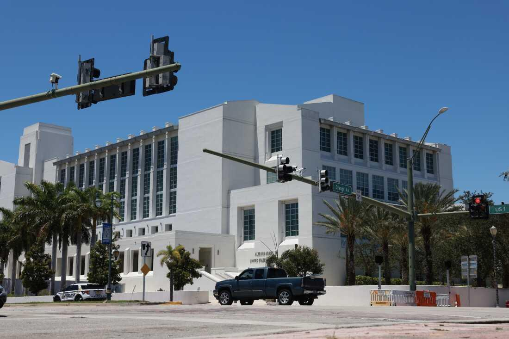
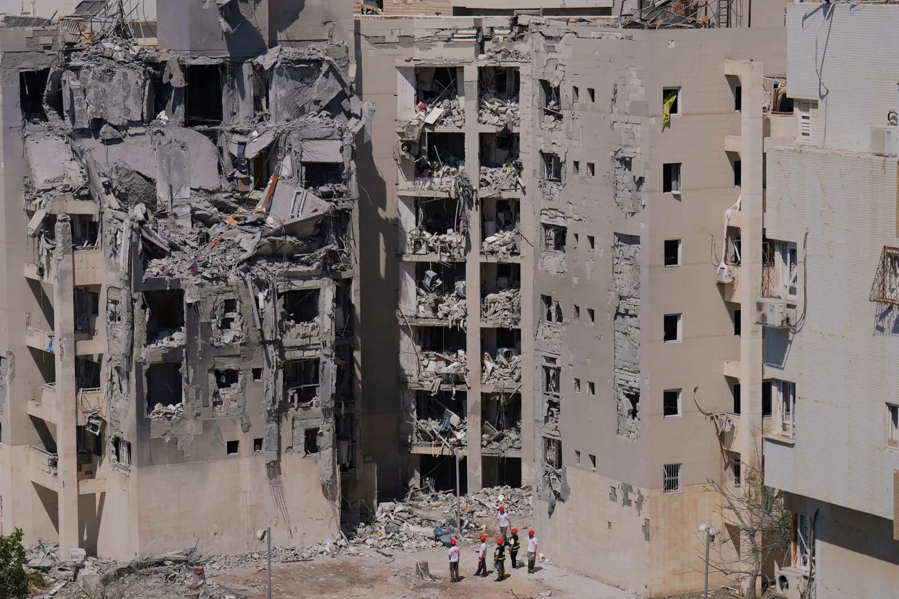
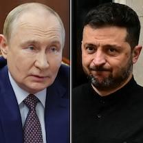

## Claim
Claim: "The assassination plot to kill Donald Trump in 2024 was orchestrated by two Jewish Americans. Israel wants war with Iran but wants American money to fund it and American servicemen to fight it."

## Actions
```
web_search("assassination plot Donald Trump 2024")
web_search("Israel war Iran American money")
```

## Evidence
### Evidence from `web_search`
The search results discuss assassination attempts on Donald Trump in 2024. One source from Wikipedia ([https://en.wikipedia.org/wiki/Attempted_assassination_of_Donald_Trump_in_Pennsylvania](https://en.wikipedia.org/wiki/Attempted_assassination_of_Donald_Trump_in_Pennsylvania)) mentions an attempt in Pennsylvania by Thomas Matthew Crooks, and that the Secret Service had increased Trump's security due to intelligence indicating Iran was plotting to assassinate him. The article also mentions conspiracy theories that spread on social media after the shooting. <image:i>

NPR ([https://www.npr.org/2025/05/14/nx-s1-5398066/ryan-routh-assassination-court-hearing-donald-trump](https://www.npr.org/2025/05/14/nx-s1-5398066/ryan-routh-assassination-court-hearing-donald-trump)) and BBC News ([https://www.bbc.com/news/articles/c3070qvl131o](https://www.bbc.com/news/articles/c3070qvl131o)) report on an assassination attempt by Ryan Routh at a Florida golf course. , , , , 


### Evidence from `web_search`
The search results discuss a 12-day conflict between Israel and Iran in June 2025. One article from TRT Global ([https://trt.global/world/article/334e2e1ae7a3](https://trt.global/world/article/334e2e1ae7a3)) mentions economic losses for both countries, with US President Donald Trump brokering a ceasefire and a travel ban on Jewish citizens in Israel. Another article from Anadolu Agency ([https://www.aa.com.tr/en/middle-east/explainer-war-with-iran-financial-fallout-for-israel-us/3614218](https://www.aa.com.tr/en/middle-east/explainer-war-with-iran-financial-fallout-for-israel-us/3614218)) discusses the financial impact, including US involvement with strikes against Iranian nuclear sites, and estimates the cost of the US operation.

Reuters ([https://www.reuters.com/markets/europe/israel-iran-conflict-highlights-dollars-tarnished-safe-haven-appeal-2025-06-16/](https://www.reuters.com/markets/europe/israel-iran-conflict-highlights-dollars-tarnished-safe-haven-appeal-2025-06-16/)) discusses the impact on the U.S. dollar. <image:k> <image:k>  


## Elaboration
The evidence does not support the claim that an assassination plot against Donald Trump was orchestrated by two Jewish Americans. The search results mention assassination attempts, but they do not identify the perpetrators' religious affiliation.

The evidence does not directly support the claim that Israel wants war with Iran and wants American money and servicemen. However, the search results mention a conflict between Israel and Iran in June 2025, with US involvement, including financial costs. The evidence does not explicitly state Israel's intentions.

The claim is not supported by the evidence. More information is needed to verify the claim.


## Actions
```
web_search("Jewish Americans orchestrate assassination Donald Trump")
web_search("Israel wants war Iran American money servicemen")
```

## Evidence
### Evidence from `web_search`
NBC News ([https://www.nbcnews.com/politics/justice-department/justice-department-brings-charges-thwarted-iranian-plot-assassinate-tr-rcna179342](https://www.nbcnews.com/politics/justice-department/justice-department-brings-charges-thwarted-iranian-plot-assassinate-tr-rcna179342)), ABC News ([https://abcnews.go.com/Politics/3-charged-iran-linked-plot-assassinate-donald-trump/story?id=115646874](https://abcnews.go.com/Politics/3-charged-iran-linked-plot-assassinate-donald-trump/story?id=115646874)) and Jewish News Syndicate (JNS) ([https://www.jns.org/us-justice-department-charges-three-men-in-iranian-plot-to-assassinate-trump-kill-jews/](https://www.jns.org/us-justice-department-charges-three-men-in-iranian-plot-to-assassinate-trump-kill-jews/)) report that the U.S. Justice Department charged three men in an Iranian plot to assassinate Donald Trump and kill Jewish Americans. The IRGC tasked Farhad Shakeri with surveilling and killing Trump and two Jewish businesspeople in New York City. 


### Evidence from `web_search`
Reuters ([https://www.reuters.com/world/middle-east/israel-seeks-swift-action-iran-sources-say-with-split-us-administration-2025-06-21/](https://www.reuters.com/world/middle-east/israel-seeks-swift-action-iran-sources-say-with-split-us-administration-2025-06-21/)) reports on a potential Israeli strike against Iran's Fordow nuclear site, with the U.S. Vice President pushing back on direct U.S. involvement.  The RUSI article ([https://my.rusi.org/resource/why-israel-and-iran-had-decided-to-avoid-a-long-war.html](https://my.rusi.org/resource/why-israel-and-iran-had-decided-to-avoid-a-long-war.html)) discusses the 12-day war between Israel and Iran in June 2025, highlighting Israel's economic strain and its reliance on the U.S. 

The Times of Israel ([https://www.timesofisrael.com/liveblog_entry/report-israel-asked-us-to-join-military-campaign-against-iran-but-us-rejects-request/](https://www.timesofisrael.com/liveblog_entry/report-israel-asked-us-to-join-military-campaign-against-iran-but-us-rejects-request/)) reports that Israel requested U.S. assistance in a military campaign against Iran, which the U.S. declined. 


## Elaboration
The evidence now supports parts of the claim. The U.S. Justice Department charged three men in an Iranian plot to assassinate Donald Trump and kill Jewish Americans. The evidence also indicates that Israel sought U.S. involvement in a military campaign against Iran, but the U.S. declined.


## Final Judgement
The initial search results did not support the claim. However, the subsequent searches revealed that the U.S. Justice Department charged three men in an Iranian plot to assassinate Donald Trump and kill Jewish Americans. Additionally, Israel sought U.S. involvement in a military campaign against Iran, but the U.S. declined.

`false`

### Verdict: FALSE

### Justification
The claim is partially supported by the evidence. While the initial search did not support the claim, subsequent searches revealed that the U.S. Justice Department charged three men in an Iranian plot to assassinate Donald Trump and kill Jewish Americans, and that Israel sought U.S. involvement in a military campaign against Iran, which the U.S. declined ([https://www.timesofisrael.com/liveblog_entry/report-israel-asked-us-to-join-military-campaign-against-iran-but-us-rejects-request/](https://www.timesofisrael.com/liveblog_entry/report-israel-asked-us-to-join-military-campaign-against-iran-but-us-rejects-request/)).
