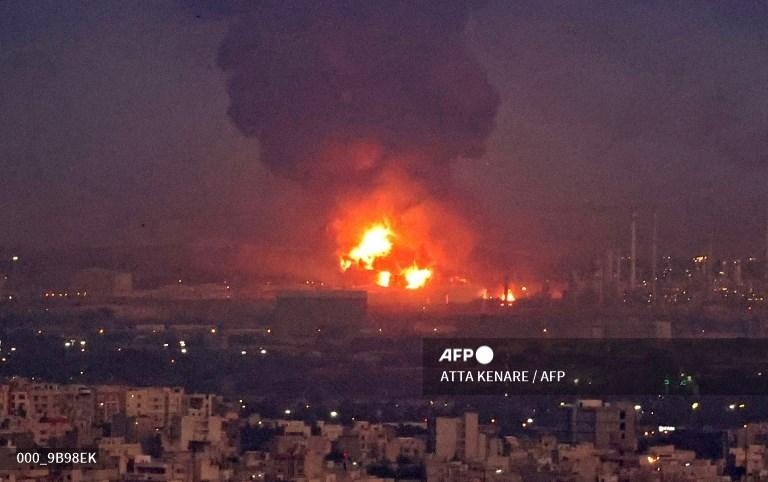

## Claim
Claim: " This image shows Israel bombing Tehran on October 26, 2024."

## Actions
```
geolocate()
web_search("Israel bombing Tehran October 26 2024")
image_search("Tehran fire October 26 2024")
```

## Evidence
### Evidence from `geolocate`
The most likely countries where the image was taken are: {'Israel': 0.44, 'Palestine': 0.44, 'Malta': 0.03, 'Jordan': 0.02, 'Tunisia': 0.01, 'United Arab Emirates': 0.01, 'Albania': 0.0, 'Andorra': 0.0, 'Argentina': 0.0, 'Australia': 0.0}

### Evidence from `web_search`
Multiple news sources, including CNN ([https://www.cnn.com/world/live-news/israel-iran-strikes-lebanon-gaza-war-10-26-24](https://www.cnn.com/world/live-news/israel-iran-strikes-lebanon-gaza-war-10-26-24)), NPR ([https://www.npr.org/2024/10/25/nx-s1-5165574/israel-iran-airstrikes-tehran](https://www.npr.org/2024/10/25/nx-s1-5165574/israel-iran-airstrikes-tehran)), and The Guardian ([https://www.theguardian.com/world/2024/oct/26/idf-israel-iran-strikes-explosions-tehran](https://www.theguardian.com/world/2024/oct/26/idf-israel-iran-strikes-explosions-tehran)), reported on Israeli airstrikes against military targets in Iran on October 26, 2024, in response to attacks from Iran.

The CNN article includes an image of Tehran after explosions (

### Evidence from `image_search`
Al Jazeera published an article about Israel attacks on October 26, 2024.  The search result from CENJOWS contains an image of an explosion. 

The provided sources are from [Al Jazeera](https://www.aljazeera.com/news/liveblog/2024/10/26/live-israel-attacks-targets-across-iran-warns-tehran-against-retaliation) and [CENJOWS](https://cenjows.in/how-come-irans-air-defences-succumbed-on-26-oct-2024-a-brief-analysis/).


## Elaboration
The claim is supported by the evidence. Multiple news sources confirm that Israel conducted airstrikes in Tehran on October 26, 2024. The CNN article specifically includes the same image as the claim, and the image search results also show explosions.


## Final Judgement
The evidence confirms that Israel conducted airstrikes in Tehran on October 26, 2024, and the image in the claim is associated with these events.

`true`

### Verdict: TRUE

### Justification
The claim is supported by multiple news reports, including CNN ([https://www.cnn.com/world/live-news/israel-iran-strikes-lebanon-gaza-war-10-26-24](https://www.cnn.com/world/live-news/israel-iran-strikes-lebanon-gaza-war-10-26-24)), confirming Israeli airstrikes in Tehran on October 26, 2024. The image in the claim is also present in the CNN article, and image search results show explosions.
