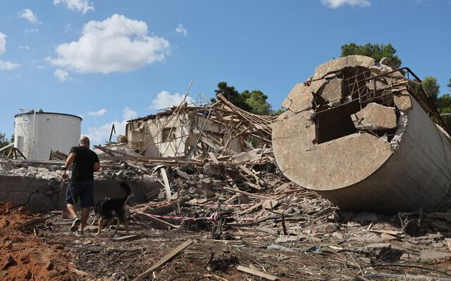

## Claim
Claim: "Gallant, a retired military general and a member of Prime Minister Benjamin Netanyahu’s war cabinet, was killed in the Iranian attack on Israel on October 1, 2024."

## Actions
```
web_search("Yoav Gallant killed October 1 2024")
web_search("Iranian attack on Israel October 1 2024")
```

## Evidence
### Evidence from `web_search`
The Times of Israel ([https://www.timesofisrael.com/after-iranian-missiles-hit-base-gallant-says-attack-didnt-even-scratch-air-force/](https://www.timesofisrael.com/after-iranian-missiles-hit-base-gallant-says-attack-didnt-even-scratch-air-force/)) reported on October 6, 2024, that Defense Minister Yoav Gallant visited the Nevatim air force base after an Iranian missile attack on October 1, 2024, including images of the aftermath of the attack  and Israelis taking cover . The Guardian ([https://www.theguardian.com/world/2024/oct/09/biden-and-netanyahu-to-speak-as-israel-attack-on-iran-expected](https://www.theguardian.com/world/2024/oct/09/biden-and-netanyahu-to-speak-as-israel-attack-on-iran-expected)) mentioned an Iranian missile attack on October 1, 2024, but stated it was a failure.

NPR ([https://www.npr.org/2024/11/05/nx-s1-5179904/israel-defense-minister-gallant-fired-netanyahu](https://www.npr.org/2024/11/05/nx-s1-5179904/israel-defense-minister-gallant-fired-netanyahu)) reported on November 5, 2024, that Prime Minister Benjamin Netanyahu fired Defense Minister Yoav Gallant , , , .


### Evidence from `web_search`
On October 1, 2024, Iran launched a missile attack on Israel, codenamed Operation True Promise II, in retaliation for the assassination of Ismail Haniyeh and other leaders. Israel shot down most of the incoming missiles. The attack was in response to Israeli attacks and assassinations of IRGC, Hamas, and Hezbollah leaders. The article also mentions that Israeli Prime Minister Benjamin Netanyahu said that Iran had “made a big mistake” and “will pay for it”.

The sources include articles from Wikipedia ([https://en.wikipedia.org/wiki/October_2024_Iranian_strikes_on_Israel](https://en.wikipedia.org/wiki/October_2024_Iranian_strikes_on_Israel)), NPR ([https://www.npr.org/2024/10/01/g-s1-25707/iran-israel-hezbollah-lebanon-attack](https://www.npr.org/2024/10/01/g-s1-25707/iran-israel-hezbollah-lebanon-attack)), and Al Jazeera ([https://www.aljazeera.com/news/2024/10/1/irans-missile-attack-against-israel-what-we-know-and-what-comes-next](https://www.aljazeera.com/news/2024/10/1/irans-missile-attack-against-israel-what-we-know-and-what-comes-next)). <image:k>, , , , , 


## Elaboration
The evidence indicates that Yoav Gallant was not killed in the Iranian attack on October 1, 2024. The Times of Israel ([https://www.timesofisrael.com/after-iranian-missiles-hit-base-gallant-says-attack-didnt-even-scratch-air-force/](https://www.timesofisrael.com/after-iranian-missiles-hit-base-gallant-says-attack-didnt-even-scratch-air-force/)) reported that he visited the Nevatim air force base after the attack. Furthermore, NPR ([https://www.npr.org/2024/11/05/nx-s1-5179904/israel-defense-minister-gallant-fired-netanyahu](https://www.npr.org/2024/11/05/nx-s1-5179904/israel-defense-minister-gallant-fired-netanyahu)) reported that he was fired on November 5, 2024.


## Final Judgement
The claim that Yoav Gallant was killed in the Iranian attack on October 1, 2024, is demonstrably false. Multiple sources confirm that Gallant was alive after the attack and was later fired from his position.

`false`

### Verdict: FALSE

### Justification
The claim is false. Evidence from The Times of Israel ([https://www.timesofisrael.com/after-iranian-missiles-hit-base-gallant-says-attack-didnt-even-scratch-air-force/](https://www.timesofisrael.com/after-iranian-missiles-hit-base-gallant-says-attack-didnt-even-scratch-air-force/)) shows that Yoav Gallant visited a base after the attack, and NPR ([https://www.npr.org/2024/11/05/nx-s1-5179904/israel-defense-minister-gallant-fired-netanyahu](https://www.npr.org/2024/11/05/nx-s1-5179904/israel-defense-minister-gallant-fired-netanyahu)) reported that he was later fired.
