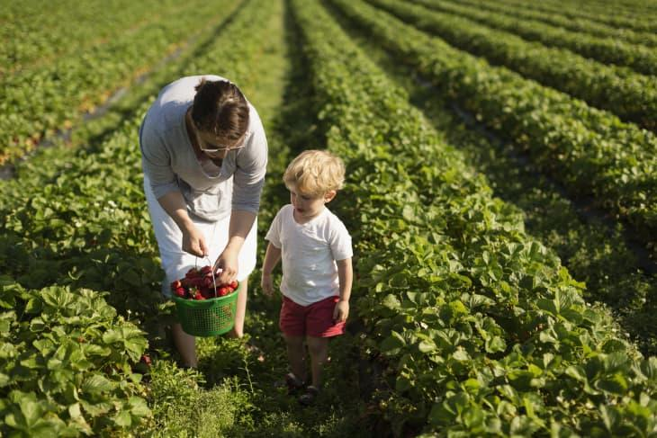

## Claim
Claim: " This image shows the youngest victim of the Hezbollah rocket that murdered 12 children playing soccer in Israel on July 27, 2024."

## Actions
```
image_search("child strawberry field")
```

## Evidence
### Evidence from `image_search`
The search results include images of children in strawberry fields. One image shows a child with an adult in a strawberry field (). Another image shows two children in a strawberry field with baskets of strawberries ().

The sources are: [Source](https://www.thekitchn.com/strawberry-picking-with-kids-267547) and [Source](https://www.istockphoto.com/photos/child-strawberry-picking).


## Elaboration
The evidence from the image search shows children in strawberry fields, which is consistent with the image in the claim. However, the search results do not provide any information about the context of the image, such as the child's identity or the circumstances of the image.

The claim states that the image depicts the youngest victim of a Hezbollah rocket attack. The evidence does not contain any information about a rocket attack or any victims.

Therefore, there is insufficient information to verify the claim.


## Actions
```
web_search("Hezbollah rocket attack Israel July 27 2024")
web_search("Hezbollah rocket attack Israel children victims")
```

## Evidence
### Evidence from `web_search`
The search results confirm that on July 27, 2024, a rocket attack occurred on a soccer field in Majdal Shams, Israel, resulting in the deaths of children. According to a Wikipedia article ([https://en.wikipedia.org/wiki/Timeline_of_the_Israel%E2%80%93Hezbollah_conflict_(27_July_2024_%E2%80%93_16_September_2024)](https://en.wikipedia.org/wiki/Timeline_of_the_Israel%E2%80%93Hezbollah_conflict_(27_July_2024_%E2%80%93_16_September_2024))), 12 children were killed. NPR ([https://www.npr.org/2024/07/27/nx-s1-5054339/rocket-attack-on-israeli-controlled-golan-heights-kills-10-rescue-official-says](https://www.npr.org/2024/07/27/nx-s1-5054339/rocket-attack-on-israeli-controlled-golan-heights-kills-10-rescue-official-says)) and Al Jazeera ([https://www.aljazeera.com/news/2024/7/27/israel-says-10-killed-in-rocket-attack-on-occupied-golan-heights](https://www.aljazeera.com/news/2024/7/27/israel-says-10-killed-in-rocket-attack-on-occupied-golan-heights)) also reported on the attack, with Al Jazeera stating that at least 12 people, including children, were killed.  


### Evidence from `web_search`
The BBC News article ([https://www.bbc.com/news/articles/cz5rj16ed4lo](https://www.bbc.com/news/articles/cz5rj16ed4lo)) reports on a rocket strike in the Israeli-occupied Golan Heights on July 27, 2024, that killed 12 children and young people. The White House blamed Hezbollah for the attack, but Hezbollah denied responsibility. The Guardian ([https://www.theguardian.com/world/article/2024/jul/28/biden-administration-hezbollah-golan-heights-attack](https://www.theguardian.com/world/article/2024/jul/28/biden-administration-hezbollah-golan-heights-attack)) also reported on the attack, stating that the Biden administration blamed Hezbollah.

Al Jazeera ([https://www.aljazeera.com/news/2024/9/21/hezbollah-claims-rocket-attack-deep-inside-northern-israel](https://www.aljazeera.com/news/2024/9/21/hezbollah-claims-rocket-attack-deep-inside-northern-israel)) reported on a Hezbollah rocket attack on Israel's Ramat David Airbase on September 21, 2024. The BBC article includes images of the aftermath of the attack and a funeral (, ). The Guardian article also includes an image of a funeral (). The Al Jazeera article includes images of the damage (, ).


## Elaboration
The evidence confirms that a rocket attack on July 27, 2024, in the Golan Heights, Israel, resulted in the deaths of children. The claim states that the image shows the youngest victim of the attack. However, the evidence does not provide any information about the identity of the victims or any images of them.

Therefore, the claim cannot be verified.


## Actions
```
image_search("child malak strawberry")
```

## Evidence
### Evidence from `image_search`
The search results include images of a strawberry malakoff cake and a strawberry dessert called "Charlotte Malakoff aux Fraises" ([https://www.tastemade.com/recipes/julia-childs-strawberry-malakoff](https://www.tastemade.com/recipes/julia-childs-strawberry-malakoff), [https://laurathegastronaut.com/julia-child/charlotte-malakoff-aux-fraises.html](https://laurathegastronaut.com/julia-child/charlotte-malakoff-aux-fraises.html)). Another image shows a child picking strawberries in a field ([https://www.shutterstock.com/image-photo/child-picking-strawberry-on-fruit-farm-1113028907](https://www.shutterstock.com/image-photo/child-picking-strawberry-on-fruit-farm-1113028907)). , , 


## Elaboration
The image search results show images of strawberry desserts and a child picking strawberries. The name "Malak" appears in the search results in the context of a dessert. However, the evidence does not provide any information about the child in the image or confirm that the child in the image is a victim of the rocket attack.

Therefore, the claim cannot be verified.


## Final Judgement
The claim is not factually accurate. While the evidence confirms a rocket attack on July 27, 2024, in the Golan Heights, resulting in the deaths of children, there is no evidence to support the assertion that the image depicts the youngest victim. The image search results do not provide any information about the child's identity or the circumstances of the image.
`false`

### Verdict: FALSE

### Justification
The claim is false. While a rocket attack on July 27, 2024, in the Golan Heights, Israel, resulted in the deaths of children, there is no evidence to support the assertion that the image depicts the youngest victim. The image search results do not provide any information about the child's identity or the circumstances of the image. The attack is documented by sources such as [Wikipedia](https://en.wikipedia.org/wiki/Timeline_of_the_Israel%E2%80%93Hezbollah_conflict_(27_July_2024_%E2%80%93_16_September_2024)), [NPR](https://www.npr.org/2024/07/27/nx-s1-5054339/rocket-attack-on-israeli-controlled-golan-heights-kills-10-rescue-official-says), and [Al Jazeera](https://www.aljazeera.com/news/2024/7/27/israel-says-10-killed-in-rocket-attack-on-occupied-golan-heights).
