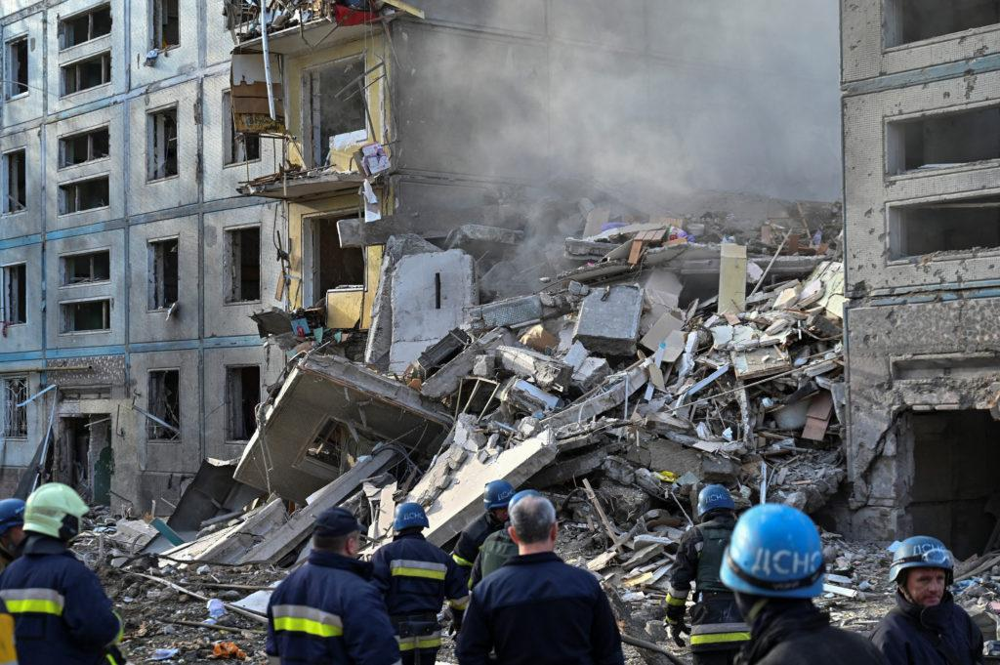
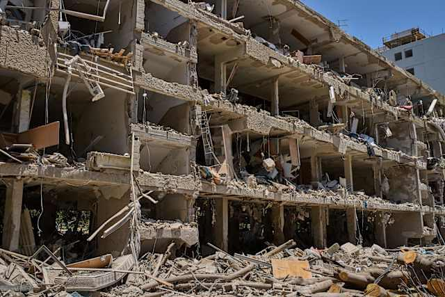
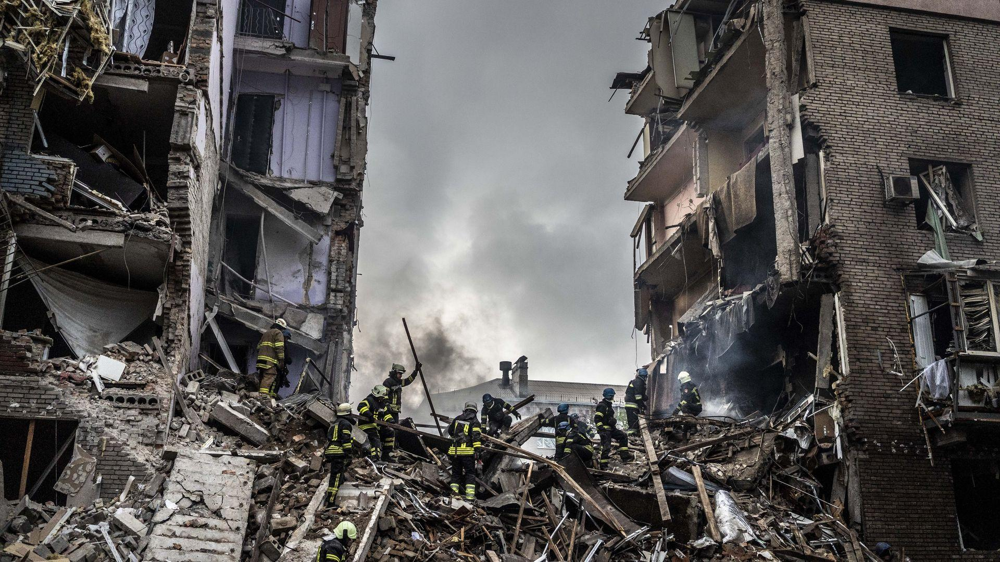

## Claim
Claim: " This image shows the assassination of Hamas leader Ismail Haniyeh on July 31st, 2024. This is how a precision strike looks like: a single missile through the window, and only Haniyeh and his bodyguard are dead. Nobody else in the building is even injured."

## Actions
```
geolocate()
web_search("Ismail Haniyeh assassination July 31 2024")
image_search("building damage missile strike")
```

## Evidence
### Evidence from `geolocate`
The most likely countries where the image was taken are: {'Cambodia': 0.35, 'Pakistan': 0.1, 'Bangladesh': 0.07, 'Ghana': 0.07, 'Bhutan': 0.06, 'China': 0.05, 'Sri Lanka': 0.04, 'Albania': 0.03, 'Kyrgyzstan': 0.02, 'Laos': 0.02}

### Evidence from `web_search`
The provided sources discuss the assassination of Hamas leader Ismail Haniyeh in Tehran, Iran, on July 31, 2024. The attack was carried out by Israel, according to Wikipedia ([https://en.wikipedia.org/wiki/Assassination_of_Ismail_Haniyeh](https://en.wikipedia.org/wiki/Assassination_of_Ismail_Haniyeh)). The CSIS article mentions that Haniyeh was killed by an explosion in his guesthouse ([https://www.csis.org/analysis/ismail-haniyehs-assassination-escalation-or-ramp](https://www.csis.org/analysis/ismail-haniyehs-assassination-escalation-or-ramp)).

CNN reports that Israel has neither confirmed nor denied being behind the assassination ([https://www.cnn.com/world/live-news/hamas-political-leader-haniyeh-killed-iran-07-31-24](https://www.cnn.com/world/live-news/hamas-political-leader-haniyeh-killed-iran-07-31-24)). The image 

### Evidence from `image_search`
The web search results include images of buildings damaged by missile strikes. One image is from a PBS article ([https://www.pbs.org/newshour/world/more-russian-missiles-slam-ukrainian-apartments-killing-13-in-zaporizhzhia](https://www.pbs.org/newshour/world/more-russian-missiles-slam-ukrainian-apartments-killing-13-in-zaporizhzhia)). Another image is from clickondetroit.com ([https://www.clickondetroit.com/news/2025/06/22/iranian-missile-fired-after-us-strikes-causes-heavy-damage-but-few-injuries-in-tel-aviv/](https://www.clickondetroit.com/news/2025/06/22/iranian-missile-fired-after-us-strikes-causes-heavy-damage-but-few-injuries-in-tel-aviv/)). The third image is from Axios ([https://www.axios.com/2022/10/11/russia-missile-strikes-ukraine](https://www.axios.com/2022/10/11/russia-missile-strikes-ukraine)). , , 


## Elaboration
The claim states that the image shows the assassination of Ismail Haniyeh on July 31st, 2024. The web search confirms that Ismail Haniyeh was assassinated on July 31, 2024, in Tehran, Iran. However, the image geolocation suggests the image was taken in Cambodia, Pakistan, or other countries, not Iran. The evidence does not confirm that the image depicts the assassination.

The claim also describes the nature of the strike. The image search shows other images of buildings damaged by missile strikes. However, the evidence does not confirm the nature of the strike in the image.

Therefore, the claim is not supported by the evidence. The location of the image does not match the location of the assassination.


## Final Judgement
The evidence indicates that Ismail Haniyeh was assassinated on July 31, 2024, in Tehran, Iran. However, the image geolocation suggests the image was taken in a different location. The image search results show other images of buildings damaged by missile strikes, but the evidence does not confirm that the image depicts the assassination.

The claim is `false`.

### Verdict: FALSE

### Justification
The claim is false. While the web search confirms the assassination of Ismail Haniyeh on July 31, 2024, the image geolocation suggests a different location than Tehran, Iran, where the assassination occurred. The image search results show other images of buildings damaged by missile strikes, but the evidence does not confirm that the image depicts the assassination.
